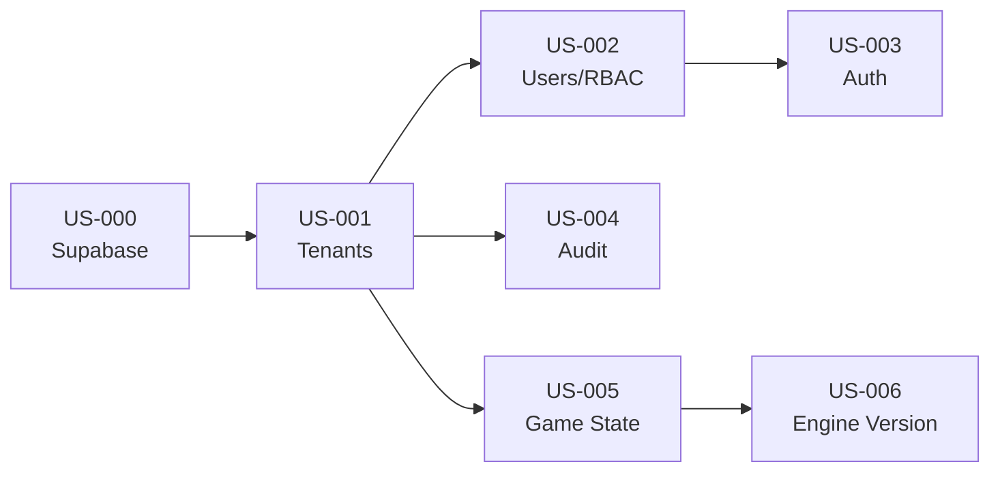

# Prompts Antigravity — EPIC E0 Foundations SaaS

> **Prompts d'implémentation** pour les User Stories US-000 à US-006
> À utiliser avec Claude Opus 4.5 / Antigravity
> Date : 2025-12-27

---

## Conventions d'utilisation

### Avant chaque prompt

1. Copier le prompt complet
2. S'assurer que l'IA a accès au workspace
3. Vérifier que les dépendances sont résolues

### Structure des prompts

```
📖 CONTEXTE    → Docs à lire en premier
🎭 RÔLE        → Persona à endosser
🎯 OBJECTIF    → US + livrables attendus
📋 AC          → Critères d'acceptation
⚠️ CONTRAINTES → Garde-fous
📤 SORTIE      → Format du livrable
```

---

## US-000 — Initialiser Supabase & connecter l'app

```markdown
📖 CONTEXTE
Lis d'abord :
- docs/README.md
- docs/40_engineering/stack.md
- docs/40_engineering/env_setup.md
- docs/40_engineering/project_structure.md
- docs/40_engineering/definition_of_done.md

🎭 RÔLE
Endosse le rôle : Lead Dev & Architecte

🎯 OBJECTIF
Implémenter US-000 : Initialiser Supabase & connecter l'app

Livrables :
1. Création du projet Supabase (ou instructions manuelles)
2. Configuration des variables d'environnement (.env.local + .env.example)
3. Client Supabase initialisé dans l'app Next.js
4. Healthcheck endpoint `/api/health` qui valide la connexion
5. Migration initiale (schéma minimal si nécessaire)

📋 CRITÈRES D'ACCEPTATION
- AC1: Given app démarrée, When connexion Supabase, Then `select 1` retourne `1`
- AC2: Given utilisateur test, When login Supabase Auth, Then session créée
- AC3: Given variables d'env manquantes, When build, Then erreur explicite

⚠️ CONTRAINTES
- Utiliser @supabase/supabase-js v2
- Client singleton exporté depuis lib/supabase/client.ts
- Séparer client navigateur et serveur (createBrowserClient / createServerClient)
- Pas de secrets dans le code (uniquement .env)
- Suivre les conventions de project_structure.md

📤 SORTIE ATTENDUE
1. Fichiers créés/modifiés avec leur chemin complet
2. Commandes à exécuter (npm install, migrations)
3. Contenu de .env.example (sans valeurs sensibles)
4. Test manuel à effectuer pour valider

CHECKLIST AVANT COMMIT
- [ ] npm run build → OK
- [ ] npm run type-check → OK
- [ ] npm run lint → OK
- [ ] Variables .env.example documentées
- [ ] README mis à jour si nouveau setup requis
- [ ] Commit: feat(supabase): initialize Supabase client [US-000]
```

---

## US-001 — Créer et gérer des tenants

```markdown
📖 CONTEXTE
Lis d'abord :
- docs/README.md
- docs/80_api_data/data_model.md (section tenants)
- docs/50_security_compliance/multi_tenant_isolation.md
- docs/40_engineering/definition_of_done.md
- docs/000_projet/specs_fonctionnelles_mvp.md (section US-001)

🎭 RÔLE
Endosse le rôle : Database Engineer + Lead Dev

🎯 OBJECTIF
Implémenter US-001 : Créer et gérer des tenants (entreprises/écoles)

Livrables :
1. Migration SQL : table `tenants` avec RLS
2. Types TypeScript : Tenant, CreateTenantInput
3. API CRUD : /api/admin/tenants (POST, GET, PATCH, DELETE)
4. Service : lib/services/tenant.service.ts
5. Tests unitaires du service

📋 CRITÈRES D'ACCEPTATION
- AC1: Given super admin, When création tenant, Then tenant_id UUID unique généré
- AC2: Given tenant créé, When query data autre tenant, Then résultat vide (RLS)
- AC3: Given tenant, When paramètres init, Then valeurs défaut appliquées

EDGE CASES À GÉRER
- Nom tenant dupliqué → erreur 409 Conflict
- Suppression tenant avec sessions actives → soft delete (deleted_at) + warning
- Tenant sans admin → impossible de créer des sessions (contrainte logique)

⚠️ CONTRAINTES
- tenant_id = UUID v4
- RLS policy : chaque row a tenant_id, filtrage automatique
- Soft delete obligatoire (pas de DELETE physique)
- Pas de données cross-tenant dans les responses
- Suivre le schéma de data_model.md exactement

📤 SORTIE ATTENDUE

1. **Migration SQL** (supabase/migrations/001_create_tenants.sql)
```sql
-- UP
CREATE TABLE tenants (
  id UUID PRIMARY KEY DEFAULT gen_random_uuid(),
  name TEXT NOT NULL,
  slug TEXT NOT NULL UNIQUE,
  settings JSONB DEFAULT '{}',
  created_at TIMESTAMPTZ DEFAULT NOW(),
  updated_at TIMESTAMPTZ DEFAULT NOW(),
  deleted_at TIMESTAMPTZ
);

-- RLS
ALTER TABLE tenants ENABLE ROW LEVEL SECURITY;
CREATE POLICY "Super admin full access" ON tenants ...
```

2. **Types TypeScript** (lib/types/tenant.ts)

3. **Service** (lib/services/tenant.service.ts)

4. **API Routes** (app/api/admin/tenants/route.ts)

5. **Test** (npm run test:run passant)

CHECKLIST AVANT COMMIT
- [ ] Migration UP et DOWN testées localement
- [ ] RLS policy testée (requête cross-tenant échoue)
- [ ] Types stricts (pas de `any`)
- [ ] Validation input (zod) sur API
- [ ] npm run build + lint + type-check + test → OK
- [ ] Commit: feat(tenants): create tenants table with RLS [US-001]
```

---

## US-002 — Inviter utilisateurs et attribuer rôles

```markdown
📖 CONTEXTE
Lis d'abord :
- docs/README.md
- docs/50_security_compliance/auth_rbac.md
- docs/80_api_data/data_model.md (sections users, roles)
- docs/000_projet/specs_fonctionnelles_mvp.md (section US-002)

🎭 RÔLE
Endosse le rôle : Lead Dev & Sécurité

🎯 OBJECTIF
Implémenter US-002 : Inviter des utilisateurs et attribuer un rôle

Livrables :
1. Migration SQL : tables `users`, `user_roles`, `invitations`
2. Types : User, Role, Invitation
3. API : /api/tenants/[tenantId]/invitations (POST, GET, DELETE)
4. Envoi email d'invitation (Supabase Auth invite)
5. Page d'activation : /auth/accept-invitation/[token]
6. Middleware RBAC pour protéger les routes

📋 CRITÈRES D'ACCEPTATION
- AC1: Given admin tenant, When invitation envoyée, Then email avec lien activation
- AC2: Given lien activation, When délai > 48h, Then lien invalide (erreur)
- AC3: Given rôle Joueur, When accès route admin, Then 403 Forbidden
- AC4: Given rôle Formateur, When création session, Then autorisé

RÔLES MVP
| Rôle | Permissions clés |
|------|------------------|
| admin_tenant | CRUD users, sessions, export |
| formateur | CRUD sessions, view users |
| joueur | play, view own sessions |
| observateur | view only |

⚠️ CONTRAINTES
- Email via Supabase Auth (inviteUserByEmail)
- Token d'invitation expire après 48h
- Changement de rôle = effet immédiat
- Pas de rôle "super admin" exposé (interne seulement)
- RLS sur users : filtrer par tenant_id

📤 SORTIE ATTENDUE

1. **Migration SQL** (supabase/migrations/002_create_users_roles.sql)
```sql
-- Enum rôles
CREATE TYPE user_role AS ENUM ('admin_tenant', 'formateur', 'joueur', 'observateur');

-- Table users  
CREATE TABLE users (
  id UUID PRIMARY KEY REFERENCES auth.users(id),
  tenant_id UUID NOT NULL REFERENCES tenants(id),
  email TEXT NOT NULL,
  role user_role NOT NULL DEFAULT 'joueur',
  ...
);

-- Table invitations
CREATE TABLE invitations (...);
```

2. **Middleware RBAC** (middleware.ts ou lib/auth/rbac.ts)
```typescript
export function requireRole(allowedRoles: Role[]) {
  return async (req: NextRequest) => {
    const user = await getUser(req);
    if (!allowedRoles.includes(user.role)) {
      return new Response('Forbidden', { status: 403 });
    }
  };
}
```

3. **API invitations** avec validation

4. **Page activation** (app/auth/accept-invitation/[token]/page.tsx)

CHECKLIST AVANT COMMIT
- [ ] Invitation email fonctionne (tester avec Supabase)
- [ ] Expiration 48h testée
- [ ] RBAC bloque accès non autorisé
- [ ] RLS users par tenant validé
- [ ] Commit: feat(auth): user invitations and RBAC [US-002]
```

---

## US-003 — Authentification sécurisée

```markdown
📖 CONTEXTE
Lis d'abord :
- docs/README.md
- docs/50_security_compliance/auth_rbac.md
- docs/40_engineering/definition_of_done.md

🎭 RÔLE
Endosse le rôle : Lead Dev & Sécurité

🎯 OBJECTIF
Implémenter US-003 : Authentification sécurisée (login/logout/reset)

Livrables :
1. Pages auth : /auth/login, /auth/logout, /auth/reset-password
2. Composants : LoginForm, ResetPasswordForm
3. Hooks : useAuth, useUser
4. Protection des routes (middleware)
5. Gestion session avec refresh token

📋 CRITÈRES D'ACCEPTATION
- AC1: Given credentials valides, When login, Then session JWT créée + redirect dashboard
- AC2: Given session active, When expiration 24h, Then refresh automatique ou re-login
- AC3: Given 5 échecs login consécutifs, When 6ème tentative, Then rate limiting (429)
- AC4: Given user, When reset password, Then email envoyé avec lien

EDGE CASES
- Password trop faible → rejet avec message explicite
- Token refresh expiré mid-session → redirection login gracieuse
- Connexions simultanées → autorisées (pas de single-session)

⚠️ CONTRAINTES
- Utiliser Supabase Auth (pas de custom auth)
- JWT stocké en httpOnly cookie (pas localStorage)
- Rate limiting via Supabase ou middleware
- Logs des tentatives échouées (pour audit)

📤 SORTIE ATTENDUE

1. **Pages Auth**
```
app/
  auth/
    login/page.tsx
    logout/route.ts
    reset-password/page.tsx
    callback/route.ts (OAuth callback)
```

2. **Composants**
```
components/auth/
  LoginForm.tsx
  ResetPasswordForm.tsx
```

3. **Hooks**
```typescript
// lib/hooks/useAuth.ts
export function useAuth() {
  const [user, setUser] = useState<User | null>(null);
  const [loading, setLoading] = useState(true);
  
  // ... Supabase auth state
  
  return { user, loading, signIn, signOut };
}
```

4. **Middleware** (middleware.ts)
- Protéger routes /dashboard/*, /admin/*
- Redirect /auth/login si non authentifié

CHECKLIST AVANT COMMIT
- [ ] Login/logout fonctionnels (test manuel)
- [ ] Reset password envoie email
- [ ] Rate limiting actif après 5 échecs
- [ ] Session persiste après refresh page
- [ ] Commit: feat(auth): login logout reset password [US-003]
```

---

## US-004 — Journal d'audit

```markdown
📖 CONTEXTE
Lis d'abord :
- docs/README.md
- docs/50_security_compliance/audit_log.md
- docs/80_api_data/data_model.md (section audit_logs)

🎭 RÔLE
Endosse le rôle : Database Engineer + Sécurité

🎯 OBJECTIF
Implémenter US-004 : Journal d'audit (actions sensibles)

Livrables :
1. Migration SQL : table `audit_logs`
2. Service : lib/services/audit.service.ts
3. Helper : logAuditEvent() appelable depuis n'importe quelle API
4. API lecture : /api/admin/audit-logs (GET avec pagination)
5. UI admin : page /admin/audit-logs

📋 CRITÈRES D'ACCEPTATION
- AC1: Given action sensible, When exécutée, Then log avec who/when/what/tenant
- AC2: Given admin tenant, When consulte audit, Then liste filtrée par tenant_id
- AC3: Given log créé, When timestamp, Then horodatage UTC

ACTIONS À LOGGER (MVP)
| Action | Description |
|--------|-------------|
| session.create | Création session de jeu |
| session.update | Modification paramètres session |
| session.delete | Suppression session |
| user.invite | Invitation utilisateur |
| user.role_change | Changement de rôle |
| export.pdf | Export PDF debrief |
| export.data | Export données utilisateur (RGPD) |

⚠️ CONTRAINTES
- Logs immutables (pas d'UPDATE, pas de DELETE)
- tenant_id obligatoire sur chaque log
- Pagination obligatoire (max 50/page)
- Retention policy : 90 jours (commentaire pour future implémentation)
- Pas de données personnelles dans le payload (anonymiser si besoin)

📤 SORTIE ATTENDUE

1. **Migration SQL**
```sql
CREATE TABLE audit_logs (
  id UUID PRIMARY KEY DEFAULT gen_random_uuid(),
  tenant_id UUID NOT NULL REFERENCES tenants(id),
  user_id UUID REFERENCES users(id),
  action TEXT NOT NULL,
  resource_type TEXT,
  resource_id UUID,
  payload JSONB DEFAULT '{}',
  ip_address INET,
  user_agent TEXT,
  created_at TIMESTAMPTZ DEFAULT NOW()
);

-- Index pour requêtes fréquentes
CREATE INDEX idx_audit_logs_tenant_created 
  ON audit_logs(tenant_id, created_at DESC);

-- RLS : lecture seule par tenant
ALTER TABLE audit_logs ENABLE ROW LEVEL SECURITY;
CREATE POLICY "Tenant read own logs" ON audit_logs
  FOR SELECT USING (tenant_id = current_tenant_id());
```

2. **Service Audit**
```typescript
// lib/services/audit.service.ts
export async function logAuditEvent(event: {
  tenantId: string;
  userId?: string;
  action: AuditAction;
  resourceType?: string;
  resourceId?: string;
  payload?: Record<string, unknown>;
  request?: NextRequest;
}): Promise<void> {
  // Insert async (ne pas bloquer la requête principale)
}
```

3. **API avec pagination**
```
GET /api/admin/audit-logs?page=1&limit=50&action=session.create
```

4. **UI Admin** (simple table avec filtres)

CHECKLIST AVANT COMMIT
- [ ] Logs créés pour toutes les actions sensibles
- [ ] Pagination fonctionne (test 100+ logs)
- [ ] RLS empêche accès cross-tenant
- [ ] Pas de PII dans les payloads
- [ ] Commit: feat(audit): audit logging for sensitive actions [US-004]
```

---

## US-005 — Stocker l'état complet par tour

```markdown
📖 CONTEXTE
Lis d'abord :
- docs/README.md
- docs/80_api_data/data_model.md (sections sessions, game_states)
- docs/20_simulation/overview.md
- docs/000_projet/specs_fonctionnelles_mvp.md (section US-005)

🎭 RÔLE
Endosse le rôle : Database Engineer + Simulation Engineer

🎯 OBJECTIF
Implémenter US-005 : Stocker l'état complet d'une partie par tour

Livrables :
1. Migration SQL : tables `sessions`, `game_states`
2. Types : Session, GameState, TurnState, Decision, Event
3. Service : lib/services/game-state.service.ts
4. API : /api/sessions/[sessionId]/turns/[turnNumber]
5. Fonctions : saveTurnState(), loadTurnState(), replayFromTurn()

📋 CRITÈRES D'ACCEPTATION
- AC1: Given tour N terminé, When sauvegarde, Then état complet persisté
- AC2: Given état tour N, When relecture, Then reprise exacte possible
- AC3: Given état, When contenu, Then inclut : décisions, événements, indices, P&L, métriques

STRUCTURE TurnState
```typescript
interface TurnState {
  session_id: string;
  turn_number: number;
  timestamp: string; // ISO8601
  
  // Indices (0-100)
  indices: {
    IAC: number;
    IPQO: number;
    IERH: number;
    IRF: number;
    IMD: number;
    IS: number;
    IPP: number;
  };
  
  // P&L
  pnl: {
    primes: number;
    sinistres: number;
    frais: number;
    produits_financiers: number;
    resultat: number;
  };
  
  // Décisions du tour
  decisions: Decision[];
  
  // Événements déclenchés
  events: TriggeredEvent[];
  
  // Métriques portefeuille par produit
  portfolio: {
    [productId: string]: {
      contracts: number;
      premiums: number;
      claims_stock: number;
      claims_flow_in: number;
      claims_flow_out: number;
    };
  };
  
  // Checksum pour validation intégrité
  checksum: string;
}
```

⚠️ CONTRAINTES
- Stockage JSONB pour flexibilité (évolution schéma)
- Checksum SHA256 du state pour détecter corruption
- Pas de modification d'un état passé (append-only)
- Compression optionnelle si state > 100KB

📤 SORTIE ATTENDUE

1. **Migration SQL**
```sql
CREATE TABLE sessions (
  id UUID PRIMARY KEY DEFAULT gen_random_uuid(),
  tenant_id UUID NOT NULL REFERENCES tenants(id),
  code VARCHAR(6) NOT NULL UNIQUE,
  status session_status NOT NULL DEFAULT 'draft',
  config JSONB NOT NULL, -- vitesse, difficulté, produits
  engine_version VARCHAR(20) NOT NULL,
  current_turn INTEGER DEFAULT 0,
  max_turns INTEGER NOT NULL,
  created_by UUID REFERENCES users(id),
  created_at TIMESTAMPTZ DEFAULT NOW(),
  started_at TIMESTAMPTZ,
  ended_at TIMESTAMPTZ
);

CREATE TABLE game_states (
  id UUID PRIMARY KEY DEFAULT gen_random_uuid(),
  session_id UUID NOT NULL REFERENCES sessions(id),
  turn_number INTEGER NOT NULL,
  state JSONB NOT NULL,
  checksum VARCHAR(64) NOT NULL,
  created_at TIMESTAMPTZ DEFAULT NOW(),
  UNIQUE(session_id, turn_number)
);
```

2. **Service**
```typescript
// lib/services/game-state.service.ts
export async function saveTurnState(
  sessionId: string, 
  turnNumber: number, 
  state: TurnState
): Promise<void>;

export async function loadTurnState(
  sessionId: string, 
  turnNumber: number
): Promise<TurnState | null>;

export async function getLatestState(
  sessionId: string
): Promise<TurnState | null>;
```

3. **Checksum**
```typescript
function computeChecksum(state: TurnState): string {
  const normalized = JSON.stringify(state, Object.keys(state).sort());
  return crypto.createHash('sha256').update(normalized).digest('hex');
}
```

CHECKLIST AVANT COMMIT
- [ ] Sauvegarde/lecture état fonctionne
- [ ] Checksum validé au chargement
- [ ] Pas de modification état passé (test)
- [ ] Types TurnState complets et stricts
- [ ] Commit: feat(game): store complete turn state [US-005]
```

---

## US-006 — Gestion version moteur

```markdown
📖 CONTEXTE
Lis d'abord :
- docs/README.md
- docs/20_simulation/overview.md
- docs/000_projet/specs_fonctionnelles_mvp.md (section US-006)

🎭 RÔLE
Endosse le rôle : Simulation Engineer + Lead Dev

🎯 OBJECTIF
Implémenter US-006 : Gestion version moteur (engine_version)

Livrables :
1. Constante ENGINE_VERSION dans lib/engine/version.ts
2. Stockage engine_version dans chaque session
3. Validation : interdire recalcul si version différente
4. Affichage version dans exports PDF et UI
5. Documentation du versioning

📋 CRITÈRES D'ACCEPTATION
- AC1: Given nouvelle partie, When création, Then engine_version stockée
- AC2: Given partie existante, When tentative recalcul avec autre version, Then erreur
- AC3: Given export PDF, When génération, Then engine_version incluse

SCHÉMA DE VERSION
```
Format: MAJOR.MINOR.PATCH
- MAJOR: changement breaking (formules, indices)
- MINOR: ajout features rétrocompatibles
- PATCH: bugfixes

Exemple: 1.0.0 (MVP)
```

⚠️ CONTRAINTES
- Version = source unique (pas de déduction)
- Pas de migration automatique entre versions
- Warning UI si comparaison scores versions différentes
- Changelog maintenu dans lib/engine/CHANGELOG.md

📤 SORTIE ATTENDUE

1. **Version constante**
```typescript
// lib/engine/version.ts
export const ENGINE_VERSION = '1.0.0' as const;

export interface EngineMetadata {
  version: typeof ENGINE_VERSION;
  releaseDate: string;
  breaking: boolean;
}

export const ENGINE_METADATA: EngineMetadata = {
  version: ENGINE_VERSION,
  releaseDate: '2025-01-15',
  breaking: false,
};
```

2. **Validation**
```typescript
// lib/engine/validation.ts
export function validateEngineVersion(
  sessionVersion: string,
  currentVersion: string = ENGINE_VERSION
): void {
  if (sessionVersion !== currentVersion) {
    throw new EngineVersionMismatchError(
      `Session uses engine ${sessionVersion}, current is ${currentVersion}. ` +
      `Recalculation not allowed.`
    );
  }
}
```

3. **Intégration session**
- À la création : `session.engine_version = ENGINE_VERSION`
- Au chargement : valider version avant calcul

4. **Changelog**
```markdown
# Engine Changelog

## 1.0.0 (2025-01-15) - MVP
- Initial release
- 7 indices: IAC, IPQO, IERH, IRF, IMD, IS, IPP
- 2 products: Auto, MRH
- Basic delay effects
```

CHECKLIST AVANT COMMIT
- [ ] ENGINE_VERSION exportée et utilisée partout
- [ ] Recalcul bloqué si version différente
- [ ] Export PDF inclut version
- [ ] CHANGELOG.md créé
- [ ] Commit: feat(engine): engine version management [US-006]
```

---

## Ordre d'exécution recommandé



| Ordre | US | Dépend de | Durée estimée |
|:-----:|:---|-----------|:-------------:|
| 1 | US-000 | - | 0.5 jour |
| 2 | US-001 | US-000 | 1 jour |
| 3 | US-002 | US-001 | 1.5 jours |
| 4 | US-003 | US-002 | 1 jour |
| 5 | US-004 | US-001 | 0.5 jour |
| 6 | US-005 | US-001 | 1 jour |
| 7 | US-006 | US-005 | 0.5 jour |

**Total Sprint 0+1 : ~6 jours**

---

## Quick Reference

```
╔═══════════════════════════════════════════════════════════════════╗
║                 EPIC E0 — FOUNDATIONS SAAS                        ║
╠═══════════════════════════════════════════════════════════════════╣
║  US-000 → Supabase init      │ feat(supabase): ...  [US-000]     ║
║  US-001 → Tenants + RLS      │ feat(tenants): ...   [US-001]     ║
║  US-002 → Users + RBAC       │ feat(auth): ...      [US-002]     ║
║  US-003 → Login/Logout       │ feat(auth): ...      [US-003]     ║
║  US-004 → Audit logs         │ feat(audit): ...     [US-004]     ║
║  US-005 → Game state storage │ feat(game): ...      [US-005]     ║
║  US-006 → Engine version     │ feat(engine): ...    [US-006]     ║
╠═══════════════════════════════════════════════════════════════════╣
║  CHECKLIST UNIVERSELLE :                                          ║
║  ☐ npm run build      → OK                                        ║
║  ☐ npm run type-check → OK                                        ║
║  ☐ npm run lint       → OK                                        ║
║  ☐ npm run test:run   → OK                                        ║
║  ☐ RLS policies testées                                           ║
║  ☐ Pas de any / secrets / console.log                             ║
╚═══════════════════════════════════════════════════════════════════╝
```
