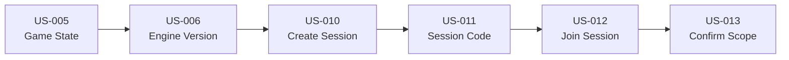

# Prompts Antigravity — Sprint 2 (Core Loop)

> **Prompts d'implémentation** pour les User Stories US-005, US-006, US-010 à US-013
> À utiliser avec Claude Opus 4.5 / Antigravity
> Date : 2025-12-29

---

## Conventions d'utilisation

### Avant chaque prompt

1. Copier le prompt complet
2. S'assurer que l'IA a accès au workspace
3. Vérifier que les dépendances sont résolues

### Structure des prompts

```
📖 CONTEXTE    → Docs à lire en premier
🎭 RÔLE        → Persona à endosser
🎯 OBJECTIF    → US + livrables attendus
📋 AC          → Critères d'acceptation
⚠️ CONTRAINTES → Garde-fous
📤 SORTIE      → Format du livrable
```

---

## US-005 — Stocker l'état complet par tour

```markdown
📖 CONTEXTE
Lis d'abord :
- docs/README.md
- docs/80_api_data/data_model.md (section game_states)
- docs/20_functional/game_logic.md (section turn_resolution)
- docs/000_projet/specs_fonctionnelles_mvp.md (section US-005)

🎭 RÔLE
Endosse le rôle : Database Engineer + Lead Dev

🎯 OBJECTIF
Implémenter US-005 : Stocker l'état complet du jeu à chaque tour

Livrables :
1. Migration SQL : tables `sessions`, `game_states`
2. Types TypeScript : Session, GameState, TurnState, Decision, Event
3. Service : lib/services/game-state.service.ts
4. API : /api/sessions/[sessionId]/turns/[turnNumber] (GET, POST)
5. Tests unitaires du service
6. Implémentation SHA256 checksum pour intégrité données

📋 CRITÈRES D'ACCEPTATION
- AC1: Given tour N terminé, When sauvegarde état, Then JSONB stocké avec décisions + events + indices + P&L + portfolio
- AC2: Given état tour N, When checksum calculé, Then SHA256 sur data JSONB reproductible
- AC3: Given demande chargement tour N, When API appelée, Then retour état complet avec métadonnées (timestamp, version moteur)

STRUCTURE TurnState
```typescript
interface TurnState {
  turnNumber: number;
  decisions: Decision[];
  events: Event[];
  indices: {
    FREQ: number;
    RC: number;
    CG: number;
    // ... 7 indices
  };
  pnl: ProfitAndLoss;
  portfolio: PortfolioMetrics;
  timestamp: string;
  engineVersion: string;
}
```

⚠️ CONTRAINTES
- game_states.data = JSONB (PostgreSQL)
- Append-only : jamais d'UPDATE, toujours INSERT nouveau tour
- Compression optionnelle si JSONB \> 100 KB
- Checksum obligatoire pour vérifier intégrité
- session_id + turn_number = clé unique composée

📤 SORTIE ATTENDUE

1. **Migration SQL** (supabase/migrations/003_game_states.sql)
```sql
CREATE TABLE sessions (
  id UUID PRIMARY KEY DEFAULT gen_random_uuid(),
  tenant_id UUID NOT NULL REFERENCES tenants(id),
  code TEXT NOT NULL UNIQUE,
  created_by UUID NOT NULL REFERENCES users(id),
  settings JSONB DEFAULT '{}',
  status TEXT DEFAULT 'draft', -- draft, active, completed
  created_at TIMESTAMPTZ DEFAULT NOW(),
  updated_at TIMESTAMPTZ DEFAULT NOW()
);

CREATE TABLE game_states (
  id UUID PRIMARY KEY DEFAULT gen_random_uuid(),
  session_id UUID NOT NULL REFERENCES sessions(id),
  turn_number INTEGER NOT NULL,
  data JSONB NOT NULL,
  checksum TEXT NOT NULL,
  engine_version TEXT NOT NULL,
  created_at TIMESTAMPTZ DEFAULT NOW(),
  UNIQUE(session_id, turn_number)
);

CREATE INDEX idx_game_states_session_turn 
  ON game_states(session_id, turn_number DESC);
```

2. **Service** (lib/services/game-state.service.ts)
```typescript
export async function saveTurnState(
  sessionId: string,
  turnNumber: number,
  state: TurnState
): Promise<void> {
  const data = JSON.stringify(state);
  const checksum = await calculateSHA256(data);
  
  // Insert avec checksum
}

export async function loadTurnState(
  sessionId: string,
  turnNumber: number
): Promise<TurnState | null> {
  // Vérifier checksum au chargement
}
```

3. **API Route** (app/api/sessions/[sessionId]/turns/[turnNumber]/route.ts)

CHECKLIST AVANT COMMIT
- [ ] Migration testée (UP et DOWN)
- [ ] Checksum vérifié (test avec données identiques)
- [ ] Compression testée si \> 100 KB
- [ ] RLS policy : seuls les membres du tenant accèdent aux states
- [ ] Commit: feat(game): save complete game state per turn [US-005]
```

---

## US-006 — Gestion version moteur

```markdown
📖 CONTEXTE
Lis d'abord :
- docs/README.md
- docs/40_engineering/versioning.md
- docs/20_functional/game_logic.md

🎭 RÔLE
Endosse le rôle : Lead Dev + Tech Lead

🎯 OBJECTIF
Implémenter US-006 : Gérer la version du moteur de simulation

Livrables :
1. Constante ENGINE_VERSION dans lib/engine/version.ts
2. Stockage engine_version dans chaque session
3. Validation : recalculs interdits si version moteur diffère
4. Affichage version moteur dans PDF export + UI
5. Documentation du schéma de versioning + changelog

📋 CRITÈRES D'ACCEPTATION
- AC1: Given nouvelle session, When initialisée, Then engine_version actuelle enregistrée
- AC2: Given session version 1.0, When moteur version 1.1, Then recalcul bloqué avec warning
- AC3: Given export PDF, When généré, Then version moteur affichée dans footer

SCHÉMA VERSIONING
Format : MAJOR.MINOR.PATCH
- MAJOR : changements breaking (formules modifiées)
- MINOR : nouvelles fonctionnalités (nouveaux leviers)
- PATCH : bugfixes (corrections calculs)

⚠️ CONTRAINTES
- version.ts = single source of truth
- Pas de version hardcodée ailleurs
- Changelog obligatoire (CHANGELOG.md)
- Version affichée dans UI (/admin/about)

📤 SORTIE ATTENDUE

1. **version.ts**
```typescript
export const ENGINE_VERSION = '1.0.0';
export const VERSION_HISTORY = [
  { version: '1.0.0', date: '2025-01-15', changes: 'Initial MVP release' }
];
```

2. **Migration** : Ajouter colonne engine_version à sessions

3. **Validation Service**
```typescript
export function canRecalculate(
  sessionEngineVersion: string,
  currentEngineVersion: string
): boolean {
  // Accepter uniquement si MAJOR.MINOR identiques
}
```

4. **UI Component** : VersionBadge.tsx affichant la version

CHECKLIST AVANT COMMIT
- [ ] version.ts créé avec VERSION actuelle
- [ ] CHANGELOG.md créé
- [ ] Colonne engine_version ajoutée à sessions
- [ ] Warning affiché si version incompatible
- [ ] Commit: feat(engine): engine version management [US-006]
```

---

## US-010 — Créer une session

```markdown
📖 CONTEXTE
Lis d'abord :
- docs/README.md
- docs/000_projet/specs_fonctionnelles_mvp.md (section US-010)
- docs/80_api_data/data_model.md (section sessions)
- docs/30_ux_ui/user_flows.md (flow creation session)

🎭 RÔLE
Endosse le rôle : Full-Stack Developer

🎯 OBJECTIF
Implémenter US-010 : Formateur crée une session de jeu

Livrables :
1. Page : /dashboard/sessions/new
2. Composant : SessionCreationForm
3. API : POST /api/sessions
4. Validation : nom session unique par tenant
5. Redirection automatique vers /dashboard/sessions/[id]/setup

📋 CRITÈRES D'ACCEPTATION
- AC1: Given formateur, When remplit formulaire (nom, description), Then session créée avec statut 'draft'
- AC2: Given nom dupliqué dans tenant, When soumission, Then erreur 409 Conflict
- AC3: Given session créée, When redirection, Then vers page setup session

CHAMPS FORMULAIRE
- Nom session (requis, max 100 caractères)
- Description (optionnel, textarea)
- Durée estimée (sélection : 2h, 4h, full day)
- Nombre max participants (défaut : 30)

⚠️ CONTRAINTES
- Seuls rôles 'formateur' et 'admin_tenant' peuvent créer
- Code session auto-généré (6 caractères alphanumériques)
- Validation Zod côté serveur
- Audit log : session.create

📤 SORTIE ATTENDUE

1. **Page** (app/dashboard/sessions/new/page.tsx)
```typescript
export default function NewSessionPage() {
  return (
    <DashboardLayout>
      <h1>Créer une nouvelle session</h1>
      <SessionCreationForm />
    </DashboardLayout>
  );
}
```

2. **Component** (components/sessions/SessionCreationForm.tsx)

3. **API** (app/api/sessions/route.ts)
```typescript
export async function POST(req: NextRequest) {
  // Validation RBAC
  // Validation input Zod
  // Génération code unique
  // Insert session
  // Log audit
  return NextResponse.json({ sessionId, code });
}
```

4. **Validation Schema**
```typescript
const createSessionSchema = z.object({
  name: z.string().min(1).max(100),
  description: z.string().optional(),
  duration: z.enum(['2h', '4h', 'full_day']),
  maxParticipants: z.number().int().min(1).max(100)
});
```

CHECKLIST AVANT COMMIT
- [ ] Formulaire fonctionne (test création)
- [ ] Code session unique généré
- [ ] Erreur 409 si nom dupliqué
- [ ] Redirection vers setup après création
- [ ] Audit log créé
- [ ] Commit: feat(sessions): session creation form [US-010]
```

---

## US-011 — Générer code session

```markdown
📖 CONTEXTE
Lis d'abord :
- docs/README.md
- docs/000_projet/specs_fonctionnelles_mvp.md (section US-011)

🎭 RÔLE
Endosse le rôle : Backend Developer

🎯 OBJECTIF
Implémenter US-011 : Génération code session unique

Livrables :
1. Helper : lib/utils/session-code.ts
2. API : GET /api/sessions/[sessionId]/code (régénération si besoin)
3. Tests unitaires : unicité, format, collisions

📋 CRITÈRES D'ACCEPTATION
- AC1: Given nouvelle session, When créée, Then code 6 caractères alphanum généré
- AC2: Given code existant, When collision, Then retry jusqu'à code unique (max 10 tentatives)
- AC3: Given session, When affichage code, Then formaté type "ABC-123" pour lisibilité

FORMAT
- 6 caractères alphanumériques (A-Z 0-9, sans O/0 I/1 pour éviter confusion)
- Exemple : `A7K9B2`, `X3M8F4`
- Séparateur optionnel pour affichage : `A7K-9B2`

⚠️ CONTRAINTES
- Charset : ABCDEFGHJKLMNPQRSTUVWXYZ23456789 (sans ambiguïtés)
- Max 10 tentatives si collision
- Code case-insensitive (toujours uppercase en DB)
- Index unique sur sessions.code

📤 SORTIE ATTENDUE

1. **Helper** (lib/utils/session-code.ts)
```typescript
const CHARSET = 'ABCDEFGHJKLMNPQRSTUVWXYZ23456789';

export function generateSessionCode(length: number = 6): string {
  let code = '';
  for (let i = 0; i < length; i++) {
    code += CHARSET[Math.floor(Math.random() * CHARSET.length)];
  }
  return code;
}

export async function generateUniqueCode(
  supabase: SupabaseClient,
  maxRetries: number = 10
): Promise<string> {
  for (let i = 0; i < maxRetries; i++) {
    const code = generateSessionCode();
    const { data } = await supabase
      .from('sessions')
      .select('id')
      .eq('code', code)
      .single();
    
    if (!data) return code;
  }
  throw new Error('Failed to generate unique session code');
}

export function formatCodeForDisplay(code: string): string {
  // ABC123 → ABC-123
  return code.slice(0, 3) + '-' + code.slice(3);
}
```

2. **Tests** (tests/utils/session-code.test.ts)
- Test génération format correct
- Test unicité (mock DB)
- Test formatage affichage

CHECKLIST AVANT COMMIT
- [ ] Fonction génération testée
- [ ] Collision handling testé
- [ ] Format affiché validé (séparateur)
- [ ] Index unique sur sessions.code vérifié
- [ ] Commit: feat(sessions): unique session code generator [US-011]
```

---

## US-012 — Rejoindre une session

```markdown
📖 CONTEXTE
Lis d'abord :
- docs/README.md
- docs/000_projet/specs_fonctionnelles_mvp.md (section US-012)
- docs/30_ux_ui/user_flows.md (flow join session)

🎭 RÔLE
Endosse le rôle : Full-Stack Developer

🎯 OBJECTIF
Implémenter US-012 : Joueur rejoint une session via code

Livrables :
1. Page : /sessions/join
2. Composant : JoinSessionForm
3. API : POST /api/sessions/join
4. Redirection : vers /game/[sessionId] après succès

📋 CRITÈRES D'ACCEPTATION
- AC1: Given code valide, When joueur saisit code, Then associé à session + redirect game
- AC2: Given code invalide, When soumission, Then erreur "Session introuvable"
- AC3: Given session complète (max participants atteint), When tentative join, Then erreur "Session complète"

WORKFLOW
1. Joueur saisit code session (input auto-uppercase)
2. Validation côté serveur
3. Vérification capacité restante
4. Création entrée session_participants
5. Redirect vers /game/[sessionId]

⚠️ CONTRAINTES
- Input code case-insensitive (normalisé uppercase)
- Vérifier session status = 'active' (pas 'draft' ou 'completed')
- Un joueur ne peut rejoindre 2x la même session
- Audit log : session.join

📤 SORTIE ATTENDUE

1. **Page** (app/sessions/join/page.tsx)
```typescript
'use client';

export default function JoinSessionPage() {
  const [code, setCode] = useState('');
  const [error, setError] = useState\<string | null\>(null);
  
  async function handleJoin() {
    const response = await fetch('/api/sessions/join', {
      method: 'POST',
      body: JSON.stringify({ code: code.toUpperCase() })
    });
    
    if (response.ok) {
      const { sessionId } = await response.json();
      router.push(`/game/${sessionId}`);
    } else {
      setError('Code invalide ou session complète');
    }
  }
  
  return (
    <div>
      <h1>Rejoindre une session</h1>
      <input 
        value={code}
        onChange={(e) => setCode(e.target.value.toUpperCase())}
        placeholder="ABC-123"
        maxLength={7}
      />
      <button onClick={handleJoin}>Rejoindre</button>
      {error && <p>{error}</p>}
    </div>
  );
}
```

2. **API** (app/api/sessions/join/route.ts)
- Validation code
- Check session active + places disponibles
- Insert session_participants
- Return sessionId

CHECKLIST AVANT COMMIT
- [ ] Input code fonctionne (auto-uppercase)
- [ ] Erreur si code invalide
- [ ] Erreur si session complète
- [ ] Redirection vers game après succès
- [ ] Commit: feat(sessions): join session with code [US-012]
```

---

## US-013 — Confirmer le scope produits

```markdown
📖 CONTEXTE
Lis d'abord :
- docs/README.md
- docs/000_projet/specs_fonctionnelles_mvp.md (section US-013)
- docs/20_functional/products_catalog.md

🎭 RÔLE
Endosse le rôle : Full-Stack Developer

🎯 OBJECTIF
Implémenter US-013 : Joueur confirme les produits à gérer

Livrables :
1. Page : /game/[sessionId]/setup
2. Composant : ProductScopeSelector
3. API : POST /api/sessions/[sessionId]/confirm-scope
4. Validation : au moins 1 produit sélectionné
5. Transition : status session 'draft' → 'active'

📋 CRITÈRES D'ACCEPTATION
- AC1: Given session draft, When joueur sélectionne produits (Auto, MRH), Then enregistrés dans session.settings
- AC2: Given sélection vide, When validation, Then erreur "Sélectionnez au moins un produit"
- AC3: Given scope confirmé, When sauvegarde, Then session.status = 'active' + redirect dashboard

PRODUITS DISPONIBLES (MVP)
- Auto (défaut : sélectionné)
  - RC Auto
  - Dommages Auto
- MRH (Multirisques Habitation)
  - RC MRH
  - Dommages MRH

⚠️ CONTRAINTES
- Produits stockés dans session.settings.products[]
- Transition status 'draft' → 'active' irréversible
- Interface : checkboxes avec descriptions
- Audit log : session.confirm_scope

📤 SORTIE ATTENDUE

1. **Component** (components/game/ProductScopeSelector.tsx)
```typescript
interface ProductScopeProps {
  sessionId: string;
  onConfirm: () => void;
}

export function ProductScopeSelector({ sessionId, onConfirm }: ProductScopeProps) {
  const [selected, setSelected] = useState\<string[]\>(['auto']); // défaut
  
  async function handleConfirm() {
    if (selected.length === 0) {
      alert('Sélectionnez au moins un produit');
      return;
    }
    
    await fetch(`/api/sessions/${sessionId}/confirm-scope`, {
      method: 'POST',
      body: JSON.stringify({ products: selected })
    });
    
    onConfirm();
  }
  
  return (
    <div>
      <h2>Choisissez vos produits</h2>
      <label>
        <input 
          type="checkbox"
          checked={selected.includes('auto')}
          onChange={...}
        />
        Auto (RC + Dommages)
      </label>
      <label>
        <input 
          type="checkbox"
          checked={selected.includes('mrh')}
          onChange={...}
        />
        MRH (RC + Dommages)
      </label>
      <button onClick={handleConfirm}>Confirmer et démarrer</button>
    </div>
  );
}
```

2. **API** (app/api/sessions/[sessionId]/confirm-scope/route.ts)
```typescript
export async function POST(req: NextRequest) {
  const { products } = await req.json();
  
  if (!products || products.length === 0) {
    return NextResponse.json(
      { error: 'At least one product required' },
      { status: 400 }
    );
  }
  
  // Update session: settings.products + status = 'active'
  // Log audit
  
  return NextResponse.json({ success: true });
}
```

CHECKLIST AVANT COMMIT
- [ ] Sélection produits fonctionne
- [ ] Validation "au moins 1" active
- [ ] Transition status 'draft' → 'active'
- [ ] Redirection après confirmation
- [ ] Commit: feat(game): product scope confirmation [US-013]
```

---

## Ordre d'exécution recommandé (Sprint 2)



| Ordre | US | Dépend de | Durée estimée | Statut |
|:-----:|:---|-----------|:-------------:|:------:|
| 1 | US-005 | E0 complet | 1 jour | ✅ Done |
| 2 | US-006 | US-005 | 0.5 jour | ✅ Done |
| 3 | US-010 | US-006 | 1 jour | ✅ Done |
| 4 | US-011 | US-010 | 0.5 jour | 🔲 À faire |
| 5 | US-012 | US-011 | 1.5 jours | 🔲 À faire |
| 6 | US-013 | US-012 | 0.5 jour | 🔲 À faire |

**Total Sprint 2 : ~4 jours**

---

## Quick Reference Sprint 2

```
╔═══════════════════════════════════════════════════════════════════╗
║               EPIC E1 — SESSIONS & CORE GAMEPLAY                  ║
╠═══════════════════════════════════════════════════════════════════╣
║  US-005 → Game state storage  │ feat(game): ...      [US-005] ✅  ║
║  US-006 → Engine version      │ feat(engine): ...    [US-006] ✅  ║
║  US-010 → Create session      │ feat(sessions): ...  [US-010] ✅  ║
║  US-011 → Session code        │ feat(sessions): ...  [US-011]     ║
║  US-012 → Join session        │ feat(sessions): ...  [US-012]     ║
║  US-013 → Confirm products    │ feat(sessions): ...  [US-013]     ║
╠═══════════════════════════════════════════════════════════════════╣
║  CHECKLIST UNIVERSELLE :                                          ║
║  ☐ npm run build      → OK                                        ║
║  ☐ npm run type-check → OK                                        ║
║  ☐ npm run lint       → OK                                        ║
║  ☐ npm run test:run   → OK                                        ║
║  ☐ RLS policies testées                                           ║
║  ☐ audit_log créé pour actions sensibles                          ║
║  ☐ Pas de any / secrets / console.log                             ║
╚═══════════════════════════════════════════════════════════════════╝
```
