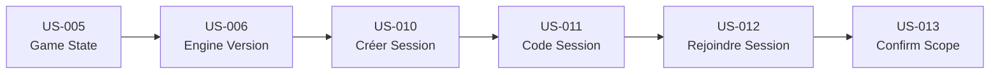

# Prompts Antigravity — Sprint 2 (Core Loop)

> **Prompts d'implémentation** pour les User Stories US-005, US-006, US-010 à US-013
> À utiliser avec Claude Opus 4.5 / Antigravity
> Date : 2025-12-29

---

## Conventions d'utilisation

### Structure des prompts

```
📖 CONTEXTE    → Docs à lire en premier
🎭 RÔLE        → Persona à endosser
🎯 OBJECTIF    → US + livrables attendus
📋 AC          → Critères d'acceptation
⚠️ CONTRAINTES → Garde-fous
📤 SORTIE      → Format du livrable
```

---

## US-005 — Stocker l'état complet par tour

```markdown
📖 CONTEXTE
Lis d'abord :
- docs/README.md
- docs/80_api_data/data_model.md (sections sessions, game_states)
- docs/20_simulation/overview.md
- docs/000_projet/specs_fonctionnelles_mvp.md (section US-005)

🎭 RÔLE
Endosse le rôle : Database Engineer + Simulation Engineer

🎯 OBJECTIF
Implémenter US-005 : Stocker l'état complet d'une partie par tour

Livrables :
1. Migration SQL : tables `sessions`, `game_states`
2. Types : Session, GameState, TurnState, Decision, Event
3. Service : lib/services/game-state.service.ts
4. API : /api/sessions/[sessionId]/turns/[turnNumber]
5. Fonctions : saveTurnState(), loadTurnState(), replayFromTurn()

📋 CRITÈRES D'ACCEPTATION
- AC1: Given tour N terminé, When sauvegarde, Then état complet persisté
- AC2: Given état tour N, When relecture, Then reprise exacte possible
- AC3: Given état, When contenu, Then inclut : décisions, événements, indices, P&L, métriques

STRUCTURE TurnState
```typescript
interface TurnState {
  session_id: string;
  turn_number: number;
  timestamp: string; // ISO8601
  
  // Indices (0-100)
  indices: {
    IAC: number;
    IPQO: number;
    IERH: number;
    IRF: number;
    IMD: number;
    IS: number;
    IPP: number;
  };
  
  // P&L
  pnl: {
    primes: number;
    sinistres: number;
    frais: number;
    produits_financiers: number;
    resultat: number;
  };
  
  // Décisions du tour
  decisions: Decision[];
  
  // Événements déclenchés
  events: TriggeredEvent[];
  
  // Métriques portefeuille par produit
  portfolio: {
    [productId: string]: {
      contracts: number;
      premiums: number;
      claims_stock: number;
      claims_flow_in: number;
      claims_flow_out: number;
    };
  };
  
  // Checksum pour validation intégrité
  checksum: string;
}
```

⚠️ CONTRAINTES
- Stockage JSONB pour flexibilité (évolution schéma)
- Checksum SHA256 du state pour détecter corruption
- Pas de modification d'un état passé (append-only)
- Compression optionnelle si state > 100KB

📤 SORTIE ATTENDUE

1. **Migration SQL**
```sql
CREATE TABLE sessions (
  id UUID PRIMARY KEY DEFAULT gen_random_uuid(),
  tenant_id UUID NOT NULL REFERENCES tenants(id),
  code VARCHAR(6) NOT NULL UNIQUE,
  status session_status NOT NULL DEFAULT 'draft',
  config JSONB NOT NULL, -- vitesse, difficulté, produits
  engine_version VARCHAR(20) NOT NULL,
  current_turn INTEGER DEFAULT 0,
  max_turns INTEGER NOT NULL,
  created_by UUID REFERENCES users(id),
  created_at TIMESTAMPTZ DEFAULT NOW(),
  started_at TIMESTAMPTZ,
  ended_at TIMESTAMPTZ
);

CREATE TABLE game_states (
  id UUID PRIMARY KEY DEFAULT gen_random_uuid(),
  session_id UUID NOT NULL REFERENCES sessions(id),
  turn_number INTEGER NOT NULL,
  state JSONB NOT NULL,
  checksum VARCHAR(64) NOT NULL,
  created_at TIMESTAMPTZ DEFAULT NOW(),
  UNIQUE(session_id, turn_number)
);
```

2. **Service**
```typescript
// lib/services/game-state.service.ts
export async function saveTurnState(
  sessionId: string, 
  turnNumber: number, 
  state: TurnState
): Promise<void>;

export async function loadTurnState(
  sessionId: string, 
  turnNumber: number
): Promise<TurnState | null>;

export async function getLatestState(
  sessionId: string
): Promise<TurnState | null>;
```

3. **Checksum**
```typescript
function computeChecksum(state: TurnState): string {
  const normalized = JSON.stringify(state, Object.keys(state).sort());
  return crypto.createHash('sha256').update(normalized).digest('hex');
}
```

CHECKLIST AVANT COMMIT
- [ ] Sauvegarde/lecture état fonctionne
- [ ] Checksum validé au chargement
- [ ] Pas de modification état passé (test)
- [ ] Types TurnState complets et stricts
- [ ] Commit: feat(game): store complete turn state [US-005]
```

---

## US-006 — Gestion version moteur

```markdown
📖 CONTEXTE
Lis d'abord :
- docs/README.md
- docs/20_simulation/overview.md
- docs/000_projet/specs_fonctionnelles_mvp.md (section US-006)

🎭 RÔLE
Endosse le rôle : Simulation Engineer + Lead Dev

🎯 OBJECTIF
Implémenter US-006 : Gestion version moteur (engine_version)

Livrables :
1. Constante ENGINE_VERSION dans lib/engine/version.ts
2. Stockage engine_version dans chaque session
3. Validation : interdire recalcul si version différente
4. Affichage version dans exports PDF et UI
5. Documentation du versioning

📋 CRITÈRES D'ACCEPTATION
- AC1: Given nouvelle partie, When création, Then engine_version stockée
- AC2: Given partie existante, When tentative recalcul avec autre version, Then erreur
- AC3: Given export PDF, When génération, Then engine_version incluse

SCHÉMA DE VERSION
```
Format: MAJOR.MINOR.PATCH
- MAJOR: changement breaking (formules, indices)
- MINOR: ajout features rétrocompatibles
- PATCH: bugfixes

Exemple: 1.0.0 (MVP)
```

⚠️ CONTRAINTES
- Version = source unique (pas de déduction)
- Pas de migration automatique entre versions
- Warning UI si comparaison scores versions différentes
- Changelog maintenu dans lib/engine/CHANGELOG.md

📤 SORTIE ATTENDUE

1. **Version constante**
```typescript
// lib/engine/version.ts
export const ENGINE_VERSION = '1.0.0' as const;

export interface EngineMetadata {
  version: typeof ENGINE_VERSION;
  releaseDate: string;
  breaking: boolean;
}

export const ENGINE_METADATA: EngineMetadata = {
  version: ENGINE_VERSION,
  releaseDate: '2025-01-15',
  breaking: false,
};
```

2. **Validation**
```typescript
// lib/engine/validation.ts
export function validateEngineVersion(
  sessionVersion: string,
  currentVersion: string = ENGINE_VERSION
): void {
  if (sessionVersion !== currentVersion) {
    throw new EngineVersionMismatchError(
      `Session uses engine ${sessionVersion}, current is ${currentVersion}. ` +
      `Recalculation not allowed.`
    );
  }
}
```

3. **Intégration session**
- À la création : `session.engine_version = ENGINE_VERSION`
- Au chargement : valider version avant calcul

4. **Changelog**
```markdown
# Engine Changelog

## 1.0.0 (2025-01-15) - MVP
- Initial release
- 7 indices: IAC, IPQO, IERH, IRF, IMD, IS, IPP
- 2 products: Auto, MRH
- Basic delay effects
```

CHECKLIST AVANT COMMIT
- [ ] ENGINE_VERSION exportée et utilisée partout
- [ ] Recalcul bloqué si version différente
- [ ] Export PDF inclut version
- [ ] CHANGELOG.md créé
- [ ] Commit: feat(engine): engine version management [US-006]
```

---

## US-010 — Créer une session

```markdown
📖 CONTEXTE
Lis d'abord :
- docs/README.md
- docs/80_api_data/data_model.md (section sessions)
- docs/30_ux_ui/screens_spec.md (création session)
- docs/000_projet/specs_fonctionnelles_mvp.md (section US-010)
- Vérifier que US-001 à US-006 sont complètes

🎭 RÔLE
Endosse le rôle : Lead Dev & Product Engineer

🎯 OBJECTIF
Implémenter US-010 : Créer une session de jeu (formateur)

Livrables :
1. API : /api/sessions (POST pour création)
2. Types : Session, SessionConfig, CreateSessionInput
3. Service : lib/services/session.service.ts
4. UI : page /dashboard/sessions/new (formulaire création)
5. Validation des paramètres avec Zod
6. Intégration audit_log pour session.create

📋 CRITÈRES D'ACCEPTATION
- AC1: Given formateur, When création session, Then paramètres configurables : vitesse, difficulté, durée, produits
- AC2: Given produits sélectionnés, When validation, Then UI/leviers configurés en conséquence
- AC3: Given session, When 0 produits sélectionnés, Then erreur bloquante

PARAMÈTRES SESSION
| Paramètre | Valeurs | Défaut |
|-----------|---------|--------|
| Vitesse | Rapide/Moyenne/Lente | Moyenne |
| Difficulté | Novice/Intermédiaire | Novice |
| Durée | 4-20 tours | 8 |
| Produits | Auto, MRH (1 min requis) | Auto+MRH |

EDGE CASES À GÉRER
- Session existante même nom → suffixe auto (ex: "Session-1")
- Modification après lancement → interdite
- Formateur sans tenant_id → erreur 403

⚠️ CONTRAINTES
- session.status = 'draft' à la création
- engine_version = ENGINE_VERSION à la création
- tenant_id = formateur.tenant_id (isolation)
- RLS sur sessions par tenant_id
- Log audit_logs: action = 'session.create'
- Validation stricte des paramètres (Zod)

📤 SORTIE ATTENDUE

1. **Types**
```typescript
// lib/types/session.ts
export type SessionSpeed = 'fast' | 'medium' | 'slow';
export type SessionDifficulty = 'novice' | 'intermediate';
export type SessionStatus = 'draft' | 'ready' | 'active' | 'completed';

export interface SessionConfig {
  speed: SessionSpeed;
  difficulty: SessionDifficulty;
  maxTurns: number;
  products: ProductId[];
}

export interface Session {
  id: string;
  tenantId: string;
  code: string;
  name: string;
  status: SessionStatus;
  config: SessionConfig;
  engineVersion: string;
  currentTurn: number;
  createdBy: string;
  createdAt: string;
  startedAt: string | null;
  endedAt: string | null;
}
```

2. **Migration SQL** (si pas existante)
```sql
CREATE TYPE session_speed AS ENUM ('fast', 'medium', 'slow');
CREATE TYPE session_difficulty AS ENUM ('novice', 'intermediate');
CREATE TYPE session_status AS ENUM ('draft', 'ready', 'active', 'completed');
```

3. **Service**
```typescript
// lib/services/session.service.ts
export async function createSession(
  input: CreateSessionInput,
  userId: string,
  tenantId: string
): Promise<Session>;
```

4. **API Route**
```typescript
// app/api/sessions/route.ts
POST /api/sessions
Body: { name, config: { speed, difficulty, maxTurns, products } }
Response: { session: Session }
```

5. **UI Création**
- Formulaire avec :
  - Nom session (text)
  - Vitesse (select)
  - Difficulté (select)
  - Durée en tours (slider 4-20)
  - Produits (checkboxes Auto/MRH, min 1)
- Bouton "Créer" → redirect vers /dashboard/sessions/[id]

CHECKLIST AVANT COMMIT
- [ ] Création session fonctionne (test manuel)
- [ ] 0 produits → erreur affichée
- [ ] engine_version = ENGINE_VERSION
- [ ] audit_log créé avec action 'session.create'
- [ ] RLS testé (autre tenant ne voit pas)
- [ ] npm run build + lint + type-check → OK
- [ ] Commit: feat(sessions): create game session [US-010]
```

---

## US-011 — Générer code/lien session

```markdown
📖 CONTEXTE
Lis d'abord :
- docs/README.md
- docs/80_api_data/data_model.md (section sessions.code)
- docs/000_projet/specs_fonctionnelles_mvp.md (section US-011)
- S'assurer que US-010 est complète

🎭 RÔLE
Endosse le rôle : Lead Dev & UX Engineer

🎯 OBJECTIF
Implémenter US-011 : Générer code/lien de session pour inviter les joueurs

Livrables :
1. Fonction : generateSessionCode() → 6 caractères alphanumériques
2. API : /api/sessions/[sessionId]/code (GET pour obtenir, POST pour régénérer)
3. UI : affichage code + lien copiable + bouton partage
4. Transition de statut : draft → ready (quand code partagé)
5. Validation statut avant régénération

📋 CRITÈRES D'ACCEPTATION
- AC1: Given session créée, When génération code, Then code 6 caractères unique
- AC2: Given session, When état, Then transitions : draft → ready → active → completed
- AC3: Given code, When partage, Then lien direct fonctionnel (/join/[code])

FORMAT CODE
- 6 caractères alphanumériques majuscules
- Exclusion de caractères ambigus (0, O, I, l)
- Charset : ABCDEFGHJKMNPQRSTUVWXYZ23456789
- Unicité garantie (retry si collision)

EDGE CASES À GÉRER
- Code expiré (session terminée) → erreur "Session terminée"
- Code déjà utilisé (même code) → régénération possible par formateur
- Session 'active' → régénération interdite

⚠️ CONTRAINTES
- Code unique globalement (pas seulement par tenant)
- Pas d'expiration temps MVP (seulement par status)
- Lien format : /join/[code]
- Code affiché en grand avec espacement : ABC DEF

📤 SORTIE ATTENDUE

1. **Générateur de code**
```typescript
// lib/utils/session-code.ts
const CHARSET = 'ABCDEFGHJKMNPQRSTUVWXYZ23456789';

export function generateSessionCode(): string {
  let code = '';
  for (let i = 0; i < 6; i++) {
    code += CHARSET[Math.floor(Math.random() * CHARSET.length)];
  }
  return code;
}

export function formatCodeForDisplay(code: string): string {
  return `${code.slice(0, 3)} ${code.slice(3, 6)}`;
}
```

2. **API**
```typescript
// app/api/sessions/[sessionId]/code/route.ts
GET  → { code, shareUrl, status }
POST → { code, shareUrl } // régénération si status = 'draft'
```

3. **UI Affichage**
```tsx
// components/sessions/SessionCodeCard.tsx
// Affiche :
// - Code en grand (ABC DEF)
// - Bouton copier lien
// - QR code (optionnel)
// - Indication de statut
```

4. **Transition statut**
```typescript
// Quand formateur clique "Prêt à démarrer" :
// session.status = 'draft' → 'ready'
// Les joueurs peuvent alors rejoindre
```

CHECKLIST AVANT COMMIT
- [ ] Code généré 6 caractères valides
- [ ] Unicité vérifiée (test 100 codes)
- [ ] Lien de partage fonctionnel
- [ ] Bouton copier fonctionne
- [ ] Régénération possible si draft
- [ ] Régénération impossible si active
- [ ] Commit: feat(sessions): generate shareable session code [US-011]
```

---

## US-012 — Rejoindre session et choisir compagnie

```markdown
📖 CONTEXTE
Lis d'abord :
- docs/README.md
- docs/80_api_data/data_model.md (sections sessions, players, companies)
- docs/30_ux_ui/screens_spec.md (écran rejoindre + sélection compagnie)
- docs/000_projet/specs_fonctionnelles_mvp.md (section US-012)
- S'assurer que US-011 est complète

🎭 RÔLE
Endosse le rôle : Lead Dev & UX Engineer

🎯 OBJECTIF
Implémenter US-012 : Rejoindre une session via code et choisir sa compagnie

Livrables :
1. Page : /join/[code] (saisie code ou accès direct)
2. API : /api/sessions/join (POST avec code)
3. UI : sélection compagnie avec fiches descriptives
4. Table : session_players (association joueur-session-compagnie)
5. Validation : joueur a accès à la session (tenant/invitation)

📋 CRITÈRES D'ACCEPTATION
- AC1: Given joueur, When code valide, Then accès écran sélection compagnie
- AC2: Given fiches compagnies, When affichage, Then ≥3 traits visibles avant choix
- AC3: Given compagnie choisie, When lancement session, Then sélection verrouillée

DONNÉES FICHE COMPAGNIE
- Nom + logo (placeholder ou icône)
- 3 traits principaux avec effet indicatif
- Forces/faiblesses en badges
- Positionnement marché (visualisation radar simplifiée)

EDGE CASES À GÉRER
- Session déjà lancée (status='active') → rejoindre impossible
- Double-clic sélection → protection debounce
- Joueur déjà dans session → redirect vers dashboard jeu
- Code invalide → message clair "Code introuvable"
- Session terminée → message "Session terminée"

⚠️ CONTRAINTES
- Joueur doit être authentifié
- Un joueur = une compagnie par session
- Pas de changement de compagnie après sélection
- Afficher seulement compagnies disponibles (non prises si multijoueur V1)
- MVP : mode solo, donc toutes compagnies disponibles

📤 SORTIE ATTENDUE

1. **Migration SQL**
```sql
CREATE TABLE session_players (
  id UUID PRIMARY KEY DEFAULT gen_random_uuid(),
  session_id UUID NOT NULL REFERENCES sessions(id),
  user_id UUID NOT NULL REFERENCES users(id),
  company_id VARCHAR(20) NOT NULL,
  joined_at TIMESTAMPTZ DEFAULT NOW(),
  UNIQUE(session_id, user_id)
);

-- RLS
ALTER TABLE session_players ENABLE ROW LEVEL SECURITY;
CREATE POLICY "Players see own sessions" ON session_players
  FOR SELECT USING (user_id = auth.uid());
```

2. **Page Join**
```tsx
// app/join/[code]/page.tsx
// 1. Validation du code
// 2. Vérification statut session (ready ou draft)
// 3. Si OK → afficher grille compagnies
// 4. Sélection → créer session_player → redirect /game/[sessionId]
```

3. **Composant Sélection**
```tsx
// components/game/CompanySelection.tsx
interface CompanyCard {
  id: string;
  name: string;
  logoPlaceholder: string;
  traits: string[];
  strengths: string[];
  weaknesses: string[];
  marketPosition: { price: 'low'|'mid'|'high', service: 'low'|'mid'|'high' };
}

// Grid responsive 3 colonnes
// Hover : effet de sélection
// Click : modal confirmation + bouton "Confirmer"
```

4. **API Join**
```typescript
// app/api/sessions/join/route.ts
POST /api/sessions/join
Body: { code: string }
Response: { session: Session, canJoin: boolean, companies: Company[] }

// Après sélection compagnie
POST /api/sessions/[sessionId]/join
Body: { companyId: string }
Response: { player: SessionPlayer, redirectUrl: string }
```

5. **Types compagnies** (données mock MVP)
```typescript
// lib/data/companies.ts
export const COMPANIES: CompanyCard[] = [
  {
    id: 'comp-1',
    name: 'AssurPlus',
    traits: ['Data-driven', 'Réseau dense', 'Innovation'],
    strengths: ['IMD +10', 'IAC +5'],
    weaknesses: ['Frais distribution +10%'],
    marketPosition: { price: 'mid', service: 'high' }
  },
  // ... 17 autres compagnies
];
```

CHECKLIST AVANT COMMIT
- [ ] /join/[code] accessible
- [ ] Code invalide → message erreur
- [ ] Fiches compagnies affichées (≥3 traits)
- [ ] Sélection crée session_player
- [ ] Debounce sur sélection
- [ ] Redirect vers /game/[sessionId] après choix
- [ ] Commit: feat(sessions): join session and select company [US-012]
```

---

## US-013 — Confirmer scope produits

```markdown
📖 CONTEXTE
Lis d'abord :
- docs/README.md
- docs/80_api_data/data_model.md (section products)
- docs/20_simulation/leviers_catalogue.md (produits Auto, MRH)
- docs/000_projet/specs_fonctionnelles_mvp.md (section US-013)
- S'assurer que US-012 est complète

🎭 RÔLE
Endosse le rôle : Lead Dev & Product Engineer

🎯 OBJECTIF
Implémenter US-013 : Confirmer le scope des produits avant le premier tour

Livrables :
1. UI : écran confirmation produits après sélection compagnie
2. Composant : ProductScopeCard avec description courte
3. API : /api/sessions/[sessionId]/confirm-scope (POST)
4. Transition : session.status = 'ready' → 'active' après confirmation
5. Affichage des leviers disponibles par produit

📋 CRITÈRES D'ACCEPTATION
- AC1: Given session rejointe, When tour 1, Then produits inclus affichés clairement
- AC2: Given produits, When affichage, Then description courte + métriques clés par produit
- AC3: Given confirmation, When validée, Then session démarre (status='active')

DONNÉES PRODUIT MVP
| Produit | Métriques affichées | Description courte |
|---------|--------------------|--------------------|
| Auto | Nb contrats, Primes, S/P, Stock sinistres | Assurance véhicules particuliers et pros |
| MRH | Nb contrats, Primes, Sensibilité climat | Assurance habitation multi-risques |

EDGE CASES À GÉRER
- Modification produits après confirmation → interdite
- Session déjà active → skip cet écran
- Aucun produit configuré → ne devrait pas arriver (validé US-010)

⚠️ CONTRAINTES
- Lecture seule : joueur ne peut pas modifier les produits
- Afficher seulement les produits sélectionnés par le formateur
- Leviers visibles dépendent de la difficulté (Novice vs Intermédiaire)
- Bouton "Commencer la partie" déclenche le tour 1

📤 SORTIE ATTENDUE

1. **Écran Confirmation**
```tsx
// app/game/[sessionId]/setup/page.tsx
// Affiche :
// 1. Récap compagnie choisie (mini-card)
// 2. Liste produits actifs avec description
// 3. Aperçu leviers disponibles (icônes)
// 4. Bouton "Commencer la partie"
```

2. **Composant ProductScope**
```tsx
// components/game/ProductScopeCard.tsx
interface ProductScopeCardProps {
  productId: 'auto' | 'mrh';
  name: string;
  description: string;
  metrics: { label: string; value: string }[];
  availableLevers: string[];
}

// Design : card avec icône produit, description, badges leviers
```

3. **Données Produits**
```typescript
// lib/data/products.ts
export const PRODUCTS = {
  auto: {
    id: 'auto',
    name: 'Automobile',
    icon: '🚗',
    description: 'Assurance véhicules particuliers et professionnels. Couvre RC, dommages, vol et assistance.',
    initialMetrics: {
      contracts: 150000,
      premiums: 45000000,
      claims_sp_ratio: 68,
      claims_stock: 12000
    },
    levers: ['tarif', 'distribution', 'sinistres', 'fraude']
  },
  mrh: {
    id: 'mrh',
    name: 'Multirisque Habitation',
    icon: '🏠',
    description: 'Assurance habitation multi-risques. Sensible aux événements climatiques.',
    initialMetrics: {
      contracts: 200000,
      premiums: 30000000,
      climate_sensitivity: 'high',
      claims_stock: 8000
    },
    levers: ['tarif', 'prevention', 'distribution', 'sinistres']
  }
};
```

4. **API Confirm**
```typescript
// app/api/sessions/[sessionId]/confirm-scope/route.ts
POST /api/sessions/[sessionId]/confirm-scope
Body: { confirmed: true }
Response: { 
  success: true, 
  session: Session, // status = 'active'
  initialState: TurnState // Tour 0/1
}

// Side effects :
// 1. session.status = 'active'
// 2. session.started_at = NOW()
// 3. Créer game_state pour tour 0 (état initial)
```

5. **Navigation**
```
/join/[code] 
  → /game/[sessionId]/setup (cet écran)
    → /game/[sessionId] (dashboard principal)
```

CHECKLIST AVANT COMMIT
- [ ] Écran setup accessible après join
- [ ] Produits affichés avec descriptions
- [ ] Leviers aperçu affichés
- [ ] Bouton "Commencer" → status='active'
- [ ] game_state tour 0 créé
- [ ] Redirect vers dashboard jeu
- [ ] Commit: feat(sessions): confirm product scope and start game [US-013]
```

---

## Ordre d'exécution Sprint 2



| Ordre | US | Dépend de | Durée estimée |
|:-----:|:---|-----------|:-------------:|
| 1 | US-005 | E0 complet | ✅ Done |
| 2 | US-006 | US-005 | 0.5 jour |
| 3 | US-010 | US-006 | 1 jour |
| 4 | US-011 | US-010 | 0.5 jour |
| 5 | US-012 | US-011 | 1.5 jours |
| 6 | US-013 | US-012 | 0.5 jour |

**Total Sprint 2 : ~4 jours**

---

## Quick Reference Sprint 2

```
╔═══════════════════════════════════════════════════════════════════╗
║               EPIC E1 — SESSIONS & CORE GAMEPLAY                  ║
╠═══════════════════════════════════════════════════════════════════╣
║  US-005 → Game state storage  │ feat(game): ...      [US-005] ✅  ║
║  US-006 → Engine version      │ feat(engine): ...    [US-006]    ║
║  US-010 → Créer session       │ feat(sessions): ...  [US-010]    ║
║  US-011 → Code session        │ feat(sessions): ...  [US-011]    ║
║  US-012 → Rejoindre session   │ feat(sessions): ...  [US-012]    ║
║  US-013 → Confirmer produits  │ feat(sessions): ...  [US-013]    ║
╠═══════════════════════════════════════════════════════════════════╣
║  CHECKLIST UNIVERSELLE :                                          ║
║  ☐ npm run build      → OK                                        ║
║  ☐ npm run type-check → OK                                        ║
║  ☐ npm run lint       → OK                                        ║
║  ☐ npm run test:run   → OK                                        ║
║  ☐ RLS policies testées                                           ║
║  ☐ audit_log créé pour actions sensibles                          ║
║  ☐ Pas de any / secrets / console.log                             ║
╚═══════════════════════════════════════════════════════════════════╝
```
