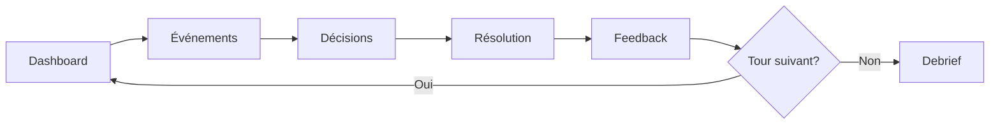
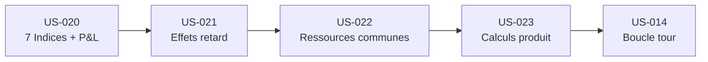

# Prompts Antigravity — Sprint 3 (Moteur)

> **Prompts d'implémentation** pour les User Stories du Sprint 3  
> Ordre d'exécution : US-020 → US-021 → US-022 → US-023 → US-014  
> À utiliser avec Claude Opus 4.5 / Antigravity  
> Date : 2025-12-31

---

## Conventions d'utilisation

### Avant chaque prompt

1. Copier le prompt complet dans une nouvelle conversation
2. S'assurer que l'IA a accès au workspace
3. Vérifier que les dépendances (Sprint 2) sont résolues

### Structure des prompts

```
📖 CONTEXTE    → Docs à lire en premier
🎭 RÔLE        → Persona à endosser
🎯 OBJECTIF    → US + livrables attendus
📋 AC          → Critères d'acceptation
⚠️ CONTRAINTES → Garde-fous
📋 DoD         → Definition of Done (checklist)
🧪 QA          → Tests et validation
📤 SORTIE      → Format du livrable
```

---

## DoD Global Sprint 3

- [ ] Code mergé dans `dev` sans conflits
- [ ] Build + lint + type-check passent (`npm run build && npm run lint`)
- [ ] Tests unitaires ajoutés (coverage ≥80% sur lib/engine/)
- [ ] Tests d'intégration API ajoutés
- [ ] Seed RNG documentée et reproductible
- [ ] Logs/télémétrie sur événements clés (turn.start, turn.resolve, etc.)
- [ ] Documentation "how to test" ajoutée dans le fichier README ou en commentaire
- [ ] Pas de régression sur tests existants

---

## QA Global Sprint 3

- 3+ tests unitaires par module moteur
- 2+ tests d'intégration (API orchestration)
- 3 propriétés moteur vérifiées : bornes [0,100], monotonicité effets, stabilité seed
- 1 scénario manuel E2E par US documenté

---

## US-020 — Calcul des 7 indices + P&L (Moteur)

```markdown
📖 CONTEXTE
Lis d'abord :
- docs/README.md
- docs/20_simulation/indices.md (ESSENTIEL — toutes les formules)
- docs/000_projet/specs_fonctionnelles_mvp.md (section US-020)
- docs/00_product/indices.md

🎭 RÔLE
Endosse le rôle : Simulation Engineer + Actuaire

🎯 OBJECTIF
Implémenter US-020 : Calcul des 7 indices + P&L

Livrables :
1. Types complets : lib/engine/types.ts
2. Module indices : lib/engine/indices.ts (7 fonctions de calcul)
3. Module P&L : lib/engine/pnl.ts
4. Fonction clamp + guards division par zéro
5. Tests unitaires : tests/engine/indices.test.ts (coverage ≥80%)
6. Tests unitaires : tests/engine/pnl.test.ts

📋 CRITÈRES D'ACCEPTATION
- AC1: Given levier activé, When résolution, Then au moins 1 indice impacté
- AC2: Given P&L, When calcul, Then = primes - sinistres - frais + produits_financiers
- AC3: Given indice, When valeur, Then dans [0, 100]

LES 7 INDICES ET FORMULES
| Indice | Formule simplifiée |
|--------|---------------------|
| IAC | 0.25×compet_prix + 0.20×qualite_service + 0.20×distrib + 0.15×garanties + 0.10×notoriete + 0.10×nps |
| IPQO | base_score × (1 - surcharge_factor), base_score = 0.25×(qualite_process + presta + si + rh) |
| IERH | 0.30×effet_effectif + 0.25×competences + 0.25×effet_turnover + 0.20×climat |
| IRF | 0.35×score_solvency + 0.30×reassurance + 0.20×provisions + 0.15×placements |
| IMD | 0.30×qualite_data + 0.25×gouv + 0.25×outillage + bonus_ia - malus_dette |
| IS | IS(t-1) - penalite_provisions - penalite_ct + bonus_prudence |
| IPP | 50 + perf_relative×25 + (100-ratio_combine_net)×0.5 |

TYPES REQUIS
```typescript
export interface IndicesState {
  IAC: number;
  IPQO: number;
  IERH: number;
  IRF: number;
  IMD: number;
  IS: number;
  IPP: number;
}

export interface CompanyVariables {
  // IAC
  competitivite_prix: number;
  qualite_service_sinistres: number;
  etendue_garanties: number;
  force_distribution: number;
  notoriete: number;
  satisfaction_nps: number;
  // IPQO
  ratio_charge_capacite: number;
  delai_gestion: number;
  taux_erreur: number;
  qualite_presta: number;
  stabilite_si: number;
  competence_rh: number;
  // IERH
  effectif_vs_besoin: number;
  competences: number;
  turnover: number;
  climat_social: number;
  // IRF
  solvency_ratio: number;
  reassurance_level: number;
  provisions_marge: number;
  placements_securite: number;
  // IMD
  qualite_donnees: number;
  gouvernance: number;
  outillage: number;
  use_cases_ia: number;
  dette_technique: number;
  // IS
  adequation_provisions: number;
  court_termisme_score: number;
  conformite: number;
  // P&L
  primes_brutes: number;
  primes_cedees: number;
  sinistres_bruts: number;
  recup_reassurance: number;
  frais_acquisition: number;
  frais_gestion: number;
  produits_financiers: number;
  resultat_marche: number;
}

export interface PnLState {
  primes: { brutes: number; nettes: number };
  sinistres: { bruts: number; nets: number };
  frais: { acquisition: number; gestion: number };
  reassurance: { primesCedees: number; recuperations: number };
  produits_financiers: number;
  resultat_technique_brut: number;
  resultat_technique_net: number;
  resultat_total: number;
  ratio_combine_brut: number;
  ratio_combine_net: number;
}
```

⚠️ CONTRAINTES
- Invariant INV-IDX-01 : 0 ≤ indice ≤ 100 (clamp obligatoire)
- Déterminisme : même input → même output (seed fixée si aléatoire)
- Guards division par zéro sur tous les ratios (primes=0, etc.)
- Variation max par tour selon difficulté : ±5 Novice, ±10 Intermédiaire, ±15 Expert
- P&L = Σ(primes) - Σ(sinistres) - Σ(frais) + Σ(produits_financiers)

📋 DoD US-020
- [ ] lib/engine/types.ts créé avec IndicesState, CompanyVariables, PnLState
- [ ] lib/engine/indices.ts implémente calculateIAC, calculateIPQO, calculateIERH, calculateIRF, calculateIMD, calculateIS, calculateIPP, calculateAllIndices
- [ ] lib/engine/pnl.ts implémente calculatePnL
- [ ] Fonction clamp(value, min, max) exportée
- [ ] Tous les ratios ont un guard contre division par zéro
- [ ] tests/engine/indices.test.ts couvre 7 fonctions + valeurs extrêmes
- [ ] tests/engine/pnl.test.ts couvre calcul P&L
- [ ] Coverage ≥80% sur lib/engine/
- [ ] Migrations DB : N/A (module calcul pur)
- [ ] Logs : console.debug sur calculs en mode développement
- [ ] Doc : commentaires JSDoc sur chaque fonction publique

🧪 QA US-020

Tests Unitaires (≥3) :
1. test_clamp_bornes : clamp(150, 0, 100) === 100, clamp(-10, 0, 100) === 0
2. test_calculateIAC_nominal : avec valeurs docs → résultat ~69.5
3. test_calculateIPP_guard_division : primes=0 → ratio_combine=100 (pas d'erreur)

Tests Intégration (≥2) :
1. test_calculateAllIndices_coherence : tous les indices retournés sont dans [0,100]
2. test_pnl_formule_complete : primes - sinistres - frais + financiers = resultat_total

Propriétés Moteur (3) :
1. Bornes : ∀ indice ∈ calculateAllIndices(vars) : 0 ≤ indice ≤ 100
2. Monotonicité : si competitivite_prix augmente, IAC augmente (toutes choses égales)
3. Stabilité seed : calculateAllIndices(vars) appelé 2× → même résultat

Scénario Manuel E2E :
1. Créer un fichier test-vectors.json avec 3 jeux de données
2. Exécuter npm run test:run -- tests/engine/
3. Vérifier que tous les tests passent
4. Injecter manuellement une valeur hors bornes (ex: competitivite_prix=150)
5. Vérifier que l'indice IAC retourné est clampé à 100

📤 SORTIE ATTENDUE

Fichiers créés :
- lib/engine/types.ts
- lib/engine/indices.ts
- lib/engine/pnl.ts
- tests/engine/indices.test.ts
- tests/engine/pnl.test.ts

Commit : feat(engine): calculate 7 indices and P&L [US-020]
```

---

## US-021 — Effets retard / Empilement / Caps

```markdown
📖 CONTEXTE
Lis d'abord :
- docs/README.md
- docs/20_simulation/indices.md (sections effets retard)
- docs/20_simulation/effets_retard.md
- docs/000_projet/specs_fonctionnelles_mvp.md (section US-021, US-023)

🎭 RÔLE
Endosse le rôle : Simulation Engineer

🎯 OBJECTIF
Implémenter US-021 : Système d'effets retard, empilement et caps

Livrables :
1. Types : lib/engine/effects-types.ts
2. Module : lib/engine/delayed-effects.ts (gestion effets différés)
3. Module : lib/engine/effect-stacking.ts (empilement + caps)
4. Tests unitaires : tests/engine/delayed-effects.test.ts
5. Tests unitaires : tests/engine/effect-stacking.test.ts

📋 CRITÈRES D'ACCEPTATION
- AC1: Given décision RH, When effet, Then délai ~2 tours (vitesse Moyenne)
- AC2: Given décision IT, When effet, Then délai 3-6 tours
- AC3: Given UI décision, When affichage, Then "effet différé attendu à T+X"
- AC4: Given effets cumulés sur même cible, When application, Then cap ±50%

TABLES DES DÉLAIS (vitesse Moyenne = trimestre)
| Domaine | Délai (tours) |
|---------|:-------------:|
| RH | 2 |
| IT/Data | 3-6 |
| Prévention | 4-8 |
| Réputation | 1-3 |
| Marketing | 1-2 |

FORMULE D'ATTÉNUATION
```
Effet(t) = Effet_Initial × (1 - decay_rate)^(t - t_decision)
decay_rate = fonction(type_levier)
```

TYPES REQUIS
```typescript
export interface DelayedEffect {
  id: string;
  decisionId: string;
  targetIndex: keyof IndicesState;
  effectType: 'absolute' | 'relative';
  value: number;
  createdAtTurn: number;
  appliesAtTurn: number;
  decayRate: number;
  domain: 'rh' | 'it' | 'prevention' | 'reputation' | 'marketing' | 'tarif';
}

export interface EffectStack {
  targetIndex: keyof IndicesState;
  effects: DelayedEffect[];
  totalDelta: number;
  cappedDelta: number;
  capApplied: boolean;
}

export interface EffectConfig {
  domain: string;
  baseDelay: number;
  decayRate: number;
  maxStack: number;
}
```

⚠️ CONTRAINTES
- Invariant INV-BIZ-08 : Σ effets_relatifs sur même cible dans même tour ≤ ±50%
- Invariant INV-BIZ-09 : delai_effet(Levier) ≥ 1T si target ∈ {IPP, IRF, IS}
- Effets persistants avec atténuation (decay)
- Seed pour reproductibilité si variation aléatoire du délai

📋 DoD US-021
- [ ] lib/engine/effects-types.ts créé avec DelayedEffect, EffectStack, EffectConfig
- [ ] lib/engine/delayed-effects.ts implémente createDelayedEffect, getActiveEffects, applyDecay
- [ ] lib/engine/effect-stacking.ts implémente stackEffects, applyCaps, calculateNetEffect
- [ ] Délais paramétrables par domaine (config objet ou YAML)
- [ ] Cap ±50% implémenté avec flag capApplied
- [ ] tests/engine/delayed-effects.test.ts avec couverture complète
- [ ] tests/engine/effect-stacking.test.ts avec cas cap dépassé
- [ ] Logs : effet créé, effet appliqué, cap déclenché
- [ ] Doc : commentaires JSDoc sur fonctions publiques

🧪 QA US-021

Tests Unitaires (≥3) :
1. test_createDelayedEffect_rh : domain='rh' → appliesAtTurn = current + 2
2. test_applyDecay : après 3 tours, effet initial 10 avec decay 0.2 → 10×0.8³ = 5.12
3. test_applyCaps : effets cumulés +80% → cappedDelta = +50%

Tests Intégration (≥2) :
1. test_effect_pipeline : créer effet → attendre tours → vérifier application
2. test_multiple_effects_same_target : 3 effets sur IAC → cap respecté

Propriétés Moteur (3) :
1. Bornes : |cappedDelta| ≤ 50 pour tout EffectStack
2. Monotonicité decay : effet(t+1) ≤ effet(t) si decay > 0
3. Stabilité seed : même séquence effets → même résultat

Scénario Manuel E2E :
1. Créer 3 décisions RH consécutives impactant IERH
2. Avancer de 2 tours (simuler)
3. Vérifier que les effets s'empilent
4. Si total >50%, vérifier que le cap s'applique et capApplied=true
5. Vérifier log "Cap déclenché sur IERH"

📤 SORTIE ATTENDUE

Fichiers créés :
- lib/engine/effects-types.ts
- lib/engine/delayed-effects.ts
- lib/engine/effect-stacking.ts
- tests/engine/delayed-effects.test.ts
- tests/engine/effect-stacking.test.ts

Commit : feat(engine): delayed effects and stacking with caps [US-021]
```

---

## US-022 — Ressources communes entre produits

```markdown
📖 CONTEXTE
Lis d'abord :
- docs/README.md
- docs/000_projet/specs_fonctionnelles_mvp.md (section US-022)
- docs/20_simulation/indices.md (IERH, IPQO)

🎭 RÔLE
Endosse le rôle : Simulation Engineer + Resource Manager

🎯 OBJECTIF
Implémenter US-022 : Ressources communes entre produits

Livrables :
1. Types : lib/engine/resource-types.ts
2. Module : lib/engine/resources.ts (gestion ressources partagées)
3. Module : lib/engine/product-engine.ts (calculs par produit)
4. Module : lib/engine/aggregation.ts (agrégation multi-produits)
5. Tests unitaires complets

📋 CRITÈRES D'ACCEPTATION
- AC1: Given budget tour, When allocation, Then consommation/solde affichés
- AC2: Given effectifs, When affectation, Then répartition par produit visible
- AC3: Given IT/Data, When investissement, Then bénéfice partagé tous produits
- AC4: Given tarif Auto modifié, When résolution, Then métriques Auto évoluent, MRH inchangé

RESSOURCES MVP
| Ressource | Type | Répartition |
|-----------|------|-------------|
| Budget tour | K€ | Consommable par décision |
| Effectifs sinistres | ETP | Partagé → impacte capacité |
| Effectifs distribution | ETP | Par produit ou partagé |
| Investissement Data/IT | K€ | Partagé → impacte IMD |
| Capital disponible | K€ | Global → impacte IRF |

RÈGLES D'AGRÉGATION
```
Indice_Global = Σ(Poids_Produit × Indice_Produit) / Σ(Poids_Produit)
Poids_Produit = Primes_Produit / Primes_Totales
```

TYPES REQUIS
```typescript
export type ProductId = 'auto' | 'mrh';

export interface ResourcePool {
  budgetTour: { total: number; consumed: number; remaining: number };
  effectifs: {
    sinistres: { total: number; byProduct: Record<ProductId, number> };
    distribution: { total: number; byProduct: Record<ProductId, number> };
    dataIT: number;
    support: number;
  };
  investissements: {
    dataIT: { total: number; pendingEffects: PendingEffect[] };
  };
  capital: { disponible: number; reassuranceBuffer: number };
}

export interface ProductMetrics {
  productId: ProductId;
  primes: number;
  sinistres: number;
  stock_sinistres: number;
  frequence: number;
  cout_moyen: number;
  ratio_sp: number;
  nbContrats: number;
  indices: IndicesState;
}

export interface AggregatedState {
  products: Record<ProductId, ProductMetrics>;
  global: { indices: IndicesState; pnl: PnLState };
  weights: Record<ProductId, number>;
}
```

⚠️ CONTRAINTES
- Budget tour : ne peut pas être négatif (guard)
- Produit sans primes → poids = 0 dans agrégation
- Un seul produit → pas d'agrégation (retour direct)
- Décisions partagées (RH, IT) affectent tous les produits
- Décisions produit-spécifiques n'affectent qu'un produit

📋 DoD US-022
- [ ] lib/engine/resource-types.ts créé avec ResourcePool, ProductMetrics, AggregatedState
- [ ] lib/engine/resources.ts implémente initializeResourcePool, consumeBudget, allocateEffectifs
- [ ] lib/engine/product-engine.ts implémente calculateProductMetrics
- [ ] lib/engine/aggregation.ts implémente calculateWeights, aggregateIndices, calculateAggregatedState
- [ ] Guard budget négatif avec message d'erreur explicite
- [ ] Cas mono-produit géré (pas d'agrégation)
- [ ] tests/engine/resources.test.ts couvre allocation budget + effectifs
- [ ] tests/engine/aggregation.test.ts couvre pondération + agrégation
- [ ] Logs : allocation effectuée, budget insuffisant, cap ressource
- [ ] Doc : commentaires JSDoc

🧪 QA US-022

Tests Unitaires (≥3) :
1. test_consumeBudget_success : 1000 dispo, consomme 500 → remaining=500
2. test_consumeBudget_insufficient : 100 dispo, demande 500 → success=false, error message
3. test_calculateWeights : Auto 70M€, MRH 30M€ → weights.auto=0.7, weights.mrh=0.3

Tests Intégration (≥2) :
1. test_aggregation_multi_products : 2 produits → indices globaux = moyenne pondérée
2. test_aggregation_single_product : 1 produit → global = product (pas de calcul)

Propriétés Moteur (3) :
1. Bornes : Σ(weights) = 1.0 (ou proche de 1 à epsilon près)
2. Isolation : modifier tarif Auto ne change pas metrics MRH
3. Stabilité : calculateAggregatedState(products) 2× → même résultat

Scénario Manuel E2E :
1. Initialiser session avec Auto + MRH
2. Effectuer une décision tarif sur Auto (-5%)
3. Résoudre le tour
4. Vérifier que metrics.auto.primes a changé
5. Vérifier que metrics.mrh.primes est inchangé
6. Vérifier que global.indices est la moyenne pondérée

📤 SORTIE ATTENDUE

Fichiers créés :
- lib/engine/resource-types.ts
- lib/engine/resources.ts
- lib/engine/product-engine.ts
- lib/engine/aggregation.ts
- tests/engine/resources.test.ts
- tests/engine/aggregation.test.ts

Commit : feat(engine): shared resources and multi-product aggregation [US-022]
```

---

## US-023 — Calculs par produit + Agrégation

```markdown
📖 CONTEXTE
Lis d'abord :
- docs/README.md
- docs/000_projet/specs_fonctionnelles_mvp.md (section US-021 originale)
- docs/20_simulation/indices.md
- lib/engine/ (modules US-020, US-021, US-022)

🎭 RÔLE
Endosse le rôle : Simulation Engineer + Actuaire

🎯 OBJECTIF
Implémenter US-023 : Calculs par produit + Agrégation multi-produits

Livrables :
1. Types : lib/engine/product-types.ts
2. Module : lib/engine/product-engine.ts (calculs par produit)
3. Module : lib/engine/aggregation.ts (agrégation multi-produits)
4. Tests unitaires : tests/engine/product-engine.test.ts
5. Tests unitaires : tests/engine/aggregation.test.ts

📋 CRITÈRES D'ACCEPTATION
- AC1: Given Auto+MRH, When décision RH/IT, Then impact partagé (capacité/qualité)
- AC2: Given tarif Auto modifié, When résolution, Then métriques Auto évoluent, MRH inchangé
- AC3: Given indices, When calcul, Then agrégation pondérée par produit

RÈGLES D'AGRÉGATION
```
Indice_Global = Σ(Poids_Produit × Indice_Produit) / Σ(Poids_Produit)
Poids_Produit = Primes_Produit / Primes_Totales
```

TYPES REQUIS
```typescript
export type ProductId = 'auto' | 'mrh';

export interface ProductMetrics {
  productId: ProductId;
  primes: number;
  sinistres: number;
  stock_sinistres: number;
  frequence: number;
  cout_moyen: number;
  ratio_sp: number;
  nbContrats: number;
  indices: IndicesState;
}

export interface AggregatedState {
  products: Record<ProductId, ProductMetrics>;
  global: { indices: IndicesState; pnl: PnLState };
  weights: Record<ProductId, number>;
}
```

⚠️ CONTRAINTES
- Produit sans primes → poids = 0 dans agrégation
- Un seul produit → pas d'agrégation (retour direct)
- Décisions partagées (RH, IT) affectent tous les produits
- Décisions produit-spécifiques n'affectent qu'un produit
- Σ(weights) = 1.0 (ou proche à epsilon près)

📋 DoD US-023
- [ ] lib/engine/product-types.ts créé avec ProductId, ProductMetrics, AggregatedState
- [ ] lib/engine/product-engine.ts implémente calculateProductMetrics, applyDecisionToProduct
- [ ] lib/engine/aggregation.ts implémente calculateWeights, aggregateIndices, calculateAggregatedState
- [ ] Cas mono-produit géré (pas d'agrégation)
- [ ] tests/engine/product-engine.test.ts couvre calculs par produit
- [ ] tests/engine/aggregation.test.ts couvre pondération + agrégation
- [ ] Logs : agrégation effectuée, poids calculés
- [ ] Doc : commentaires JSDoc

🧪 QA US-023

Tests Unitaires (≥3) :
1. test_calculateWeights : Auto 70M€, MRH 30M€ → weights.auto=0.7, weights.mrh=0.3
2. test_aggregateIndices : IAC_auto=80, IAC_mrh=60, weights 0.7/0.3 → IAC_global=74
3. test_singleProduct : 1 produit → global === product (pas de calcul)

Tests Intégration (≥2) :
1. test_aggregation_multi_products : 2 produits → indices globaux = moyenne pondérée
2. test_decision_isolation : modifier tarif Auto → metrics MRH inchangées

Propriétés Moteur (3) :
1. Bornes : Σ(weights) = 1.0 (epsilon 0.001)
2. Isolation : modifier un produit ne change pas l'autre
3. Stabilité : calculateAggregatedState(products) 2× → même résultat

Scénario Manuel E2E :
1. Initialiser session avec Auto + MRH
2. Vérifier que weights correspond au ratio de primes
3. Modifier tarif Auto (-5%)
4. Résoudre le tour
5. Vérifier que metrics.auto a changé
6. Vérifier que metrics.mrh est inchangé
7. Vérifier indices globaux = moyenne pondérée

📤 SORTIE ATTENDUE

Fichiers créés :
- lib/engine/product-types.ts
- lib/engine/product-engine.ts
- lib/engine/aggregation.ts
- tests/engine/product-engine.test.ts
- tests/engine/aggregation.test.ts

Commit : feat(engine): multi-product calculations and aggregation [US-023]
```

---

## US-014 — Boucle de tour complète (Orchestration)

```markdown
📖 CONTEXTE
Lis d'abord :
- docs/README.md
- docs/000_projet/specs_fonctionnelles_mvp.md (section US-014)
- docs/20_simulation/indices.md
- lib/engine/ (modules US-020, US-021, US-022)

🎭 RÔLE
Endosse le rôle : Full-Stack Developer + Game Designer

🎯 OBJECTIF
Implémenter US-014 : Boucle de tour complète

Livrables :
1. State Machine : lib/game/turn-machine.ts
2. Service : lib/services/turn.service.ts
3. API : POST /api/game/[sessionId]/turns/[turnNumber]/resolve
4. Page : app/game/[sessionId]/turn/[turnNumber]/page.tsx
5. Composants : TurnDashboard, EventsPanel, DecisionsPanel, ResolutionScreen, FeedbackScreen
6. Tests d'intégration

📋 CRITÈRES D'ACCEPTATION
- AC1: Given tour N, When phase, Then séquence : dashboard → événements → décisions → résolution → feedback
- AC2: Given décision validée, When submit, Then calcul moteur + passage tour N+1
- AC3: Given résolution, When feedback, Then variations majeures résumées

PHASES DU TOUR
```typescript
enum TurnPhase {
  DASHBOARD = 'dashboard',
  EVENTS = 'events',
  DECISIONS = 'decisions',
  RESOLUTION = 'resolution',
  FEEDBACK = 'feedback'
}

interface TurnContext {
  sessionId: string;
  turnNumber: number;
  phase: TurnPhase;
  previousState: TurnState | null;
  currentState: TurnState;
  pendingDecisions: Decision[];
  activeEvents: Event[];
}
```

FLUX DÉTAILLÉ


⚠️ CONTRAINTES
- State machine stricte : impossible de revenir en arrière
- Décisions atomiques : commit ou rollback
- Timer optionnel (MVP sans timeout)
- Sauvegarde automatique à chaque changement de phase
- Audit log : turn.start, turn.resolve, turn.complete
- Seed RNG passée au moteur pour reproductibilité
- Dernier tour → redirection vers debrief

📋 DoD US-014
- [ ] lib/game/turn-machine.ts implémente nextPhase, canTransition, TurnPhase enum
- [ ] lib/services/turn.service.ts implémente resolveTurn, saveTurnState, loadTurnState
- [ ] API route.ts POST /api/game/[sessionId]/turns/[turnNumber]/resolve
- [ ] Page app/game/[sessionId]/turn/[turnNumber]/page.tsx avec gestion phases
- [ ] 5 composants React : TurnDashboard, EventsPanel, DecisionsPanel, ResolutionScreen, FeedbackScreen
- [ ] Sauvegarde état à chaque transition de phase (via game-state.service)
- [ ] Audit logs créés : turn.start, turn.resolve, turn.complete
- [ ] Redirection vers /game/[sessionId]/debrief si dernier tour
- [ ] Seed RNG passée au moteur dans le contexte
- [ ] tests/game/turn-machine.test.ts
- [ ] tests/api/turn-resolve.test.ts

🧪 QA US-014

Tests Unitaires (≥3) :
1. test_nextPhase : DASHBOARD → EVENTS → DECISIONS → RESOLUTION → FEEDBACK
2. test_canTransition_valid : canTransition(EVENTS, DECISIONS) === true
3. test_canTransition_invalid : canTransition(FEEDBACK, EVENTS) === false

Tests Intégration (≥2) :
1. test_resolve_turn_api : POST decisions → 200, nextState retourné
2. test_turn_state_persistence : résoudre tour → charger → état identique

Propriétés Moteur (3) :
1. Déterminisme : même decisions + même seed → même nextState
2. Bornes indices : après résolution, tous indices dans [0,100]
3. Cohérence phase : après FEEDBACK, turnNumber++ ou fin partie

Scénario Manuel E2E :
1. Lancer une session avec 2 produits (Auto + MRH)
2. Naviguer vers /game/[sessionId]/turn/1
3. Passer phase DASHBOARD (voir indices initiaux)
4. Passer phase EVENTS (voir événements marché)
5. Passer phase DECISIONS (sélectionner 2 leviers)
6. Cliquer "Valider décisions"
7. Observer phase RESOLUTION (animation calcul)
8. Observer phase FEEDBACK (variations affichées)
9. Cliquer "Tour suivant"
10. Vérifier navigation vers /game/[sessionId]/turn/2
11. Si tour final, vérifier redirection vers debrief

📤 SORTIE ATTENDUE

Fichiers créés :
- lib/game/turn-machine.ts
- lib/services/turn.service.ts
- app/api/game/[sessionId]/turns/[turnNumber]/resolve/route.ts
- app/game/[sessionId]/turn/[turnNumber]/page.tsx
- components/game/TurnDashboard.tsx
- components/game/EventsPanel.tsx
- components/game/DecisionsPanel.tsx
- components/game/ResolutionScreen.tsx
- components/game/FeedbackScreen.tsx
- tests/game/turn-machine.test.ts
- tests/api/turn-resolve.test.ts

API Exemple :
```json
// POST /api/game/abc123/turns/1/resolve
// Request
{
  "decisions": [
    { "leverId": "LEV-TAR-01", "value": -3, "productId": "auto" },
    { "leverId": "LEV-RH-02", "value": 10, "productId": "shared" }
  ],
  "seed": 42
}

// Response 200
{
  "success": true,
  "nextState": {
    "turnNumber": 2,
    "indices": { "IAC": 72, "IPQO": 68, "IERH": 65, "IRF": 75, "IMD": 45, "IS": 70, "IPP": 62 },
    "pnl": { "resultat_total": 5200000 }
  },
  "feedback": {
    "majorVariations": [
      { "index": "IAC", "delta": +5, "drivers": ["LEV-TAR-01", "EVENT-INF-01"] }
    ]
  }
}
```

Commit : feat(game): complete turn loop with orchestration [US-014]
```

---

## Ordre d'exécution (Sprint 3)



| Ordre | US | Dépend de | Durée estimée | Statut |
|:-----:|:---|-----------|:-------------:|:------:|
| 1 | US-020 | Sprint 2 complet | 1.5 jours | ✅ Fait |
| 2 | US-021 | US-020 | 1.5 jours | ✅ Fait |
| 3 | US-022 | US-021 | 1 jour | 🔲 À faire |
| 4 | US-023 | US-022 | 1 jour | 🔲 À faire |
| 5 | US-014 | US-020, US-021, US-022, US-023 | 1.5 jours | 🔲 À faire |

**Total Sprint 3 : ~6.5 jours**

---

## Quick Reference Sprint 3

```
╔═══════════════════════════════════════════════════════════════════╗
║               EPIC E2 — MOTEUR DE SIMULATION                      ║
╠═══════════════════════════════════════════════════════════════════╣
║  US-020 → 7 indices + P&L         │ feat(engine): ... [US-020]    ║
║  US-021 → Effets retard + caps    │ feat(engine): ... [US-021]    ║
║  US-022 → Ressources communes     │ feat(engine): ... [US-022]    ║
║  US-023 → Calculs produit/agrég   │ feat(engine): ... [US-023]    ║
║  US-014 → Boucle tour             │ feat(game): ...  [US-014]     ║
╠═══════════════════════════════════════════════════════════════════╣
║  INVARIANTS CRITIQUES :                                           ║
║  ☐ 0 ≤ Indice ≤ 100 (clamp obligatoire)                          ║
║  ☐ Pas de division par zéro (guards)                             ║
║  ☐ P&L = primes - sinistres - frais + produits_financiers        ║
║  ☐ Agrégation pondérée = Σ(poids × valeur) / Σ(poids)            ║
║  ☐ Variation max/tour selon difficulté (±5, ±10, ±15)            ║
║  ☐ Cap effets cumulés ±50% (INV-BIZ-08)                          ║
║  ☐ Seed RNG pour reproductibilité                                ║
╠═══════════════════════════════════════════════════════════════════╣
║  CHECKLIST UNIVERSELLE :                                          ║
║  ☐ npm run build      → OK                                        ║
║  ☐ npm run type-check → OK                                        ║
║  ☐ npm run lint       → OK                                        ║
║  ☐ npm run test:run   → OK (coverage ≥80% moteur)                ║
║  ☐ Tests unitaires + intégration + propriétés                    ║
║  ☐ Pas de any / secrets / console.log en prod                    ║
║  ☐ Audit logs sur événements clés                                ║
╚═══════════════════════════════════════════════════════════════════╝
```
