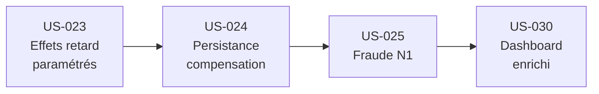

# Prompts Antigravity — Epic E3 UI & Contenu (Sprint 4)

> **Prompts d'implémentation** pour les User Stories US-023, US-024, US-025, US-030  
> Ordre d'exécution : US-023 → US-024 → US-025 → US-030  
> À utiliser avec Claude Opus 4.5 / Antigravity  
> Date : 2026-01-01

---

## Conventions d'utilisation

### Avant chaque prompt

1. Copier le prompt complet dans une nouvelle conversation
2. S'assurer que l'IA a accès au workspace
3. Vérifier que les dépendances (Sprint 3) sont résolues

### Structure des prompts

```
📖 CONTEXTE    → Docs à lire en premier
🎭 RÔLE        → Persona à endosser
🎯 OBJECTIF    → US + livrables attendus
📋 AC          → Critères d'acceptation
⚠️ CONTRAINTES → Garde-fous
📋 DoD         → Definition of Done (checklist)
🧪 QA          → Tests et validation
📤 SORTIE      → Format du livrable
```

---

## DoD Global Sprint 4

- [ ] Code mergé dans `dev` sans conflits
- [ ] Build + lint + type-check passent (`npm run build && npm run lint`)
- [ ] Tests unitaires ajoutés (coverage ≥80% sur modules modifiés)
- [ ] Tests d'intégration API ajoutés
- [ ] UI responsive (≥1024px)
- [ ] États gérés : loading, empty, error, success
- [ ] Logs/télémétrie sur événements clés
- [ ] Documentation mise à jour si nécessaire
- [ ] Pas de régression sur tests existants

---

## QA Global Sprint 4

- 3+ tests unitaires par module moteur
- 2+ tests d'intégration par US
- 3 propriétés moteur vérifiées : bornes [0,100], caps ±50%, atténuation croissante
- 1 scénario manuel E2E par US documenté

---

## US-023 — Effets retard paramétrés

```markdown
📖 CONTEXTE
Lis d'abord :
- docs/README.md
- docs/20_simulation/effets_retard.md (ESSENTIEL — système complet)
- docs/000_projet/specs_fonctionnelles_mvp.md (section US-023)
- docs/20_simulation/indices.md
- lib/engine/delayed-effects.ts (implémentation existante US-021)

🎭 RÔLE
Endosse le rôle : Simulation Engineer + Full-Stack Developer

🎯 OBJECTIF
Implémenter US-023 : Effets retard paramétrés avec UI

Livrables :
1. Configuration : lib/engine/config/delay-config.ts (paramètres par domaine)
2. Extension types : lib/engine/effects-types.ts (délais par vitesse de jeu)
3. Service : lib/services/delayed-effects.service.ts
4. Composant : components/game/DelayedEffectIndicator.tsx
5. Composant : components/game/EffectTimeline.tsx
6. Tests unitaires + intégration

📋 CRITÈRES D'ACCEPTATION
- AC1: Given décision RH, When effet, Then délai ~2 tours (vitesse Moyenne)
- AC2: Given décision IT, When effet, Then délai 3-6 tours
- AC3: Given UI décision, When affichage, Then "effet différé attendu à T+X"

TABLE DES DÉLAIS (vitesse Moyenne = trimestre)
| Domaine | Délai min | Délai max |
|---------|:---------:|:---------:|
| RH | 2 | 3 |
| IT/Data | 3 | 6 |
| Prévention | 4 | 8 |
| Réputation | 1 | 3 |
| Marketing | 1 | 2 |
| Tarif | 0 | 1 |

TYPES REQUIS
```typescript
export type GameSpeed = 'fast' | 'medium' | 'slow';

export interface DelayConfig {
  domain: string;
  baseDelay: { min: number; max: number };
  speedMultiplier: Record<GameSpeed, number>;
  decayRate: number;
  peakTurn: number;
}

export const DELAY_CONFIGS: Record<string, DelayConfig> = {
  rh: { 
    domain: 'rh',
    baseDelay: { min: 2, max: 3 },
    speedMultiplier: { fast: 0.5, medium: 1, slow: 2 },
    decayRate: 0.2,
    peakTurn: 3
  },
  it: {
    domain: 'it',
    baseDelay: { min: 3, max: 6 },
    speedMultiplier: { fast: 0.5, medium: 1, slow: 2 },
    decayRate: 0.15,
    peakTurn: 5
  },
  prevention: {
    domain: 'prevention',
    baseDelay: { min: 4, max: 8 },
    speedMultiplier: { fast: 0.5, medium: 1, slow: 2 },
    decayRate: 0.1,
    peakTurn: 6
  },
  reputation: {
    domain: 'reputation',
    baseDelay: { min: 1, max: 3 },
    speedMultiplier: { fast: 0.5, medium: 1, slow: 2 },
    decayRate: 0.25,
    peakTurn: 2
  },
  marketing: {
    domain: 'marketing',
    baseDelay: { min: 1, max: 2 },
    speedMultiplier: { fast: 0.5, medium: 1, slow: 2 },
    decayRate: 0.3,
    peakTurn: 2
  },
  tarif: {
    domain: 'tarif',
    baseDelay: { min: 0, max: 1 },
    speedMultiplier: { fast: 0.5, medium: 1, slow: 2 },
    decayRate: 0.4,
    peakTurn: 1
  }
};

export interface DelayedEffectDisplay {
  effectId: string;
  description: string;
  expectedTurn: number;
  turnsRemaining: number;
  intensity: 'low' | 'medium' | 'high';
  targetIndex: keyof IndicesState;
  estimatedImpact: { min: number; max: number };
}
```

⚠️ CONTRAINTES
- Délais paramétrables par fichier config (pas hardcodés)
- Vitesse de jeu affecte tous les délais multiplicativement
- UI doit afficher clairement "effet attendu à T+X"
- Indicateur visuel de l'intensité restante (décroissante)
- i18n ready (textes externalisés)

📋 DoD US-023
- [ ] lib/engine/config/delay-config.ts créé avec DELAY_CONFIGS exporté
- [ ] lib/services/delayed-effects.service.ts implémente getDelayForDomain, getPendingEffectsForUI
- [ ] components/game/DelayedEffectIndicator.tsx affiche "Effet attendu T+X"
- [ ] components/game/EffectTimeline.tsx affiche les effets en attente
- [ ] Délais varient selon GameSpeed (fast=×0.5, slow=×2)
- [ ] tests/engine/delay-config.test.ts couvre calcul délais
- [ ] tests/components/DelayedEffectIndicator.test.tsx
- [ ] Pas de valeurs hardcodées (tout dans config)
- [ ] Logs : effet planifié, effet appliqué avec délai réel
- [ ] Doc : commentaires JSDoc sur fonctions publiques

🧪 QA US-023

Tests Unitaires (≥3) :
1. test_getDelayForDomain_rh_medium : domain='rh', speed='medium' → delay ∈ [2,3]
2. test_getDelayForDomain_it_fast : domain='it', speed='fast' → delay ∈ [1.5,3]
3. test_getPendingEffectsForUI : 3 effets en attente → retourne 3 DelayedEffectDisplay

Tests Intégration (≥2) :
1. test_delay_service_with_engine : créer effet RH → vérifier délai correct appliqué
2. test_ui_indicator_display : créer effet → composant affiche "Effet attendu à T+3"

Propriétés Moteur (3) :
1. Délai proportionnel : delay(slow) = 2 × delay(medium)
2. Délai borné : delay ≥ baseDelay.min pour tout domaine
3. Stabilité : getDelayForDomain(domain, speed) appelé 2× → même résultat (si pas de random)

Scénario Manuel E2E :
1. Lancer une session en vitesse "Moyenne"
2. Aller sur l'écran décisions
3. Sélectionner un levier RH (ex: recrutement)
4. Vérifier que l'indicateur affiche "Effet attendu à T+2" ou "T+3"
5. Changer la vitesse de jeu à "Rapide"
6. Revérifier que l'indicateur affiche un délai réduit (T+1)
7. Valider les décisions, avancer les tours
8. Vérifier que l'effet s'applique au tour prévu

📤 SORTIE ATTENDUE

Fichiers créés :
- lib/engine/config/delay-config.ts
- lib/services/delayed-effects.service.ts
- components/game/DelayedEffectIndicator.tsx
- components/game/EffectTimeline.tsx
- tests/engine/delay-config.test.ts
- tests/components/DelayedEffectIndicator.test.tsx

Commit : feat(engine): parameterized delay effects with UI indicator [US-023]
```

---

## US-024 — Persistance et compensation

```markdown
📖 CONTEXTE
Lis d'abord :
- docs/README.md
- docs/20_simulation/effets_retard.md (section persistance)
- docs/000_projet/specs_fonctionnelles_mvp.md (section US-024)
- lib/engine/delayed-effects.ts
- lib/engine/effect-stacking.ts

🎭 RÔLE
Endosse le rôle : Simulation Engineer + Actuaire

🎯 OBJECTIF
Implémenter US-024 : Persistance des effets et coût de compensation

Livrables :
1. Module : lib/engine/effect-persistence.ts
2. Module : lib/engine/compensation.ts
3. Service : lib/services/effect-history.service.ts
4. Composant : components/game/EffectHistoryPanel.tsx
5. Composant : components/game/CompensationCostIndicator.tsx
6. Tests unitaires + intégration

📋 CRITÈRES D'ACCEPTATION
- AC1: Given décision passée, When tours suivants, Then effet persiste (atténuation)
- AC2: Given décision corrective, When tardive, Then coût de rattrapage augmenté
- AC3: Given historique, When consultation, Then décisions passées accessibles

FORMULE D'ATTÉNUATION
```
Effet(t) = Effet_Initial × (1 - decay_rate)^(t - t_decision)
```

FORMULE COÛT COMPENSATION
```
Coût_Compensation(t) = Coût_Base × (1 + 0.2 × (t - t_decision))
```

TYPES REQUIS
```typescript
export interface PersistentEffect {
  id: string;
  decisionId: string;
  originalValue: number;
  currentValue: number;
  createdAtTurn: number;
  lastCalculatedTurn: number;
  decayRate: number;
  targetIndex: keyof IndicesState;
  status: 'active' | 'depleted' | 'compensated';
}

export interface CompensationOption {
  originalDecisionId: string;
  baseCost: number;
  currentCost: number;
  costMultiplier: number;
  turnsElapsed: number;
  effectToReverse: number;
  isViable: boolean; // false si effet déjà trop atténué
}

export interface EffectHistoryEntry {
  turnNumber: number;
  decisionId: string;
  decisionDescription: string;
  targetIndex: keyof IndicesState;
  initialEffect: number;
  currentEffect: number;
  status: 'active' | 'depleted' | 'compensated';
}
```

⚠️ CONTRAINTES
- Effet minimal : si Effet(t) < 0.5 → status='depleted', effet ignoré
- Coût compensation plafonné à 3× coût base
- Compensation possible uniquement si effet encore actif (>0.5)
- Historique limité aux 10 derniers tours (performance)
- Affichage clair du coût croissant dans l'UI

📋 DoD US-024
- [ ] lib/engine/effect-persistence.ts implémente calculateDecayedEffect, updatePersistentEffect
- [ ] lib/engine/compensation.ts implémente calculateCompensationCost, applyCompensation
- [ ] lib/services/effect-history.service.ts implémente getEffectHistory, getCompensationOptions
- [ ] components/game/EffectHistoryPanel.tsx affiche l'historique des décisions/effets
- [ ] components/game/CompensationCostIndicator.tsx affiche le coût de compensation
- [ ] Seuil depletion = 0.5 implémenté
- [ ] Plafond coût compensation = 3× base implémenté
- [ ] tests/engine/effect-persistence.test.ts
- [ ] tests/engine/compensation.test.ts
- [ ] Logs : effet décayi, compensation appliquée, effet épuisé

🧪 QA US-024

Tests Unitaires (≥3) :
1. test_calculateDecayedEffect : effet initial 10, decay 0.2, t=3 → 10×0.8³ = 5.12
2. test_depletedEffect : effet initial 2, decay 0.2, t=5 → currentValue < 0.5 → status='depleted'
3. test_compensationCost : coût base 100, t_elapsed=3 → 100×(1+0.2×3) = 160

Tests Intégration (≥2) :
1. test_effect_decay_over_turns : créer effet → avancer 5 tours → vérifier atténuation
2. test_compensation_application : effet actif → appliquer compensation → status='compensated'

Propriétés Moteur (3) :
1. Monotonicité : effet(t+1) ≤ effet(t) pour decay > 0
2. Bornes coût : compensationCost ≤ 3 × baseCost
3. Conservation : si compensation appliquée, effet neutralisé

Scénario Manuel E2E :
1. Lancer une session, effectuer une décision RH négative au tour 1
2. Consulter le panneau historique, vérifier la décision est affichée
3. Avancer de 3 tours
4. Vérifier que l'effet affiché dans l'historique a diminué
5. Ouvrir les options de compensation pour cette décision
6. Vérifier que le coût affiché est > coût initial (ex: +60%)
7. Appliquer la compensation
8. Vérifier que l'effet est marqué "compensé" dans l'historique
9. Vérifier le log "Compensation appliquée"

📤 SORTIE ATTENDUE

Fichiers créés :
- lib/engine/effect-persistence.ts
- lib/engine/compensation.ts
- lib/services/effect-history.service.ts
- components/game/EffectHistoryPanel.tsx
- components/game/CompensationCostIndicator.tsx
- tests/engine/effect-persistence.test.ts
- tests/engine/compensation.test.ts

Commit : feat(engine): effect persistence and compensation with costs [US-024]
```

---

## US-025 — Fraude niveau 1

```markdown
📖 CONTEXTE
Lis d'abord :
- docs/README.md
- docs/000_projet/specs_fonctionnelles_mvp.md (section US-025)
- docs/20_simulation/leviers_catalogue.md (levier fraude)
- docs/20_simulation/indices.md (IPQO, IPP)

🎭 RÔLE
Endosse le rôle : Simulation Engineer + Expert Fraude

🎯 OBJECTIF
Implémenter US-025 : Levier Fraude niveau 1

Livrables :
1. Types : lib/engine/fraud-types.ts
2. Module : lib/engine/fraud-n1.ts
3. Composant : components/game/levers/FraudLeverN1.tsx
4. Tests unitaires

📋 CRITÈRES D'ACCEPTATION
- AC1: Given fraude N1, When activation, Then effet rapide (1-2 tours)
- AC2: Given fraude N1, When plafond, Then gain max ~5% S/P
- AC3: Given N1 actif, When N2 disponible (V1), Then prérequis affiché

EFFETS FRAUDE N1
| Action | Effet | Délai | Coût |
|--------|-------|:-----:|:----:|
| Contrôles déclaratifs | S/P -1% à -2% | 1T | Faible |
| Scoring dossiers | S/P -1% à -3% | 1-2T | Moyen |
| Détection automatique | S/P -2% à -3% | 2T | Moyen |
| Plafond cumulé | Max 5% | - | - |

TYPES REQUIS
```typescript
export type FraudActionN1 = 
  | 'controles_declaratifs'
  | 'scoring_dossiers'
  | 'detection_automatique';

export interface FraudN1Config {
  actionId: FraudActionN1;
  label: string;
  description: string;
  effectRange: { min: number; max: number }; // % réduction S/P
  delay: { min: number; max: number };
  cost: 'low' | 'medium' | 'high';
  costValue: number; // K€
  prerequisites: string[];
}

export const FRAUD_N1_ACTIONS: Record<FraudActionN1, FraudN1Config> = {
  controles_declaratifs: {
    actionId: 'controles_declaratifs',
    label: 'Contrôles déclaratifs',
    description: 'Renforcer les vérifications sur les déclarations clients',
    effectRange: { min: 1, max: 2 },
    delay: { min: 1, max: 1 },
    cost: 'low',
    costValue: 50,
    prerequisites: []
  },
  scoring_dossiers: {
    actionId: 'scoring_dossiers',
    label: 'Scoring des dossiers',
    description: 'Appliquer un score de risque fraude à chaque dossier',
    effectRange: { min: 1, max: 3 },
    delay: { min: 1, max: 2 },
    cost: 'medium',
    costValue: 150,
    prerequisites: ['controles_declaratifs']
  },
  detection_automatique: {
    actionId: 'detection_automatique',
    label: 'Détection automatique',
    description: 'IA de détection des patterns frauduleux',
    effectRange: { min: 2, max: 3 },
    delay: { min: 2, max: 2 },
    cost: 'medium',
    costValue: 200,
    prerequisites: ['scoring_dossiers']
  }
};

export const FRAUD_N1_CAP = 5; // % max de réduction S/P cumulée

export interface FraudN1State {
  activeActions: FraudActionN1[];
  totalReduction: number; // % cumulé
  capReached: boolean;
  n2Available: boolean; // prérequis pour V1
}
```

⚠️ CONTRAINTES
- Cap strict à 5% de réduction S/P cumulée (invariant)
- Actions ont des prérequis (scoring requiert contrôles)
- Affichage clair que N2 est "V1" (hors scope MVP)
- Coût déduit du budget tour
- Log si cap atteint

📋 DoD US-025
- [ ] lib/engine/fraud-types.ts créé avec FraudN1Config, FRAUD_N1_ACTIONS, FRAUD_N1_CAP
- [ ] lib/engine/fraud-n1.ts implémente activateFraudAction, calculateFraudEffect, checkN1Cap
- [ ] components/game/levers/FraudLeverN1.tsx affiche les 3 actions avec coûts et prérequis
- [ ] Cap 5% strictement respecté
- [ ] Prérequis vérifiés avant activation
- [ ] Badge "V1" affiché sur N2 (inactif, info seulement)
- [ ] tests/engine/fraud-n1.test.ts couvre effets et cap
- [ ] tests/components/FraudLeverN1.test.tsx
- [ ] Logs : action fraude activée, cap atteint

🧪 QA US-025

Tests Unitaires (≥3) :
1. test_activateFraudAction_success : budget suffisant, prérequis OK → activation
2. test_activateFraudAction_prerequisite_fail : scoring sans controles → erreur
3. test_checkN1Cap : reduction cumulée 4% + nouvelle action 3% → cappé à 5%

Tests Intégration (≥2) :
1. test_fraud_effect_on_sp_ratio : activer fraude N1 → S/P diminue
2. test_fraud_with_budget_deduction : activer fraude → budget tour diminué du coût

Propriétés Moteur (3) :
1. Cap borné : totalReduction ≤ FRAUD_N1_CAP (5%)
2. Prérequis : pas de scoring si controles non actif
3. Cohérence coût : budget après action = budget avant - costValue

Scénario Manuel E2E :
1. Lancer une session avec produit Auto
2. Aller à l'écran décisions > section Fraude
3. Vérifier que seul "Contrôles déclaratifs" est activable
4. Activer "Contrôles déclaratifs"
5. Vérifier que le budget a diminué de 50K€
6. Vérifier que "Scoring dossiers" est maintenant activable
7. Activer "Scoring dossiers"
8. Activer "Détection automatique"
9. Vérifier que le total affiché est cappé à 5%
10. Vérifier notification "Cap fraude N1 atteint"
11. Vérifier que la section N2 affiche "[V1]" et est désactivée

📤 SORTIE ATTENDUE

Fichiers créés :
- lib/engine/fraud-types.ts
- lib/engine/fraud-n1.ts
- components/game/levers/FraudLeverN1.tsx
- tests/engine/fraud-n1.test.ts
- tests/components/FraudLeverN1.test.tsx

Commit : feat(engine): fraud N1 lever with cap and prerequisites [US-025]
```

---

## US-030 — Dashboard principal enrichi

```markdown
📖 CONTEXTE
Lis d'abord :
- docs/README.md
- docs/000_projet/specs_fonctionnelles_mvp.md (section US-030)
- docs/30_ux_ui/screens_spec.md
- docs/20_simulation/indices.md
- app/game/[sessionId]/page.tsx (dashboard existant)

🎭 RÔLE
Endosse le rôle : Full-Stack Developer + UX Designer

🎯 OBJECTIF
Implémenter US-030 : Dashboard principal enrichi avec grille produits

Livrables :
1. Composant : components/game/dashboard/ProductGrid.tsx
2. Composant : components/game/dashboard/IndexGauge.tsx
3. Composant : components/game/dashboard/PnLChart.tsx
4. Composant : components/game/dashboard/EffectifRepartition.tsx
5. Composant : components/game/dashboard/AlertBadges.tsx
6. Page mise à jour : app/game/[sessionId]/dashboard/page.tsx
7. Tests composants

📋 CRITÈRES D'ACCEPTATION
- AC1: Given cockpit, When affichage, Then grille produits + total visible
- AC2: Given difficulté Novice, When vue, Then indicateurs macro uniquement
- AC3: Given difficulté Intermédiaire, When vue, Then indicateurs détaillés

INDICATEURS MVP PAR PRODUIT
| Indicateur | Affichage | Novice | Intermédiaire |
|------------|-----------|:------:|:-------------:|
| Nb contrats | Nombre | ✅ | ✅ |
| Primes collectées | € | ✅ | ✅ |
| Stock sinistres | Nombre | ✅ | ✅ |
| Flux entrées/sorties | ±Nombre | ❌ | ✅ |
| Fréquence | % | ❌ | ✅ |
| Coût moyen | € | ❌ | ✅ |

INDICATEURS GLOBAUX
| Élément | Type | Affichage |
|---------|------|-----------|
| 7 indices | Jauges | Valeur + variation |
| P&L | Graphique | Courbe + barres |
| Effectifs | Donut | Répartition |
| Alertes | Badges | Criticité + cause |

TYPES REQUIS
```typescript
export type Difficulty = 'novice' | 'intermediate' | 'expert';

export interface DashboardConfig {
  difficulty: Difficulty;
  showDetailedMetrics: boolean;
  showFluxMetrics: boolean;
  showAlerts: boolean;
  alertThresholds: AlertThresholds;
}

export interface ProductDisplayMetrics {
  productId: ProductId;
  productName: string;
  nbContrats: number;
  primesCollectees: number;
  stockSinistres: number;
  fluxEntrees?: number;
  fluxSorties?: number;
  frequence?: number;
  coutMoyen?: number;
}

export interface IndexDisplay {
  indexId: keyof IndicesState;
  label: string;
  value: number;
  previousValue: number;
  delta: number;
  deltaPercent: number;
  status: 'critical' | 'warning' | 'ok' | 'good';
  thresholds: { critical: number; warning: number; good: number };
}

export interface AlertThresholds {
  ierh_critical: number;
  imd_critical: number;
  irf_critical: number;
  stock_increase_warning: number;
}

export const DEFAULT_ALERT_THRESHOLDS: AlertThresholds = {
  ierh_critical: 40,
  imd_critical: 30,
  irf_critical: 35,
  stock_increase_warning: 20
};

export interface DashboardAlert {
  id: string;
  type: 'critical' | 'warning' | 'info';
  title: string;
  description: string;
  relatedIndex?: keyof IndicesState;
  suggestedActions: string[];
}
```

⚠️ CONTRAINTES
- Responsive ≥1024px (pas mobile MVP)
- Performance : render <100ms avec 2 produits
- Accessibilité : aria-labels sur jauges et graphiques
- CSS Modules (pas de Tailwind inline)
- Données mises à jour en temps réel via contexte
- Couleurs conformes au design system

📋 DoD US-030
- [ ] components/game/dashboard/ProductGrid.tsx affiche grille produits
- [ ] components/game/dashboard/IndexGauge.tsx affiche jauges 7 indices
- [ ] components/game/dashboard/PnLChart.tsx affiche graphique P&L
- [ ] components/game/dashboard/EffectifRepartition.tsx affiche donut effectifs
- [ ] components/game/dashboard/AlertBadges.tsx affiche alertes avec seuils
- [ ] app/game/[sessionId]/dashboard/page.tsx intègre tous les composants
- [ ] Indicateurs filtrés selon difficulté (Novice vs Intermédiaire)
- [ ] États loading/empty/error gérés
- [ ] Responsive ≥1024px testé
- [ ] tests/components/dashboard/*.test.tsx
- [ ] Logs : dashboard loaded, data refresh

🧪 QA US-030

Tests Unitaires (≥3) :
1. test_ProductGrid_renders_products : 2 produits → 2 cartes affichées
2. test_IndexGauge_status_critical : value < 30 → status='critical'
3. test_AlertBadges_threshold : IERH=35 (< 40) → alerte critique affichée

Tests Intégration (≥2) :
1. test_dashboard_page_loads : API session → page affiche tous les composants
2. test_difficulty_filtering : Novice → flux non affichés, Intermédiaire → flux affichés

Propriétés UI (3) :
1. Responsive : largeur 1024px → pas de scroll horizontal
2. Accessibilité : toutes les jauges ont aria-label avec valeur
3. Performance : render <100ms (mesure via React DevTools)

Scénario Manuel E2E :
1. Lancer une session avec 2 produits en mode "Novice"
2. Aller au dashboard (/game/[id]/dashboard)
3. Vérifier la grille produits (2 cartes : Auto + MRH)
4. Vérifier que chaque carte affiche : nb contrats, primes, stock sinistres
5. Vérifier que les indicateurs détaillés (fréquence, coût moyen) sont cachés
6. Changer la difficulté à "Intermédiaire" (si possible dans session)
7. Vérifier que les indicateurs détaillés apparaissent
8. Vérifier les 7 jauges d'indices avec couleurs appropriées
9. Vérifier le graphique P&L (si données suffisantes)
10. Vérifier la répartition effectifs (donut chart)
11. Si IERH < 40, vérifier qu'une alerte "Capacité insuffisante" apparaît
12. Redimensionner la fenêtre à 1024px, vérifier pas de scroll horizontal

📤 SORTIE ATTENDUE

Fichiers créés :
- components/game/dashboard/ProductGrid.tsx
- components/game/dashboard/ProductGrid.module.css
- components/game/dashboard/IndexGauge.tsx
- components/game/dashboard/IndexGauge.module.css
- components/game/dashboard/PnLChart.tsx
- components/game/dashboard/PnLChart.module.css
- components/game/dashboard/EffectifRepartition.tsx
- components/game/dashboard/EffectifRepartition.module.css
- components/game/dashboard/AlertBadges.tsx
- components/game/dashboard/AlertBadges.module.css
- app/game/[sessionId]/dashboard/page.tsx
- tests/components/dashboard/ProductGrid.test.tsx
- tests/components/dashboard/IndexGauge.test.tsx
- tests/components/dashboard/AlertBadges.test.tsx

Commit : feat(ui): enriched dashboard with product grid and indicators [US-030]
```

---

## Ordre d'exécution (Sprint 4)



| Ordre | US | Dépend de | Durée estimée | Statut |
|:-----:|:---|-----------|:-------------:|:------:|
| 1 | US-023 | Sprint 3 (US-021) | 1.5 jours | 🔲 À faire |
| 2 | US-024 | US-023 | 1.5 jours | 🔲 À faire |
| 3 | US-025 | US-024 | 1 jour | 🔲 À faire |
| 4 | US-030 | US-024, US-025 | 2 jours | 🔲 À faire |

**Total Sprint 4 : ~6 jours**

---

## Quick Reference Sprint 4

```
╔═══════════════════════════════════════════════════════════════════╗
║               EPIC E3 — UI & CONTENU                              ║
╠═══════════════════════════════════════════════════════════════════╣
║  US-023 → Effets retard param.  │ feat(engine): ... [US-023]      ║
║  US-024 → Persistance/compens.  │ feat(engine): ... [US-024]      ║
║  US-025 → Fraude N1             │ feat(engine): ... [US-025]      ║
║  US-030 → Dashboard enrichi     │ feat(ui): ... [US-030]          ║
╠═══════════════════════════════════════════════════════════════════╣
║  INVARIANTS CRITIQUES :                                           ║
║  ☐ Délais paramétrables (pas hardcodés)                          ║
║  ☐ Cap compensation = 3× coût base                               ║
║  ☐ Cap fraude N1 = 5% max S/P                                    ║
║  ☐ Dashboard responsive ≥1024px                                  ║
║  ☐ Indicateurs filtrés par difficulté                            ║
╚═══════════════════════════════════════════════════════════════════╝
```

---

## Checklist de validation prompts_epic_e3.md

| Critère | Vérifié |
|---------|:-------:|
| En-tête complet (titre, date, liste US) | ✅ |
| DoD Global présent | ✅ |
| QA Global présent | ✅ |
| Chaque US a toutes les sections (📖🎭🎯📋⚠️📋🧪📤) | ✅ |
| Types TypeScript inclus si applicable | ✅ |
| Exemples de code fonctionnels | ✅ |
| Tests unitaires ≥3 par module | ✅ |
| Tests intégration ≥2 par US | ✅ |
| Scénario E2E documenté par US | ✅ |
| Diagramme mermaid valide | ✅ |
| Tableau récapitulatif avec statuts | ✅ |
| Quick Reference ASCII | ✅ |
| Pas de placeholders | ✅ |
| Encodage UTF-8 | ✅ |

---

> **Document de prompts** — À exécuter dans l'ordre pour le Sprint 4.
