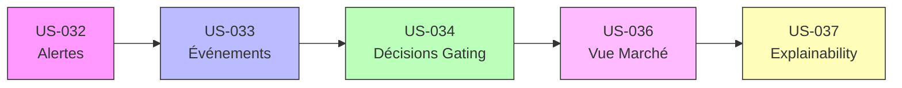

# Prompts Antigravity — Epic E4 Polish & Export UI (Sprint 5)

> **Prompts d'implémentation** pour les User Stories US-032 à US-037
> Ordre d'exécution : US-032 → US-033 → US-034 → US-036 → US-037
> À utiliser avec Claude Opus 4.5 / Antigravity
> Date : 2026-01-02

---

## 📋 Conventions d'utilisation

### Comment utiliser ce fichier

1. **Exécutez les prompts dans l'ordre** indiqué (dépendances respectées)
2. **Copiez-collez le prompt complet** de chaque US dans Antigravity
3. **Validez le DoD** avant de passer à l'US suivante
4. **Committez** avec le message formaté indiqué

### Légende des icônes

| Icône | Signification |
|:-----:|---------------|
| 📖 | Contexte et documents à lire |
| 🎭 | Rôle à endosser |
| 🎯 | Objectif et livrables |
| 📋 | Critères d'acceptation / DoD |
| ⚠️ | Contraintes et garde-fous |
| 🧪 | Tests et validation QA |
| 📤 | Sortie attendue et commit |

---

## 📋 DoD Global Sprint 5

Chaque US doit valider **TOUS** les critères suivants :

### Build & Types
- [ ] `npm run build` passe sans erreur
- [ ] `npm run type-check` passe sans erreur
- [ ] Pas de `any` sauf exception documentée

### Lint & Code
- [ ] `npm run lint` passe sans erreur
- [ ] Pas de `console.log` en production
- [ ] Pas de code commenté sans `// TODO`

### Tests
- [ ] `npm run test:run` passe
- [ ] Tests unitaires ajoutés (≥3 par module)
- [ ] Tests intégration ajoutés (≥2 par US)
- [ ] Couverture moteur maintenue ≥80%

### Documentation
- [ ] JSDoc pour fonctions publiques
- [ ] Types exportés documentés
- [ ] README mis à jour si nouveau setup

### Commit
- [ ] Format : `feat(<scope>): <description> [US-XXX]`
- [ ] Scope strict = US uniquement

---

## 🧪 QA Global Sprint 5

### Exigences minimales par US

| Type de test | Minimum requis | Description |
|--------------|:--------------:|-------------|
| Tests unitaires | ≥3 | Par module/composant |
| Tests intégration | ≥2 | Par US |
| Propriétés moteur | 3 | Si logique moteur |
| Scénario E2E | 1 | Par US (étapes numérotées) |

### Commandes de test

```bash
# Tests unitaires
npm run test:run

# Tests avec couverture
npm run test:coverage

# Tests d'un fichier spécifique
npm run test:run -- --grep "AlertSystem"
```

---

## 🎯 US-032 — Système d'Alertes

### 📖 CONTEXTE

Lis d'abord les documents suivants :
- `docs/README.md`
- `docs/000_projet/specs_fonctionnelles_mvp.md` (US-032)
- `docs/20_simulation/indices.md` (seuils et indices)
- `docs/40_engineering/definition_of_done.md`
- `docs/40_engineering/stack.md`

### 🎭 RÔLE

Endosse le rôle : **Lead Dev & UX Engineer**

Tu es responsable de créer un système d'alertes intelligent qui détecte les situations critiques et propose des recommandations actionables au joueur.

### 🎯 OBJECTIF

Implémenter le système d'alertes avec seuils configurables et recommandations contextuelles.

**Livrables attendus :**
1. `lib/engine/alerts/alert-types.ts` — Types TypeScript pour les alertes
2. `lib/engine/alerts/alert-engine.ts` — Moteur de détection des alertes
3. `lib/engine/alerts/alert-config.ts` — Configuration des seuils par difficulté
4. `components/game/alerts/AlertBadge.tsx` — Composant badge d'alerte
5. `components/game/alerts/AlertPanel.tsx` — Panneau de liste des alertes
6. `tests/engine/alerts.test.ts` — Tests unitaires moteur
7. `tests/components/AlertPanel.test.tsx` — Tests composants

### 📋 AC (Critères d'Acceptation)

| ID | Critère |
|----|---------|
| AC1 | Given seuil franchi (ex: IERH < 40), When détection, Then alerte créée avec cause probable |
| AC2 | Given alerte active, When affichage, Then leviers conseillés suggérés (top 3) |
| AC3 | Given multiple alertes, When priorité, Then affichage par criticité (🔴 > ⚠️ > 💡) |
| AC4 | Given alerte résolue, When indices OK, Then alerte disparaît automatiquement |

### ⚠️ CONTRAINTES

- **Pas de logique métier hardcodée** : utiliser `alert-config.ts` pour tous les seuils
- **Internationalisation** : tous les textes via i18n keys (préparer structure)
- **Performance** : calcul des alertes < 50ms pour 20 indices
- **Pas de refactor non demandé** : scope strict US-032
- **Types stricts** : pas de `any`

### 📋 DoD Spécifique US-032

- [ ] Types `AlertType`, `AlertSeverity`, `Alert` exportés
- [ ] Seuils configurables par difficulté (Novice vs Intermédiaire)
- [ ] 4 types d'alertes MVP implémentés :
  - [ ] Goulot RH (IERH < 40)
  - [ ] Dette IT (IMD < 30)
  - [ ] Résilience faible (IRF < 35)
  - [ ] Stock sinistres (+20% vs T-1)
- [ ] Composants AlertBadge et AlertPanel fonctionnels
- [ ] Tests unitaires moteur (≥3) passent
- [ ] Tests composants (≥2) passent

### 🧪 QA

#### Tests Unitaires (≥3)

```typescript
// tests/engine/alerts.test.ts
import { describe, it, expect } from 'vitest';
import { detectAlerts, AlertSeverity } from '@/lib/engine/alerts/alert-engine';

describe('AlertEngine', () => {
  it('should detect HR bottleneck when IERH < 40', () => {
    const indices = { IERH: 35, IMD: 60, IRF: 50 };
    const alerts = detectAlerts(indices, 'novice');
    
    expect(alerts).toContainEqual(
      expect.objectContaining({
        type: 'HR_BOTTLENECK',
        severity: AlertSeverity.WARNING,
        threshold: 40,
        currentValue: 35
      })
    );
  });

  it('should detect IT debt when IMD < 30', () => {
    const indices = { IERH: 60, IMD: 25, IRF: 50 };
    const alerts = detectAlerts(indices, 'novice');
    
    expect(alerts).toContainEqual(
      expect.objectContaining({
        type: 'IT_DEBT',
        severity: AlertSeverity.WARNING
      })
    );
  });

  it('should detect critical resilience when IRF < 35', () => {
    const indices = { IERH: 60, IMD: 60, IRF: 30 };
    const alerts = detectAlerts(indices, 'novice');
    
    expect(alerts).toContainEqual(
      expect.objectContaining({
        type: 'LOW_RESILIENCE',
        severity: AlertSeverity.CRITICAL
      })
    );
  });

  it('should return empty array when all indices above thresholds', () => {
    const indices = { IERH: 60, IMD: 60, IRF: 60 };
    const alerts = detectAlerts(indices, 'novice');
    
    expect(alerts).toHaveLength(0);
  });
});
```

#### Tests Intégration (≥2)

```typescript
// tests/integration/alerts-integration.test.ts
import { describe, it, expect } from 'vitest';
import { render, screen } from '@testing-library/react';
import { AlertPanel } from '@/components/game/alerts/AlertPanel';

describe('AlertPanel Integration', () => {
  it('should render alerts sorted by severity', () => {
    const alerts = [
      { type: 'HR_BOTTLENECK', severity: 'warning', message: 'RH' },
      { type: 'LOW_RESILIENCE', severity: 'critical', message: 'Résilience' }
    ];
    
    render(<AlertPanel alerts={alerts} />);
    
    const alertElements = screen.getAllByRole('alert');
    expect(alertElements[0]).toHaveTextContent('Résilience'); // Critical first
    expect(alertElements[1]).toHaveTextContent('RH');
  });

  it('should display recommended levers for each alert', () => {
    const alerts = [
      { 
        type: 'HR_BOTTLENECK', 
        severity: 'warning',
        recommendedLevers: ['LEV-RH-01', 'LEV-RH-02']
      }
    ];
    
    render(<AlertPanel alerts={alerts} showRecommendations />);
    
    expect(screen.getByText(/LEV-RH-01/)).toBeInTheDocument();
  });
});
```

#### Scénario E2E

```gherkin
Scenario: Alert lifecycle during gameplay
  1. Given une session en cours avec IERH = 45
  2. When le joueur fait une décision réduisant IERH à 35
  3. Then une alerte "Goulot RH" apparaît avec badge ⚠️
  4. And la cause probable "Capacité insuffisante" est affichée
  5. And les leviers recommandés incluent "Recrutement" et "Formation"
  6. When le joueur active le levier "Recrutement massif"
  7. And le tour suivant IERH remonte à 55
  8. Then l'alerte "Goulot RH" disparaît automatiquement
```

### 📤 SORTIE

**Fichiers créés/modifiés :**
```
lib/engine/alerts/
├── alert-types.ts
├── alert-engine.ts
└── alert-config.ts
components/game/alerts/
├── AlertBadge.tsx
└── AlertPanel.tsx
tests/engine/
└── alerts.test.ts
tests/components/
└── AlertPanel.test.tsx
```

**Commit message :**
```
feat(alerts): implement alert detection system with thresholds [US-032]

- Add AlertEngine with configurable thresholds per difficulty
- Create AlertBadge and AlertPanel UI components
- Support 4 alert types: HR, IT, Resilience, Claims backlog
- Add recommended levers per alert type
- Include unit tests (4) and integration tests (2)
```

---

## 🎯 US-033 — Écran Événements (News Flash)

### 📖 CONTEXTE

Lis d'abord les documents suivants :
- `docs/README.md`
- `docs/000_projet/specs_fonctionnelles_mvp.md` (US-033)
- `docs/20_simulation/events_catalogue.md` (types d'événements)
- `docs/10_game_design/gameplay_core.md` (boucle de jeu)
- `docs/40_engineering/definition_of_done.md`

### 🎭 RÔLE

Endosse le rôle : **UX Designer & Frontend Developer**

Tu crées une interface engageante pour présenter les événements du marché et de la compagnie avec un style "news flash" immersif.

### 🎯 OBJECTIF

Implémenter l'écran d'affichage des événements avec style narratif engageant.

**Livrables attendus :**
1. `lib/engine/events/event-types.ts` — Types événements enrichis
2. `lib/engine/events/event-formatter.ts` — Formateur de narratifs
3. `components/game/events/EventCard.tsx` — Carte d'événement individuel
4. `components/game/events/EventsScreen.tsx` — Écran liste événements
5. `components/game/events/NewsFlashBanner.tsx` — Bannière breaking news
6. `tests/engine/event-formatter.test.ts` — Tests formatage
7. `tests/components/EventsScreen.test.tsx` — Tests composants

### 📋 AC (Critères d'Acceptation)

| ID | Critère |
|----|---------|
| AC1 | Given événement, When affichage, Then type (marché 🌍 / compagnie 🏢) visible |
| AC2 | Given événement, When détail, Then impact quantifié + durée affichés |
| AC3 | Given événement, When news flash, Then narratif engageant (≥50 caractères) |
| AC4 | Given multiple événements, When affichage, Then ordre chronologique inversé |

### ⚠️ CONTRAINTES

- **Style engageant** : pas de texte technique brut, narratif journalistique
- **Accessibilité** : ARIA labels, navigation clavier
- **Responsive** : fonctionne sur 1024px+
- **Animations** : entrées subtiles (fade-in, slide)
- **Pas de refactor non demandé**

### 📋 DoD Spécifique US-033

- [ ] Types `GameEvent`, `EventType`, `EventImpact` exportés
- [ ] Formateur de narratifs avec templates par type d'événement
- [ ] Composant EventCard avec :
  - [ ] Icône type (marché/compagnie)
  - [ ] Titre accrocheur
  - [ ] Description narrative
  - [ ] Badge impact (positif ✅ / négatif ❌ / neutre ⚪)
  - [ ] Durée restante
- [ ] Écran EventsScreen avec liste scrollable
- [ ] NewsFlashBanner pour événements importants
- [ ] Animation d'entrée smooth

### 🧪 QA

#### Tests Unitaires (≥3)

```typescript
// tests/engine/event-formatter.test.ts
import { describe, it, expect } from 'vitest';
import { formatEventNarrative, EventType } from '@/lib/engine/events/event-formatter';

describe('EventFormatter', () => {
  it('should format climate event with dramatic narrative', () => {
    const event = {
      type: EventType.CLIMATE_EPISODE,
      severity: 'high',
      impactMRH: 15,
      impactAuto: 5
    };
    
    const narrative = formatEventNarrative(event);
    
    expect(narrative.length).toBeGreaterThan(50);
    expect(narrative).toContain('tempête');
  });

  it('should format inflation event with economic context', () => {
    const event = {
      type: EventType.INFLATION,
      rate: 8,
      duration: 'persistent'
    };
    
    const narrative = formatEventNarrative(event);
    
    expect(narrative).toContain('inflation');
    expect(narrative).toContain('8%');
  });

  it('should format disruptor event with competitive angle', () => {
    const event = {
      type: EventType.DISRUPTOR,
      priceImpact: -5,
      duration: 3
    };
    
    const narrative = formatEventNarrative(event);
    
    expect(narrative).toContain('concurrent');
    expect(narrative).toContain('-5%');
  });
});
```

#### Tests Intégration (≥2)

```typescript
// tests/integration/events-screen.test.ts
import { describe, it, expect } from 'vitest';
import { render, screen } from '@testing-library/react';
import { EventsScreen } from '@/components/game/events/EventsScreen';

describe('EventsScreen Integration', () => {
  it('should display events sorted by timestamp descending', () => {
    const events = [
      { id: '1', type: 'CLIMATE', timestamp: '2026-01-01', title: 'Ancien' },
      { id: '2', type: 'INFLATION', timestamp: '2026-01-02', title: 'Récent' }
    ];
    
    render(<EventsScreen events={events} />);
    
    const cards = screen.getAllByRole('article');
    expect(cards[0]).toHaveTextContent('Récent');
    expect(cards[1]).toHaveTextContent('Ancien');
  });

  it('should show NewsFlashBanner for critical events', () => {
    const events = [
      { id: '1', type: 'CYBER_ATTACK', severity: 'critical', title: 'Cyberattaque!' }
    ];
    
    render(<EventsScreen events={events} showFlash />);
    
    expect(screen.getByRole('banner')).toHaveTextContent('Cyberattaque');
  });
});
```

#### Scénario E2E

```gherkin
Scenario: Event display during turn
  1. Given un tour avec 2 événements (inflation + épisode climatique)
  2. When le joueur accède à l'écran événements
  3. Then une bannière NewsFlash affiche l'événement le plus critique
  4. And la liste affiche les 2 événements avec icônes type
  5. When le joueur clique sur "Épisode climatique"
  6. Then le détail affiche : impact MRH +15% S/P, durée 2 tours
  7. And un narratif engageant de type "Une tempête historique frappe..."
  8. When le joueur ferme le détail
  9. Then il peut naviguer vers l'écran suivant
```

### 📤 SORTIE

**Fichiers créés/modifiés :**
```
lib/engine/events/
├── event-types.ts
└── event-formatter.ts
components/game/events/
├── EventCard.tsx
├── EventsScreen.tsx
└── NewsFlashBanner.tsx
tests/engine/
└── event-formatter.test.ts
tests/components/
└── EventsScreen.test.tsx
```

**Commit message :**
```
feat(events): implement news flash events screen [US-033]

- Add EventFormatter with narrative templates per event type
- Create EventCard with type icons, impact badges, duration
- Add NewsFlashBanner for critical events
- Implement chronological sorting with animations
- Include unit tests (3) and integration tests (2)
```

---

## 🎯 US-034 — Écran Décisions avec Gating par Difficulté

### 📖 CONTEXTE

Lis d'abord les documents suivants :
- `docs/README.md`
- `docs/000_projet/specs_fonctionnelles_mvp.md` (US-034)
- `docs/20_simulation/leviers_catalogue.md` (catalogue complet)
- `docs/10_game_design/modes_difficultes.md` (gating)
- `docs/40_engineering/definition_of_done.md`

### 🎭 RÔLE

Endosse le rôle : **Lead Dev & Game Designer**

Tu crées le système de gating qui filtre les leviers disponibles selon la difficulté, avec une UX claire pour guider le joueur.

### 🎯 OBJECTIF

Implémenter le filtrage des leviers par niveau de difficulté avec interface adaptative.

**Livrables attendus :**
1. `lib/engine/levers/lever-gating.ts` — Logique de filtrage
2. `lib/engine/levers/lever-config.ts` — Configuration gating par difficulté
3. `components/game/levers/LeverGatingBadge.tsx` — Badge niveau requis
4. `components/game/decisions/DecisionsScreen.tsx` — Écran décisions filtré
5. `components/game/decisions/LeverCard.tsx` — Carte levier avec gating
6. `tests/engine/lever-gating.test.ts` — Tests logique gating
7. `tests/components/DecisionsScreen.test.tsx` — Tests composants

### 📋 AC (Critères d'Acceptation)

| ID | Critère |
|----|---------|
| AC1 | Given Novice, When leviers, Then uniquement macro (8-10 leviers) |
| AC2 | Given Intermédiaire, When leviers, Then macro + avancés (15-18 leviers) |
| AC3 | Given levier, When sélection, Then options + coût + impact indicatif affiché |
| AC4 | Given levier non disponible, When affichage, Then grisé avec badge "Intermédiaire+" |

### ⚠️ CONTRAINTES

- **Catalogue source** : utiliser `leviers_catalogue.md` comme référence
- **Configuration externalisée** : pas de liste hardcodée dans le code
- **UX progressive** : leviers avancés visibles mais grisés (teasing)
- **Performance** : filtrage < 20ms
- **Pas de refactor non demandé**

### 📋 DoD Spécifique US-034

- [ ] Configuration gating dans `lever-config.ts` :
  - [ ] Liste Novice : 8-10 leviers macro
  - [ ] Liste Intermédiaire : +7-8 leviers avancés
- [ ] Fonction `getAvailableLevers(difficulty)` exportée
- [ ] LeverCard avec :
  - [ ] Nom et description
  - [ ] Coût (budget, RH)
  - [ ] Impact prévu (indicatif)
  - [ ] Badge gating si non disponible
- [ ] DecisionsScreen avec :
  - [ ] Tabs par catégorie (Tarif, Distribution, RH, IT, etc.)
  - [ ] Filtrage actif par difficulté
  - [ ] Preview impact au survol

### 🧪 QA

#### Tests Unitaires (≥4)

```typescript
// tests/engine/lever-gating.test.ts
import { describe, it, expect } from 'vitest';
import { getAvailableLevers, isLeverAvailable } from '@/lib/engine/levers/lever-gating';

describe('LeverGating', () => {
  it('should return 8-10 levers for Novice difficulty', () => {
    const levers = getAvailableLevers('novice');
    
    expect(levers.length).toBeGreaterThanOrEqual(8);
    expect(levers.length).toBeLessThanOrEqual(10);
  });

  it('should return 15-18 levers for Intermediate difficulty', () => {
    const levers = getAvailableLevers('intermediate');
    
    expect(levers.length).toBeGreaterThanOrEqual(15);
    expect(levers.length).toBeLessThanOrEqual(18);
  });

  it('should include all Novice levers in Intermediate', () => {
    const noviceLevers = getAvailableLevers('novice');
    const intermediateLevers = getAvailableLevers('intermediate');
    
    noviceLevers.forEach(lever => {
      expect(intermediateLevers).toContainEqual(
        expect.objectContaining({ id: lever.id })
      );
    });
  });

  it('should correctly identify lever availability', () => {
    expect(isLeverAvailable('LEV-TAR-01', 'novice')).toBe(true);
    expect(isLeverAvailable('LEV-TAR-SEGMENT', 'novice')).toBe(false);
    expect(isLeverAvailable('LEV-TAR-SEGMENT', 'intermediate')).toBe(true);
  });
});
```

#### Tests Intégration (≥2)

```typescript
// tests/integration/decisions-screen.test.ts
import { describe, it, expect } from 'vitest';
import { render, screen } from '@testing-library/react';
import { DecisionsScreen } from '@/components/game/decisions/DecisionsScreen';

describe('DecisionsScreen Integration', () => {
  it('should show gating badge for unavailable levers in Novice', () => {
    render(<DecisionsScreen difficulty="novice" />);
    
    const segmentLever = screen.getByTestId('lever-LEV-TAR-SEGMENT');
    expect(segmentLever).toHaveClass('disabled');
    expect(segmentLever).toHaveTextContent('Intermédiaire+');
  });

  it('should show all levers enabled in Intermediate', () => {
    render(<DecisionsScreen difficulty="intermediate" />);
    
    const segmentLever = screen.getByTestId('lever-LEV-TAR-SEGMENT');
    expect(segmentLever).not.toHaveClass('disabled');
    expect(segmentLever).not.toHaveTextContent('Intermédiaire+');
  });
});
```

#### Scénario E2E

```gherkin
Scenario: Lever selection with difficulty gating
  1. Given une session en mode Novice
  2. When le joueur ouvre l'écran Décisions
  3. Then 8-10 leviers sont actifs et cliquables
  4. And les leviers avancés sont visibles mais grisés
  5. And chaque levier grisé affiche un badge "Intermédiaire+"
  6. When le joueur sélectionne "Tarif global"
  7. Then les options (-5%, 0%, +5%, +10%) sont affichées
  8. And le coût budgétaire est affiché
  9. And l'impact prévu sur IAC est indiqué
  10. When le joueur confirme -5%
  11. Then le levier est ajouté aux décisions du tour
```

### 📤 SORTIE

**Fichiers créés/modifiés :**
```
lib/engine/levers/
├── lever-gating.ts
└── lever-config.ts
components/game/levers/
└── LeverGatingBadge.tsx
components/game/decisions/
├── DecisionsScreen.tsx
└── LeverCard.tsx
tests/engine/
└── lever-gating.test.ts
tests/components/
└── DecisionsScreen.test.tsx
```

**Commit message :**
```
feat(decisions): implement lever gating by difficulty [US-034]

- Add LeverGating system with Novice (8-10) and Intermediate (15-18) configs
- Create DecisionsScreen with category tabs and filtering
- Add LeverCard with cost, impact preview, and gating badge
- Show advanced levers as teaser (grayed) in Novice mode
- Include unit tests (4) and integration tests (2)
```

---

## 🎯 US-036 — Vue Marché

### 📖 CONTEXTE

Lis d'abord les documents suivants :
- `docs/README.md`
- `docs/000_projet/specs_fonctionnelles_mvp.md` (US-036)
- `docs/20_simulation/indices.md` (IAC, parts de marché)
- `docs/10_game_design/gameplay_core.md` (compétition simulée)
- `docs/40_engineering/definition_of_done.md`

### 🎭 RÔLE

Endosse le rôle : **Data Visualization Expert & Frontend Developer**

Tu crées une vue marché claire montrant la position concurrentielle du joueur.

### 🎯 OBJECTIF

Implémenter la vue marché avec parts de marché et tendances prix par produit.

**Livrables attendus :**
1. `lib/engine/market/market-types.ts` — Types données marché
2. `lib/engine/market/market-calculator.ts` — Calculs parts de marché
3. `components/game/market/MarketShareChart.tsx` — Graphique parts de marché
4. `components/game/market/PriceTrendChart.tsx` — Graphique tendances prix
5. `components/game/market/MarketScreen.tsx` — Écran vue marché
6. `tests/engine/market-calculator.test.ts` — Tests calculs
7. `tests/components/MarketScreen.test.tsx` — Tests composants

### 📋 AC (Critères d'Acceptation)

| ID | Critère |
|----|---------|
| AC1 | Given vue marché, When affichage, Then parts de marché par produit visibles |
| AC2 | Given concurrents, When données, Then prix moyens du marché affichés |
| AC3 | Given tendances, When graphique, Then évolution sur 4 derniers tours |
| AC4 | Given position joueur, When comparaison, Then écart vs moyenne marché |

### ⚠️ CONTRAINTES

- **Données simulées cohérentes** : parts doivent totaliser 100%
- **3-5 concurrents fictifs** : noms génériques (Concurrent A, B, C)
- **Graphiques lisibles** : légende, couleurs distinctes
- **Responsive** : adapté 1024px+
- **Pas de refactor non demandé**

### 📋 DoD Spécifique US-036

- [ ] Types `MarketData`, `Competitor`, `PriceTrend` exportés
- [ ] Calcul parts de marché avec :
  - [ ] Part joueur (dynamique selon IAC)
  - [ ] 3-5 concurrents simulés
  - [ ] Total = 100%
- [ ] MarketShareChart avec :
  - [ ] Pie chart ou bar chart
  - [ ] Légende avec %
  - [ ] Highlight position joueur
- [ ] PriceTrendChart avec :
  - [ ] Line chart 4 derniers tours
  - [ ] Prix joueur vs moyenne marché
  - [ ] Par produit (Auto, MRH)
- [ ] MarketScreen intégrant les deux graphiques

### 🧪 QA

#### Tests Unitaires (≥3)

```typescript
// tests/engine/market-calculator.test.ts
import { describe, it, expect } from 'vitest';
import { calculateMarketShares, simulateCompetitors } from '@/lib/engine/market/market-calculator';

describe('MarketCalculator', () => {
  it('should calculate market shares totaling 100%', () => {
    const playerIAC = 70;
    const shares = calculateMarketShares(playerIAC);
    
    const total = shares.reduce((sum, s) => sum + s.share, 0);
    expect(total).toBeCloseTo(100, 1);
  });

  it('should give higher share to player with high IAC', () => {
    const highIAC = calculateMarketShares(80);
    const lowIAC = calculateMarketShares(40);
    
    const playerShareHigh = highIAC.find(s => s.isPlayer)?.share || 0;
    const playerShareLow = lowIAC.find(s => s.isPlayer)?.share || 0;
    
    expect(playerShareHigh).toBeGreaterThan(playerShareLow);
  });

  it('should generate 3-5 competitors', () => {
    const competitors = simulateCompetitors();
    
    expect(competitors.length).toBeGreaterThanOrEqual(3);
    expect(competitors.length).toBeLessThanOrEqual(5);
  });
});
```

#### Tests Intégration (≥2)

```typescript
// tests/integration/market-screen.test.ts
import { describe, it, expect } from 'vitest';
import { render, screen } from '@testing-library/react';
import { MarketScreen } from '@/components/game/market/MarketScreen';

describe('MarketScreen Integration', () => {
  it('should display market share chart with player highlighted', () => {
    const marketData = {
      shares: [
        { name: 'Vous', share: 25, isPlayer: true },
        { name: 'Concurrent A', share: 30, isPlayer: false }
      ]
    };
    
    render(<MarketScreen data={marketData} />);
    
    expect(screen.getByText('Vous')).toBeInTheDocument();
    expect(screen.getByText('25%')).toBeInTheDocument();
  });

  it('should display price trend chart with 4 data points', () => {
    const marketData = {
      priceTrends: [
        { turn: 1, playerPrice: 100, marketAvg: 105 },
        { turn: 2, playerPrice: 98, marketAvg: 104 },
        { turn: 3, playerPrice: 97, marketAvg: 103 },
        { turn: 4, playerPrice: 95, marketAvg: 102 }
      ]
    };
    
    render(<MarketScreen data={marketData} />);
    
    expect(screen.getByTestId('price-trend-chart')).toBeInTheDocument();
  });
});
```

#### Scénario E2E

```gherkin
Scenario: Market view analysis
  1. Given une session avec 4 tours joués
  2. When le joueur ouvre la vue marché
  3. Then un graphique parts de marché affiche 4-6 acteurs
  4. And la part du joueur est mise en évidence (couleur distincte)
  5. And chaque part affiche un pourcentage
  6. When le joueur consulte les tendances prix
  7. Then un graphique ligne montre l'évolution sur 4 tours
  8. And deux lignes : "Votre prix" et "Moyenne marché"
  9. And l'écart relatif est calculé (ex: "-5% vs marché")
```

### 📤 SORTIE

**Fichiers créés/modifiés :**
```
lib/engine/market/
├── market-types.ts
└── market-calculator.ts
components/game/market/
├── MarketShareChart.tsx
├── PriceTrendChart.tsx
└── MarketScreen.tsx
tests/engine/
└── market-calculator.test.ts
tests/components/
└── MarketScreen.test.tsx
```

**Commit message :**
```
feat(market): implement market view with shares and price trends [US-036]

- Add MarketCalculator for share computation (total = 100%)
- Create MarketShareChart with player highlight
- Add PriceTrendChart with 4-turn evolution
- Simulate 3-5 competitors with coherent pricing
- Include unit tests (3) and integration tests (2)
```

---

## 🎯 US-037 — Explainability (Top 3 Drivers)

### 📖 CONTEXTE

Lis d'abord les documents suivants :
- `docs/README.md`
- `docs/000_projet/specs_fonctionnelles_mvp.md` (US-037)
- `docs/20_simulation/indices.md` (calculs indices)
- `docs/20_simulation/effets_retard.md` (persistence effets)
- `docs/40_engineering/definition_of_done.md`

### 🎭 RÔLE

Endosse le rôle : **Data Scientist & UX Designer**

Tu crées un système d'explication des variations d'indices pour aider le joueur à comprendre les causes.

### 🎯 OBJECTIF

Implémenter le système d'explainability affichant les top 3 drivers pour chaque variation majeure.

**Livrables attendus :**
1. `lib/engine/explainability/driver-types.ts` — Types drivers
2. `lib/engine/explainability/driver-analyzer.ts` — Analyseur de contributions
3. `lib/engine/explainability/driver-formatter.ts` — Formateur lisible
4. `components/game/explainability/DriverCard.tsx` — Carte driver
5. `components/game/explainability/DriversPanel.tsx` — Panneau top 3
6. `tests/engine/driver-analyzer.test.ts` — Tests analyse
7. `tests/components/DriversPanel.test.tsx` — Tests composants

### 📋 AC (Critères d'Acceptation)

| ID | Critère |
|----|---------|
| AC1 | Given variation majeure (≥5 pts), When analyse, Then top 3 drivers affichés |
| AC2 | Given driver, When type, Then = décision / événement / effet retard |
| AC3 | Given driver, When contribution, Then % de la variation totale |
| AC4 | Given drivers, When affichage, Then triés par contribution décroissante |

### ⚠️ CONTRAINTES

- **Variation seuil** : déclencher analyse si |Δindice| ≥ 5 points
- **3 types de drivers** : décisions joueur, événements, effets retard
- **Contributions sommées** : peuvent dépasser 100% (effets opposés)
- **Langage clair** : pas de jargon technique
- **Pas de refactor non demandé**

### 📋 DoD Spécifique US-037

- [ ] Types `Driver`, `DriverType`, `Contribution` exportés
- [ ] Fonction `analyzeDrivers(indexId, previousValue, currentValue)` :
  - [ ] Identifie les 3 principales causes
  - [ ] Calcule la contribution de chaque cause
  - [ ] Trie par |contribution| décroissante
- [ ] DriverCard avec :
  - [ ] Icône type (📊 décision, 🌍 événement, ⏳ retard)
  - [ ] Description cause
  - [ ] Contribution (+X ou -Y)
  - [ ] Impact sur l'indice (↑ ou ↓)
- [ ] DriversPanel intégré au feedback post-résolution

### 🧪 QA

#### Tests Unitaires (≥4)

```typescript
// tests/engine/driver-analyzer.test.ts
import { describe, it, expect } from 'vitest';
import { analyzeDrivers, DriverType } from '@/lib/engine/explainability/driver-analyzer';

describe('DriverAnalyzer', () => {
  it('should return top 3 drivers sorted by contribution', () => {
    const context = {
      decisions: [{ id: 'LEV-TAR-01', impact: { IAC: 3 } }],
      events: [{ id: 'EVT-INFLATION', impact: { IAC: -2 } }],
      delayedEffects: [{ origin: 'LEV-MKT-01', turn: 2, impact: { IAC: 4 } }]
    };
    
    const drivers = analyzeDrivers('IAC', 50, 55, context);
    
    expect(drivers).toHaveLength(3);
    expect(Math.abs(drivers[0].contribution)).toBeGreaterThanOrEqual(
      Math.abs(drivers[1].contribution)
    );
  });

  it('should identify decision as driver type', () => {
    const context = {
      decisions: [{ id: 'LEV-TAR-01', impact: { IAC: 5 } }],
      events: [],
      delayedEffects: []
    };
    
    const drivers = analyzeDrivers('IAC', 50, 55, context);
    
    expect(drivers[0].type).toBe(DriverType.DECISION);
  });

  it('should identify delayed effect as driver type', () => {
    const context = {
      decisions: [],
      events: [],
      delayedEffects: [{ origin: 'LEV-RH-01', turn: 2, impact: { IERH: 8 } }]
    };
    
    const drivers = analyzeDrivers('IERH', 40, 48, context);
    
    expect(drivers[0].type).toBe(DriverType.DELAYED_EFFECT);
  });

  it('should return empty array if variation < 5', () => {
    const context = {
      decisions: [{ id: 'LEV-TAR-01', impact: { IAC: 2 } }],
      events: [],
      delayedEffects: []
    };
    
    const drivers = analyzeDrivers('IAC', 50, 52, context);
    
    expect(drivers).toHaveLength(0);
  });
});
```

#### Tests Intégration (≥2)

```typescript
// tests/integration/drivers-panel.test.ts
import { describe, it, expect } from 'vitest';
import { render, screen } from '@testing-library/react';
import { DriversPanel } from '@/components/game/explainability/DriversPanel';

describe('DriversPanel Integration', () => {
  it('should display top 3 drivers with icons', () => {
    const drivers = [
      { type: 'DECISION', description: 'Baisse tarif -3%', contribution: 3, direction: 'up' },
      { type: 'EVENT', description: 'Inflation +2%', contribution: -2, direction: 'down' },
      { type: 'DELAYED_EFFECT', description: 'Marketing T-2', contribution: 4, direction: 'up' }
    ];
    
    render(<DriversPanel drivers={drivers} indexName="IAC" variation={5} />);
    
    expect(screen.getAllByRole('listitem')).toHaveLength(3);
    expect(screen.getByText('📊')).toBeInTheDocument(); // Decision icon
    expect(screen.getByText('🌍')).toBeInTheDocument(); // Event icon
    expect(screen.getByText('⏳')).toBeInTheDocument(); // Delayed icon
  });

  it('should show contribution percentages', () => {
    const drivers = [
      { type: 'DECISION', description: 'Baisse tarif', contribution: 3, direction: 'up' }
    ];
    
    render(<DriversPanel drivers={drivers} indexName="IAC" variation={5} />);
    
    expect(screen.getByText(/\+3/)).toBeInTheDocument();
  });
});
```

#### Scénario E2E

```gherkin
Scenario: Explainability after turn resolution
  1. Given un tour résolu avec IAC passant de 50 à 58 (+8)
  2. When la phase feedback s'affiche
  3. Then un panneau "Pourquoi IAC +8?" apparaît
  4. And il affiche 3 drivers :
     | Rang | Type | Description | Contribution |
     | 1 | ⏳ Effet retard | Marketing T-2 | +4 |
     | 2 | 📊 Décision | Baisse tarif -3% | +3 |
     | 3 | 🌍 Événement | Inflation +2% | -2 |
  5. And chaque driver a une icône correspondant à son type
  6. And les contributions sont affichées avec signe (+ ou -)
  7. When le joueur clique sur un driver
  8. Then un tooltip affiche plus de détails
```

### 📤 SORTIE

**Fichiers créés/modifiés :**
```
lib/engine/explainability/
├── driver-types.ts
├── driver-analyzer.ts
└── driver-formatter.ts
components/game/explainability/
├── DriverCard.tsx
└── DriversPanel.tsx
tests/engine/
└── driver-analyzer.test.ts
tests/components/
└── DriversPanel.test.tsx
```

**Commit message :**
```
feat(explainability): implement top 3 drivers analysis [US-037]

- Add DriverAnalyzer to identify decision/event/delayed effect contributions
- Create DriversPanel for feedback display
- Support 3 driver types with icons and contribution percentages
- Trigger only for variations >= 5 points
- Include unit tests (4) and integration tests (2)
```

---

## 📊 Ordre d'Exécution

### Diagramme de dépendances



### Tableau récapitulatif

| Ordre | US | Titre | Dépend de | Durée estimée | Statut |
|:-----:|:---|-------|-----------|:-------------:|:------:|
| 1 | US-032 | Système d'Alertes | Sprint 4 | 1 jour | 🔲 À faire |
| 2 | US-033 | Écran Événements | US-032 | 1 jour | 🔲 À faire |
| 3 | US-034 | Décisions Gating | US-033 | 1.5 jours | 🔲 À faire |
| 4 | US-036 | Vue Marché | US-034 | 1 jour | 🔲 À faire |
| 5 | US-037 | Explainability | US-036 | 1 jour | 🔲 À faire |

**Durée totale estimée : 5.5 jours**

---

## 📋 Quick Reference

```
╔═══════════════════════════════════════════════════════════════════════════════════════════╗
║                         EPIC E4 — POLISH & EXPORT UI (Sprint 5)                           ║
╠═══════════════════════════════════════════════════════════════════════════════════════════╣
║  US-032 → Alertes              │ feat(alerts): implement alert detection [US-032]         ║
║  US-033 → Événements           │ feat(events): implement news flash screen [US-033]       ║
║  US-034 → Décisions Gating     │ feat(decisions): implement lever gating [US-034]         ║
║  US-036 → Vue Marché           │ feat(market): implement market view [US-036]             ║
║  US-037 → Explainability       │ feat(explainability): implement top 3 drivers [US-037]   ║
╠═══════════════════════════════════════════════════════════════════════════════════════════╣
║  COMMANDES                                                                                ║
║  npm run build        → Build production                                                  ║
║  npm run type-check   → Vérification types                                                ║
║  npm run lint         → ESLint                                                            ║
║  npm run test:run     → Tests Vitest                                                      ║
║  npm run test:coverage → Coverage report                                                  ║
╚═══════════════════════════════════════════════════════════════════════════════════════════╝
```

---

## ✅ Checklist de Validation Finale

| Critère | Vérifié |
|---------|:-------:|
| En-tête complet (titre, date, liste US) | ☑ |
| DoD Global présent | ☑ |
| QA Global présent | ☑ |
| Chaque US a toutes les sections (📖🎭🎯📋⚠️📋🧪📤) | ☑ |
| Types TypeScript inclus | ☑ |
| Exemples de code fonctionnels | ☑ |
| Tests unitaires ≥3 par module | ☑ |
| Tests intégration ≥2 par US | ☑ |
| Scénario E2E documenté par US | ☑ |
| Diagramme mermaid valide | ☑ |
| Tableau récapitulatif avec statuts | ☑ |
| Quick Reference ASCII | ☑ |
| Pas de placeholders | ☑ |
| Encodage UTF-8 | ☑ |
