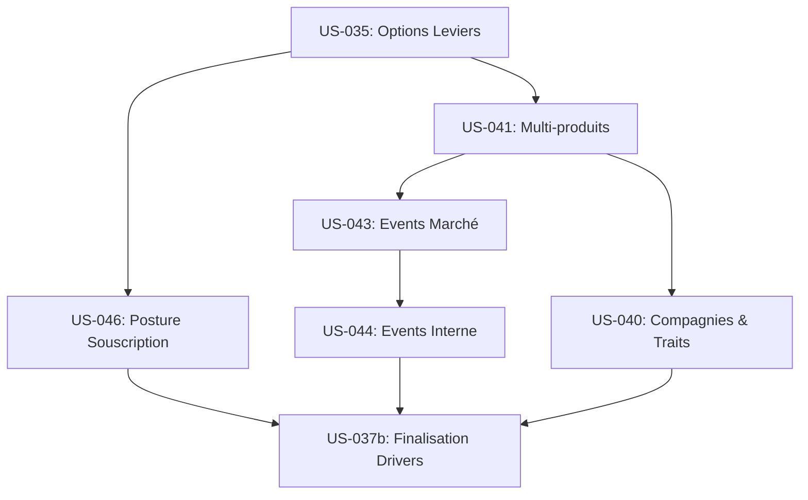

# Prompts Antigravity — Contenu & Scoring (Sprint 6)

> **Prompts d'implémentation** pour les User Stories US-035 à US-037b
> Ordre d'exécution : US-035 → US-040 → US-041 → US-043 → US-044 → US-046 → US-037b
> À utiliser avec Claude Opus 4.5 / Antigravity
> Date : 2026-01-04

---

## 📋 Conventions d'utilisation

### Comment utiliser ce fichier

1. **Exécutez les prompts dans l'ordre** indiqué (dépendances respectées)
2. **Copiez-collez le prompt complet** de chaque US dans Antigravity
3. **Validez le DoD** avant de passer à l'US suivante
4. **Committez** avec le message formaté indiqué

### Légende des icônes

| Icône | Signification |
|:-----:|---------------|
| 📖 | Contexte et documents à lire |
| 🎭 | Rôle à endosser |
| 🎯 | Objectif et livrables |
| 📋 | Critères d'acceptation / DoD |
| ⚠️ | Contraintes et garde-fous |
| 🧪 | Tests et validation QA |
| 📤 | Sortie attendue et commit |

---

## 📋 DoD Global Sprint 6

Chaque US doit valider **TOUS** les critères suivants :

### Build & Types
- [ ] `npm run build` passe sans erreur
- [ ] `npm run type-check` passe sans erreur
- [ ] Pas de `any` sauf exception documentée

### Lint & Code
- [ ] `npm run lint` passe sans erreur
- [ ] Pas de `console.log` en production
- [ ] Pas de code commenté sans `// TODO`

### Tests
- [ ] `npm run test:run` passe
- [ ] Tests unitaires ajoutés (≥3 par module)
- [ ] Tests intégration ajoutés (≥2 par US)
- [ ] Couverture moteur maintenue ≥80%

---

## 🧪 QA Global Sprint 6

### Exigences minimales par US

| Type de test | Minimum requis | Description |
|--------------|:--------------:|-------------|
| Tests unitaires | ≥3 | Par module/composant |
| Tests intégration | ≥2 | Par US |
| Propriétés moteur | 3 | Si logique moteur |
| Scénario E2E | 1 | Par US (étapes numérotées) |

---

## 🎯 US-035 — Sélection niveau/intensité leviers (Options)

### 📖 CONTEXTE

Lis d'abord les documents suivants :
- `docs/README.md`
- `docs/20_simulation/leviers_catalogue.md` (Sections 1.1 Schema et exemples Options/Levels)
- `lib/engine/types.ts` (Structure actuelle Decision/Action)
- `components/game/levers/LeverCard.tsx` (Composant actuel)
- `docs/40_engineering/definition_of_done.md`

### 🎭 RÔLE

Endosse le rôle : **Senior Frontend Engineer + UX Designer**

Tu es responsable d'enrichir l'interaction avec les leviers pour dépasser le simple ON/OFF et permettre des choix stratégiques fins (options) ou des investissements long terme (niveaux).

### 🎯 OBJECTIF

Implémenter la sélection d'options et de niveaux progressifs pour les leviers.
Actuellement, un levier est seulement ON/OFF. Il doit supporter :
1. Les options mutuellement exclusives (ex: Tarif Agressif / Standard / Premium)
2. Les niveaux progressifs (ex: Fraude N1 → N2 → N3) avec prérequis

**Livrables attendus :**
1. `lib/engine/levers/option-types.ts` — Types pour options et niveaux
2. `lib/engine/levers/levers-helper.ts` — Utilitaires de résolution
3. `components/game/levers/LeverOptions.tsx` — Sélecteur d'options
4. `components/game/levers/ProgressiveLevel.tsx` — Sélecteur de niveaux
5. `tests/engine/lever-options.test.ts` — Tests logique
6. `tests/components/LeverCard.test.tsx` — Tests UX

### 📋 AC (Critères d'Acceptation)

| ID | Critère |
|----|---------|
| AC1 | Given levier à options (ex: Tarif), When click, Then liste options affichée |
| AC2 | Given levier progressif (ex: Fraude), When click, Then niveaux affichés avec statut (Acquis / Dispo / Verrouillé) |
| AC3 | Given option sélectionnée, When validation, Then l'action contient `optionId` |
| AC4 | Given niveau N2, When prérequis N1 non acquis, Then sélection impossible (disabled + tooltip) |
| AC5 | Given sélection validée, When tour résolu, Then effet spécifique de l'option appliqué |

### ⚠️ CONTRAINTES

- **Types stricts** : Pas de `any`, utiliser des Generics si nécessaire
- **UX** : Feedback immédiat sur le coût et l'impact prévisionnel lors du choix d'une option
- **Compatibilité** : Ne pas casser les leviers simples (ON/OFF) existants
- **Performance** : Rendu instantané même avec 50 leviers

### 📋 DoD Spécifique US-035

- [ ] Interface `Lever` mise à jour avec `options` et `levels`
- [ ] Interface `Action` mise à jour avec `optionId`
- [ ] Composant `LeverCard` refactorisé pour intégrer les nouveaux sélecteurs
- [ ] Validation des prérequis de niveau (N1 requis pour N2)

### 🧪 QA

#### Tests Unitaires (≥3)

```typescript
// tests/engine/lever-options.test.ts
import { describe, it, expect } from 'vitest';
import { resolveLeverEffect } from '@/lib/engine/levers/levers-helper';
import { Lever, Action } from '@/lib/engine/types';

describe('LeverOptions Logic', () => {
  it('should apply specific effect for selected option', () => {
    const lever: Lever = {
      id: 'LEV-TEST',
      options: [
        { id: 'opt1', effects: [{ target: 'IAC', value: 10 }] },
        { id: 'opt2', effects: [{ target: 'IAC', value: 20 }] }
      ]
    } as any;
    
    // Action avec option 2
    const action: Action = { leverId: 'LEV-TEST', optionId: 'opt2' };
    const effects = resolveLeverEffect(lever, action);
    
    expect(effects[0].value).toBe(20);
  });

  it('should validate level prerequisites', () => {
    const lever: Lever = {
      id: 'LEV-PROG',
      type: 'Progressive',
      levels: {
        N2: { prerequisites: [{ type: 'lever_level', target: 'LEV-PROG', value: 'N1' }] }
      }
    } as any;
    
    const activeLevers = {}; // N1 non actif
    const canUnlock = checkPrerequisites(lever.levels.N2, activeLevers);
    
    expect(canUnlock).toBe(false);
  });
});
```

#### Tests Intégration (≥2)

```typescript
// tests/components/LeverCard.test.tsx
import { render, screen, fireEvent } from '@testing-library/react';
import { LeverCard } from '@/components/game/levers/LeverCard';

describe('LeverCard Integration', () => {
  it('should display options when lever has options', () => {
    const lever = { 
      id: 'L1', 
      name: 'Tarif', 
      options: [{id: 'A', label: 'Agressif'}, {id: 'B', label: 'Standard'}] 
    };
    
    render(<LeverCard lever={lever} />);
    
    fireEvent.click(screen.getByText('Tarif'));
    expect(screen.getByText('Agressif')).toBeVisible();
    expect(screen.getByText('Standard')).toBeVisible();
  });
});
```

#### Scénario E2E

```gherkin
Scenario: Selection of a progressive level
  1. Given une session avec le levier "Fraude" (Progressif)
  2. And le niveau N1 est déjà acquis (actif)
  3. When le joueur ouvre la carte du levier
  4. Then le niveau N1 est marqué "Acquis" (vert)
  5. And le niveau N2 est marqué "Disponible" (blanc)
  6. And le niveau N3 est marqué "Verrouillé" (gris)
  7. When le joueur clique sur le niveau N2
  8. Then le coût du N2 est ajouté au budget prévisionnel
  9. And le niveau N2 passe à l'état "Sélectionné"
```

### 📤 SORTIE

**Fichiers créés/modifiés :**
```
lib/engine/levers/
├── option-types.ts
└── levers-helper.ts
components/game/levers/
├── LeverCard.tsx
├── LeverOptions.tsx
└── ProgressiveLevel.tsx
tests/engine/
└── lever-options.test.ts
tests/components/
└── LeverCard.test.tsx
```

**Commit message :**
```
feat(levers): add option and progressive level selection [US-035]

- Update Lever interface to support options and progressive levels
- Create LeverOptions and ProgressiveLevel components
- Implement prerequisite checking logic for levels
- Update Action type to include optionId
- Add unit and integration tests
```

---

## 🎯 US-040 — 18 fiches compagnies & Traits

### 📖 CONTEXTE

Lis d'abord :
- `docs/000_projet/specs_fonctionnelles_mvp.md` (Section US-040)
- `lib/game/types.ts`
- `docs/20_simulation/indices.md`

### 🎭 RÔLE

Endosse le rôle : **Game Content Designer + Backend Dev**

Tu dois créer le contenu statique riche qui donnera de la variété au jeu : 18 compagnies avec des identités distinctes et des bonus/malus de départ (Traits).

### 🎯 OBJECTIF

Créer le catalogue de 18 compagnies jouables et le système de "Traits".
Chaque compagnie a : Nom, Logo (string/icon), Description, et 3 Traits.

**Livrables attendus :**
1. `lib/data/companies.ts` — Catalogue statique
2. `lib/engine/traits/trait-types.ts` — Définitions Types
3. `lib/engine/traits/trait-engine.ts` — Logique d'application
4. `components/setup/CompanySelector.tsx` — UI de choix
5. `tests/engine/traits.test.ts` — Tests logique

### 📋 AC

| ID | Critère |
|----|---------|
| AC1 | Given nouvelle partie, When choix compagnie, Then 18 choix disponibles scindés parl catégories |
| AC2 | Given compagnie choisie, When start, Then 3 traits appliqués (ex: IMD +10) |
| AC3 | Given Trait "Low Cost", When calcul frais, Then frais gestion -10% |

### ⚠️ CONTRAINTES

- **Contenu réaliste** : Noms crédibles (ex: "AssurÉthique", "NeoCover", "Protect'Immo")
- **Équilibre** : Chaque compagnie doit avoir des forces et faiblesses équivalentes

### 📋 DoD Spécifique US-040

- [ ] Fichier `companies.ts` complet (18 entrées)
- [ ] Interface `Company` et `CompanyTrait`
- [ ] Fonction `applyInitialTraits(state, company)`
- [ ] Fonction `getTraitModifiers(company)` pour les calculs par tour

### 🧪 QA

#### Tests Unitaires

```typescript
// tests/engine/traits.test.ts
import { describe, it, expect } from 'vitest';
import { applyInitialTraits } from '@/lib/engine/traits/trait-engine';
import { TraitEffect } from '@/lib/engine/traits/trait-types';

describe('TraitEngine', () => {
  it('should apply initial bonus to indices', () => {
    const state = { indices: { IMD: 50 } } as any;
    const trait = { 
      id: 'DATA_DRIVEN', 
      effects: [{ target: 'IMD', value: 10, type: 'absolute' }] 
    };
    
    const newState = applyInitialTraits(state, [trait]);
    expect(newState.indices.IMD).toBe(60);
  });
});
```

#### Scénario E2E

```gherkin
Scenario: Company selection impacts start state
  1. Given l'écran de création de session
  2. When je sélectionne la compagnie "TechSure" (Trait: Tech-First IMD+15)
  3. And je lance la partie
  4. Then au premier tour, l'indice IMD est à 65 (50 base + 15)
  5. And le badge "Tech-First" est visible dans le profil compagnie
```

### 📤 SORTIE

**Commit message :**
```
feat(content): add 18 companies and trait system [US-040]

- Create company catalog with 18 entries
- Implement Trait system (initial bonus + persistent modifiers)
- Add CompanySelector UI
- Verify trait application logic with tests
```

---

## 🎯 US-041 — Produits Auto + MRH (Multi-produits)

### 📖 CONTEXTE

Lis d'abord :
- `docs/00_product/specs_fonctionnelles_mvp.md` (US-041)
- `lib/engine/types.ts`

### 🎭 RÔLE

Endosse le rôle : **Simulation Architect**

C'est une refonte majeure du coeur du moteur pour passer de mono-produit à multi-produits.

### 🎯 OBJECTIF

Rendre le moteur réellement multi-produits (Auto / MRH).
Distinguer les métriques (Primes, Sinistres, S/P) par produit avant agrégation.

**Livrables attendus :**
1. `lib/engine/products/product-types.ts` — Types
2. `lib/engine/products/product-engine.ts` — Logique calcul par produit
3. `components/dashboard/ProductGrid.tsx` — Affichage
4. `tests/engine/product-engine.test.ts` — Tests

### 📋 AC

| ID | Critère |
|----|---------|
| AC1 | Given produit Auto, When calcul, Then utilise les bases techniques Auto (Frequence: High, Warning: Low) |
| AC2 | Given produit MRH, When calcul, Then utilise les bases MRH (Frequence: Low, Cost: Variable) |
| AC3 | Given Dashbord, When affichage, Then colonnes Auto et MRH distinctes + Total |

### ⚠️ CONTRAINTES

- **Migration douce** : `GameState.indices` reste l'agrégat pour compatibilité
- **Extensibilité** : Prévoir l'ajout futur de "Santé" ou "Prevoyance"

### 📋 DoD Spécifique US-041

- [ ] Enum `ProductType.AUTO` et `ProductType.MRH`
- [ ] Structure `ProductState` dans le `GameState`
- [ ] Calculs P&L séparés par produit
- [ ] Agrégation pondérée pour le P&L global

### 🧪 QA

#### Tests Unitaires

```typescript
// tests/engine/product-engine.test.ts
import { describe, it, expect } from 'vitest';
import { calculateProductMetrics, ProductType } from '@/lib/engine/products/product-engine';

describe('ProductEngine', () => {
  it('should use specific technical base for Auto', () => {
    const metrics = calculateProductMetrics(ProductType.AUTO, { tarifLevel: 0 });
    // Auto a une fréquence de base plus élevée
    expect(metrics.frequency).toBeGreaterThan(0.10);
  });

  it('should use specific technical base for MRH', () => {
    const metrics = calculateProductMetrics(ProductType.MRH, { tarifLevel: 0 });
    // MRH a une fréquence plus basse
    expect(metrics.frequency).toBeLessThan(0.05);
  });
});
```

#### Scénario E2E

```gherkin
Scenario: Multi-product dashboard visualization
  1. Given une partie avec Auto et MRH actifs
  2. When j'affiche le dashboard
  3. Then je vois 3 colonnes : Auto | MRH | Total
  4. When je baisse le tarif Auto
  5. And je résous le tour
  6. Then le CA Auto augmente (élasticité prix)
  7. But le CA MRH reste stable (indépendance)
```

### 📤 SORTIE

**Commit message :**
```
feat(engine): implement multi-product logic (Auto/MRH) [US-041]

- Define ProductType and ProductState interfaces
- Implement specific technical bases for Auto and MRH
- Add ProductGrid component for segmented view
- Refactor aggregated P&L calculation
```

---

## 🎯 US-043 — Événements marché

### 📖 CONTEXTE

Lis `docs/00_product/specs_fonctionnelles_mvp.md` (US-043).

### 🎭 RÔLE

Endosse le rôle : **Game Designer + Backend Dev**

### 🎯 OBJECTIF

Implémenter le générateur d'événements de marché (exogènes) : Météo, Inflation, Réglementation.

**Livrables :**
1. `lib/engine/events/market-events.ts`
2. `lib/data/events-catalog.ts`
3. `tests/engine/market-events.test.ts`

### 📋 AC

| ID | Critère |
|----|---------|
| AC1 | Given tour N, When génération, Then probabilité d'événement selon la seed |
| AC2 | Given événement "Tempête", When impact, Then S/P MRH augmente fortement |
| AC3 | Given événement "Inflation", When impact, Then Coûts sinistres augmentent durablement |

### ⚠️ CONTRAINTES

- **Déterminisme** : Utiliser `seed` pour que la génération soit rejouable
- **Types** : `MarketEvent` étend `GameEvent`

### 🧪 QA

#### Tests Unitaires

```typescript
// tests/engine/market-events.test.ts
import { describe, it, expect } from 'vitest';
import { generateMarketEvents } from '@/lib/engine/events/market-events';

describe('MarketEvents', () => {
  it('should generate deterministic events based on seed', () => {
    const eventsA = generateMarketEvents(1, 'seed-123');
    const eventsB = generateMarketEvents(1, 'seed-123');
    expect(eventsA).toEqual(eventsB);
  });
  
  it('should apply impact correctly', () => {
     // Test logic here
  });
});
```

### 📤 SORTIE

**Commit message :**
```
feat(events): add market events generation and impacts [US-043]

- Create market event catalog (Storm, Inflation, etc.)
- Implement deterministic event generator
- Connect impacts to engine parameters
```

---

## 🎯 US-044 — Événements compagnie (Interne)

### 📖 CONTEXTE

Lis `docs/00_product/specs_fonctionnelles_mvp.md` (US-044).

### 🎭 RÔLE

Endosse le rôle : **Backend Dev**

### 🎯 OBJECTIF

Implémenter les événements déclenchés par l'état interne de la compagnie (Indices critiques).
Ex: IMD < 30 => Risque Cyber.

**Livrables :**
1. `lib/engine/events/internal-events.ts`
2. `tests/engine/internal-events.test.ts`

### 📋 AC

| ID | Critère |
|----|---------|
| AC1 | Given IMD < 30, When check triggers, Then probabilité 20% Cyberattaque |
| AC2 | Given IERH < 40, When check triggers, Then probabilité 15% Grève/Départ |
| AC3 | Given événement interne, When trigger, Then message explicite sur la cause |

### ⚠️ CONTRAINTES

- **Feedback** : Le joueur doit comprendre que c'est une conséquence de ses actes.

### 🧪 QA

#### Tests Unitaires

```typescript
// tests/engine/internal-events.test.ts
import { describe, it, expect } from 'vitest';
import { checkInternalTriggers } from '@/lib/engine/events/internal-events';

describe('InternalEvents', () => {
  it('should trigger cyber attack if IMD is low', () => {
    const state = { indices: { IMD: 20 } } as any;
    // Forcage du random pour test
    const events = checkInternalTriggers(state, 0.99); // Haut risque
    
    expect(events).toContainEqual(expect.objectContaining({ type: 'CYBER_ATTACK' }));
  });
});
```

### 📤 SORTIE

**Commit message :**
```
feat(events): implement internal trigger events [US-044]

- Implement trigger logic based on index thresholds
- Add Cyber Attack and Strike events
- Add causal explanation in event description
```

---

## 🎯 US-046 — Posture souscription

### 📖 CONTEXTE

Lis `docs/20_simulation/leviers_catalogue.md` (LEV-UND-01).

### 🎭 RÔLE

Endosse le rôle : **Fullstack Dev**

### 🎯 OBJECTIF

Implémenter le levier "Posture de souscription" impactant Volume vs Qualité (Anti-sélection).

**Livrables :**
1. `lib/data/levers-catalog.ts` (Mise à jour)
2. `lib/engine/mechanics/underwriting.ts`

### 📋 AC

| ID | Critère |
|----|---------|
| AC1 | Given posture Permissive, When résolution, Then Primes hautes, S/P dégradé (futur) |
| AC2 | Given posture Sélective, When résolution, Then Primes basses, S/P amélioré |

### 🧪 QA

#### Tests Unitaires

```typescript
// tests/engine/underwriting.test.ts
import { describe, it, expect } from 'vitest';
import { calculateUnderwritingImpact } from '@/lib/engine/mechanics/underwriting';

describe('Underwriting Mechanics', () => {
  it('should degrade future S/P for permissive posture', () => {
    const impact = calculateUnderwritingImpact('permissive');
    expect(impact.futureLossRatio).toBeGreaterThan(0); // Augmentation sinistralité
  });
});
```

### 📤 SORTIE

**Commit message :**
```
feat(levers): add underwriting posture lever [US-046]

- Add LEV-UND-01 to catalog with 4 options
- Implement anti-selection mechanics (volume vs risk quality)
```

---

## 🎯 US-037b — Finalisation Top 3 Drivers

### 📖 CONTEXTE

Lis `docs/00_product/specs_fonctionnelles_mvp.md` (US-037).

### 🎭 RÔLE

Endosse le rôle : **Data Scientist**

### 🎯 OBJECTIF

Calculer dynamiquement les 3 causes principales de variation pour chaque indice.

**Livrables :**
1. `lib/engine/analytics/impact-tracker.ts`
2. `components/dashboard/ExplainabilityPanel.tsx` (Update)
3. `tests/engine/impact-tracker.test.ts`

### 📋 AC

| ID | Critère |
|----|---------|
| AC1 | Given variation IAC +5, When tracking, Then liste [Tarif: -3, Pub: +8] |
| AC2 | Given multiples impacts, When tracking, Then agglomérér par source |

### 🧪 QA

#### Tests Unitaires

```typescript
// tests/engine/impact-tracker.test.ts
describe('ImpactTracker', () => {
  it('should aggregate impacts by source', () => {
    // ... test logic
  });
});
```

### 📤 SORTIE

**Commit message :**
```
feat(data): finalize top 3 drivers calculation [US-037b]

- Implement ImpactTracker service
- Connect real engine logs to Explainability UI
```

---

## 4. Ordre d'exécution



| Ordre | US | Dépend de | Durée estimée | Statut |
|:-----:|:---|-----------|:-------------:|:------:|
| 1 | US-035 | - | 1j | 🔲 À faire |
| 2 | US-040 | US-035 (pour UI) | 1j | 🔲 À faire |
| 3 | US-041 | - | 2j | 🔲 À faire |
| 4 | US-043 | US-041 | 1.5j | 🔲 À faire |
| 5 | US-044 | US-043 (infra event) | 1j | 🔲 À faire |
| 6 | US-046 | US-035 | 0.5j | 🔲 À faire |
| 7 | US-037b | Tout le reste | 1j | 🔲 À faire |

## 5. Quick Reference

```
╔═══════════════════════════════════════════════════════════════════╗
║               EPIC E6 — CONTENU & SCORING                         ║
╠═══════════════════════════════════════════════════════════════════╣
║  US-035 → Options Leviers  │ feat(levers): options [US-035]       ║
║  US-040 → 18 Compagnies    │ feat(content): companies [US-040]    ║
║  US-041 → Auto/MRH Logic   │ feat(engine): products [US-041]      ║
║  US-043 → Events Marché    │ feat(events): market [US-043]        ║
║  US-044 → Events Interne   │ feat(events): internal [US-044]      ║
║  US-046 → Posture Souscr.  │ feat(levers): posture [US-046]       ║
║  US-037b→ Top 3 Drivers    │ feat(data): drivers [US-037b]        ║
╚═══════════════════════════════════════════════════════════════════╝
```
