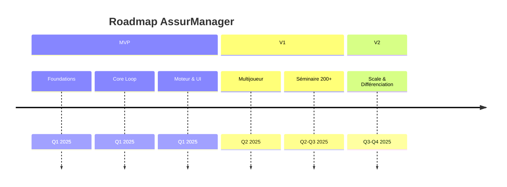

# Release Plan — AssurManager : Le Défi IARD

> **Document de planification des releases**
> Date de création : 2025-12-27
> Source of truth : `scope.md`, `backlog.md`, `prd.md`

---

## 1) Vision globale

---

## 2) MVP — « Jouer & apprendre en solo »

### Objectif
Livrer une version vendable en B2B permettant à un utilisateur de jouer une partie solo complète avec debrief et export PDF.

### Périmètre

| Composant | Scope MVP |
|-----------|-----------|
| **Mode de jeu** | Solo uniquement |
| **Produits jouables** | Auto + MRH |
| **Compagnies** | 18 fiches avec traits |
| **Indices** | 7 (IAC, IPQO, IERH, IRF, IMD, IS, IPP) |
| **Vitesse** | Moyenne (1 tour = trimestre) |
| **Difficulté** | Novice + Intermédiaire |
| **Leviers** | 20+ (macro, selon difficulté) |
| **Événements** | Marché (5+) + Compagnie (2+) |
| **Export** | PDF simple + debrief web |
| **Admin** | Session + participants + KPI basiques |
| **Sécurité** | Multi-tenant, RBAC, audit, RGPD minimal |

### Jalons clés

| Jalon | Durée estimée | Contenu | Critères de sortie |
|-------|:-------------:|---------|-------------------|
| **M1 — Bootstrap** | 2 sem | Supabase, auth, tenant, état partie | Login + création session fonctionnels |
| **M2 — Core Loop** | 2 sem | Boucle de tour complète | Dashboard → décisions → résolution → feedback |
| **M3 — Moteur** | 2 sem | 7 indices + P&L + effets retard | Invariants respectés, tests 80% |
| **M4 — UI & Contenu** | 2 sem | Cockpit, marché, 18 compagnies, événements | UX jouable, alertes fonctionnelles |
| **M5 — Polish & Export** | 2 sem | Debrief, PDF, instrumentation, QA | Partie jouable bout en bout |

**Durée totale MVP : 10 semaines** (développeur solo)

### Critères de succès MVP

> Tiré de `scope.md` §8

- [ ] Une session solo se joue jusqu'au bout sans crash
- [ ] Métriques cockpit (contrats/primes/sinistres/effectifs) cohérentes tour à tour
- [ ] Événements marché + ≥2 événements compagnie déclenchés et visibles
- [ ] Effets retard (RH/IT/prévention/réputation) perceptibles
- [ ] Debrief final + export PDF fonctionnent
- [ ] Sécurité B2B minimale en place (tenant isolation, RBAC, audit)

### Risques MVP

| Risque | Impact | Probabilité | Mitigation |
|--------|:------:|:-----------:|------------|
| Calibration moteur complexe | Délai | Moyenne | Tests unitaires + invariants stricts |
| Explosion combinatoire multi-produits | Qualité | Moyenne | Limiter à Auto+MRH, design modulaire |
| UI cockpit surchargée | UX | Faible | Wireframes validés avant dev |
| Explainability insuffisante | Pédagogie | Moyenne | Top 3 drivers + alertes claires |

---

## 3) V1 — « Multijoueur & Séminaire 200+ »

### Objectif
Étendre à l'usage événementiel : sessions multi-joueurs synchrones avec équipes, observateurs et outils facilitateur.

### Périmètre additionnel

| Composant | Ajouts V1 |
|-----------|-----------|
| **Mode de jeu** | + Multijoueur synchrone |
| **Séminaire** | Observateurs illimités, projection, outils facilitateur |
| **Produits** | + PJ, GAV jouables |
| **Difficulté** | + Expert, + Mode Survie |
| **Leviers** | + Fraude N2/N3, scoring data-driven, conformité |
| **Debrief** | Comparatif inter-équipes |
| **Admin** | Pondérations, scénarios, intensité événements |
| **Scalabilité** | Tests de charge 200+ participants |

### Jalons clés

| Jalon | Durée | Contenu |
|-------|:-----:|---------|
| V1.1 | 3 sem | Lobby, équipes, synchro tours |
| V1.2 | 2 sem | Observateurs, projection |
| V1.3 | 2 sem | Outils facilitateur (pause, injection) |
| V1.4 | 2 sem | Produits PJ/GAV + leviers avancés |
| V1.5 | 2 sem | Tests charge + stabilisation |

**Durée totale V1 : 11 semaines** (après MVP)

### Dépendances

- MVP complet et stable
- Architecture temps réel (WebSocket ou SSE)
- Infrastructure scalable (Vercel Edge, Supabase Realtime)

---

## 4) V2 — « Scale & Différenciation »

### Objectif
Industrialisation et différenciation : IA stratégique, analytics pédagogiques, marketplace de contenu.

### Périmètre additionnel

| Composant | Ajouts V2 |
|-----------|-----------|
| **IA concurrente** | Profils stratégiques (agressif, prudent, data-driven) |
| **Analytics** | KPIs pédagogiques, détection de biais, progression |
| **Contenu** | Marketplace/bibliothèque de scénarios |
| **Branding** | Logo/couleurs tenant + exports avancés |
| **Performance** | Optimisations temps réel séminaire massif |

### Jalons indicatifs

| Jalon | Durée | Contenu |
|-------|:-----:|---------|
| V2.1 | 4 sem | IA concurrente stratégique |
| V2.2 | 3 sem | Analytics pédagogiques |
| V2.3 | 3 sem | Marketplace scénarios |
| V2.4 | 2 sem | Branding + exports |

**Durée totale V2 : 12 semaines**

---

## 5) Hors scope global

> Tiré de `scope.md` §7.2

Les éléments suivants sont **hors périmètre toutes versions** sauf décision contraire explicite :

- Connexion SI assureur réels (ERP/S2P/CRM)
- Modèle actuariel complet / tarification réelle
- Certification réglementaire type outil de décision opérationnelle
- Personnalisation client sur-mesure au-delà des paramètres prévus
- Gestion RH/finance au niveau micro (contrats, conventions, détail comptable)

---

## 6) Tableau récapitulatif

| Release | Durée | Stories | Valeur clé |
|---------|:-----:|:-------:|------------|
| **MVP** | 10 sem | ~42 P0 | Solo jouable + export |
| **V1** | 11 sem | ~25 P0/P1 | Multijoueur + séminaire |
| **V2** | 12 sem | ~20 P1/P2 | Scale + différenciation |

---

## 7) Décisions projet

| ID | Décision | Date | Contexte |
|----|----------|:----:|----------|
| RP-001 | MVP = Solo uniquement | 2025-12 | Time-to-market + valeur B2B vendable |
| RP-002 | Auto+MRH seuls jouables MVP | 2025-12 | Maîtriser la complexité multi-produits |
| RP-003 | Durée sprint = 2 semaines | 2025-12 | Standard, adapté au rythme solo |
| RP-004 | Buffer 10% par jalon | 2025-12 | Absorber imprévus techniques |
| RP-005 | Séminaire 200+ = V1 | 2025-12 | Exigence produit réelle, différée |

---

## 8) Checklist de validation

- [ ] Jalons MVP alignés avec `scope.md`
- [ ] Critères de succès couvrent le DoD MVP
- [ ] Risques identifiés avec mitigations
- [ ] Hors scope explicite
- [ ] Estimations cohérentes avec sizing backlog

---

> **Document de référence** — À mettre à jour à chaque changement de scope ou de planning.
