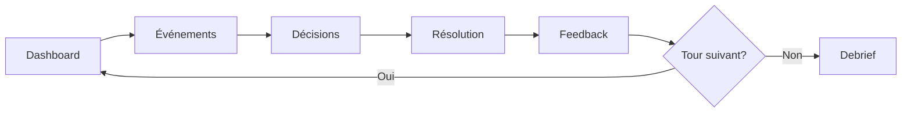

# Spécifications Fonctionnelles MVP — AssurManager

> **Document de référence** pour les User Stories P0 du MVP
> Date : 2025-12-27
> Source of truth : `backlog.md`, `prd.md`, `scope.md`, `definition_of_done.md`

---

## 1) Conventions

### DoR (Definition of Ready)
Une US est **prête** quand :
- [ ] AC (Acceptance Criteria) validés par le PO
- [ ] Dépendances identifiées et résolues
- [ ] Mockups/wireframes disponibles (si UI)
- [ ] Données de test définies

### DoD (Definition of Done)
Une US est **terminée** quand :
- [ ] Code mergé dans `dev`
- [ ] Build + lint + type-check passent
- [ ] Tests unitaires ajoutés (si moteur)
- [ ] AC validés manuellement
- [ ] Pas de régression

### Format AC
```
Given [contexte]
When [action]
Then [résultat attendu]
```

---

## 2) EPIC E0 — Foundations SaaS

### US-000 — Initialiser Supabase & connecter l'app

| Champ | Valeur |
|-------|--------|
| **Priorité** | P0 |
| **Taille** | M (5 pts) |
| **Epic** | E0.0 Bootstrap |

#### DoR
- [ ] Projet Supabase créé
- [ ] Clés API récupérées

#### AC
| ID | Critère |
|----|---------|
| AC1 | Given app démarrée, When connection Supabase, Then `select 1` retourne `1` |
| AC2 | Given utilisateur test, When login, Then session créée |
| AC3 | Given env variables, When build, Then pas d'erreur |

#### Edge Cases
- Variables d'env manquantes → erreur explicite au démarrage
- Supabase indisponible → affichage message maintenance

#### Dépendances
Aucune (première US)

---

### US-001 — Créer et gérer des tenants

| Champ | Valeur |
|-------|--------|
| **Priorité** | P0 |
| **Taille** | L (8 pts) |
| **Epic** | E0.1 Multi-tenant |

#### DoR
- [ ] US-000 complète
- [ ] Schéma table `tenants` défini

#### AC
| ID | Critère |
|----|---------|
| AC1 | Given super admin, When création tenant, Then `tenant_id` unique généré |
| AC2 | Given tenant créé, When query data, Then isolation stricte (RLS) |
| AC3 | Given tenant, When paramètres init, Then valeurs par défaut appliquées |

#### Edge Cases
- Nom tenant dupliqué → erreur 409
- Suppression tenant avec sessions actives → soft delete + warning
- Tenant sans admin → impossible de créer des sessions

#### Dépendances
- US-000

---

### US-002 — Inviter utilisateurs et attribuer rôles

| Champ | Valeur |
|-------|--------|
| **Priorité** | P0 |
| **Taille** | L (8 pts) |
| **Epic** | E0.1 RBAC |

#### DoR
- [ ] US-001 complète
- [ ] Emails configurés (Supabase Auth)

#### AC
| ID | Critère |
|----|---------|
| AC1 | Given admin tenant, When invitation envoyée, Then email avec lien activation |
| AC2 | Given lien activation, When expiration 48h, Then lien invalide |
| AC3 | Given rôle Joueur, When accès admin, Then 403 Forbidden |
| AC4 | Given rôle Formateur, When création session, Then autorisé |

#### Edge Cases
- Email déjà utilisé → message "Compte existant"
- Invitation expirée → possibilité de renvoyer
- Changement de rôle → effet immédiat

#### Dépendances
- US-001

---

### US-003 — Authentification sécurisée

| Champ | Valeur |
|-------|--------|
| **Priorité** | P0 |
| **Taille** | M (5 pts) |
| **Epic** | E0.1 Auth |

#### DoR
- [ ] US-002 complète
- [ ] Configuration Supabase Auth

#### AC
| ID | Critère |
|----|---------|
| AC1 | Given credentials valides, When login, Then session JWT créée |
| AC2 | Given session, When expiration 24h, Then refresh ou re-login |
| AC3 | Given 5 échecs login, When 6ème tentative, Then rate limiting (429) |
| AC4 | Given user, When reset password, Then email envoyé |

#### Edge Cases
- Password faible → rejet avec feedback
- Token expiré mid-session → redirection login gracieuse
- Connexion simultanée autorisée (pas de single-session)

#### Dépendances
- US-002

---

### US-004 — Journal d'audit

| Champ | Valeur |
|-------|--------|
| **Priorité** | P0 |
| **Taille** | M (5 pts) |
| **Epic** | E0.1 Audit |

#### DoR
- [ ] US-003 complète
- [ ] Table `audit_logs` définie

#### AC
| ID | Critère |
|----|---------|
| AC1 | Given action sensible, When exécutée, Then log `who/when/what/tenant` |
| AC2 | Given admin tenant, When consulte audit, Then liste filtrée tenant |
| AC3 | Given log, When création, Then horodatage UTC |

#### Actions loggées MVP
- Création/modification session
- Changement de rôle
- Export données
- Suppression utilisateur

#### Edge Cases
- Volume logs élevé → pagination (50/page)
- Logs anciens → rétention 90 jours

#### Dépendances
- US-003

---

### US-005 — Stocker l'état complet par tour

| Champ | Valeur |
|-------|--------|
| **Priorité** | P0 |
| **Taille** | L (8 pts) |
| **Epic** | E0.2 Stockage |

#### DoR
- [ ] US-001 complète
- [ ] Schéma `game_states` défini

#### AC
| ID | Critère |
|----|---------|
| AC1 | Given tour N terminé, When sauvegarde, Then état complet persisté |
| AC2 | Given état tour N, When relecture, Then reprise exacte possible |
| AC3 | Given état, When contenu, Then : décisions, événements, indices, P&L, métriques |

#### Données stockées
```typescript
interface TurnState {
  turn_number: number;
  indices: Record<IndexId, number>;
  pnl: PnLSnapshot;
  decisions: Decision[];
  events: Event[];
  portfolio: PortfolioMetrics;
  timestamp: string;
}
```

#### Edge Cases
- Crash mid-tour → restauration dernier état valide
- Corruption données → checksum de validation

#### Dépendances
- US-001

---

### US-006 — Gestion version moteur

| Champ | Valeur |
|-------|--------|
| **Priorité** | P0 |
| **Taille** | M (5 pts) |
| **Epic** | E0.2 Versioning |

#### DoR
- [ ] US-005 complète

#### AC
| ID | Critère |
|----|---------|
| AC1 | Given nouvelle partie, When création, Then `engine_version` stockée |
| AC2 | Given partie existante, When recalcul, Then interdit par défaut |
| AC3 | Given export, When génération, Then `engine_version` incluse |

#### Edge Cases
- Migration moteur → flag explicite requis
- Comparaison scores → warning si versions différentes

#### Dépendances
- US-005

---

## 3) EPIC E1 — Sessions & Core Gameplay

### US-010 — Créer une session

| Champ | Valeur |
|-------|--------|
| **Priorité** | P0 |
| **Taille** | M (5 pts) |
| **Epic** | E1.1 Création session |

#### DoR
- [ ] US-001-006 complètes
- [ ] Catalogue produits défini

#### AC
| ID | Critère |
|----|---------|
| AC1 | Given formateur, When création session, Then paramètres : vitesse, difficulté, durée, produits |
| AC2 | Given produits sélectionnés, When validation, Then UI/leviers configurés |
| AC3 | Given session, When 0 produits, Then erreur bloquante |

#### Paramètres session
| Paramètre | Valeurs | Défaut |
|-----------|---------|--------|
| Vitesse | Rapide/Moyenne/Lente | Moyenne |
| Difficulté | Novice/Intermédiaire | Novice |
| Durée | 4-20 tours | 8 |
| Produits | Auto, MRH (1 min) | Auto+MRH |

#### Edge Cases
- Session existante même nom → suffixe auto
- Modification après lancement → interdite

#### Dépendances
- E0 complet

---

### US-011 — Générer code/lien session

| Champ | Valeur |
|-------|--------|
| **Priorité** | P0 |
| **Taille** | M (5 pts) |
| **Epic** | E1.1 |

#### AC
| ID | Critère |
|----|---------|
| AC1 | Given session créée, When génération code, Then code 6 caractères unique |
| AC2 | Given session, When état, Then : brouillon → prête → lancée → terminée |
| AC3 | Given code, When partage, Then lien direct de rejointe |

#### Edge Cases
- Code expiré (session terminée) → erreur explicite
- Session pleine (V1) → pas applicable MVP (solo)

---

### US-012 — Rejoindre session et choisir compagnie

| Champ | Valeur |
|-------|--------|
| **Priorité** | P0 |
| **Taille** | M (5 pts) |
| **Epic** | E1.2 Onboarding |

#### AC
| ID | Critère |
|----|---------|
| AC1 | Given joueur, When code valide, Then accès sélection compagnie |
| AC2 | Given fiches compagnies, When affichage, Then traits visibles avant choix |
| AC3 | Given compagnie choisie, When lancement, Then sélection verrouillée |

#### Données fiche compagnie
- Nom + logo (placeholder)
- 3 traits principaux
- Forces/faiblesses indicatives
- Positionnement marché

#### Edge Cases
- Session déjà lancée → rejoindre impossible
- Double-clic sélection → protection debounce

---

### US-013 — Confirmer scope produits

| Champ | Valeur |
|-------|--------|
| **Priorité** | P0 |
| **Taille** | M (5 pts) |
| **Epic** | E1.2 |

#### AC
| ID | Critère |
|----|---------|
| AC1 | Given session rejointe, When tour 1, Then produits inclus affichés |
| AC2 | Given produits, When affichage, Then description courte par produit |

#### Edge Cases
- Modification produits après confirmation → interdite

---

### US-014 — Boucle de tour complète

| Champ | Valeur |
|-------|--------|
| **Priorité** | P0 |
| **Taille** | L (8 pts) |
| **Epic** | E1.3 Core Loop |

#### AC
| ID | Critère |
|----|---------|
| AC1 | Given tour N, When phase, Then séquence : dashboard → événements → décisions → résolution → feedback |
| AC2 | Given décision validée, When submit, Then calcul moteur + passage tour N+1 |
| AC3 | Given résolution, When feedback, Then variations majeures résumées |

#### Flux détaillé


#### Edge Cases
- Timeout décision (V1) → pas MVP
- Crash résolution → rollback + retry
- Partie terminée → navigation vers debrief uniquement

---

## 4) EPIC E2 — Moteur de simulation

### US-020 — Calcul des 7 indices + P&L

| Champ | Valeur |
|-------|--------|
| **Priorité** | P0 |
| **Taille** | L (8 pts) |
| **Epic** | E2.1 Indices |

#### DoR
- [ ] Formules validées (`20_simulation/indices.md`)
- [ ] Test vectors définis

#### AC
| ID | Critère |
|----|---------|
| AC1 | Given levier activé, When résolution, Then au moins 1 indice impacté |
| AC2 | Given P&L, When calcul, Then = primes - sinistres - frais + produits_financiers |
| AC3 | Given indice, When valeur, Then dans [0, 100] |

#### Invariants moteur
1. `0 ≤ indice ≤ 100` pour les 7 indices
2. `P&L = Σ(primes) - Σ(sinistres) - Σ(frais) + Σ(produits_financiers)`
3. Pas de division par zéro (gardes explicites)
4. Résultat déterministe (seed fixée)

#### Edge Cases
- Indice hors bornes → clamping [0, 100]
- Primes = 0 → gardes sur ratios
- Événement extrême → caps sur variations

---

### US-021 — Calculs par produit + agrégation

| Champ | Valeur |
|-------|--------|
| **Priorité** | P0 |
| **Taille** | L (8 pts) |
| **Epic** | E2.2 Multi-produits |

#### AC
| ID | Critère |
|----|---------|
| AC1 | Given Auto+MRH, When décision RH/IT, Then impact partagé (capacité/qualité) |
| AC2 | Given tarif Auto modifié, When résolution, Then métriques Auto évoluent, MRH inchangé |
| AC3 | Given indices, When calcul, Then agrégation pondérée par produit |

#### Règles d'agrégation
```
Indice_Global = Σ(Poids_Produit × Indice_Produit) / Σ(Poids_Produit)
Poids_Produit = f(Primes_Produit / Primes_Totales)
```

#### Edge Cases
- Produit sans primes → poids = 0
- Un seul produit → pas d'agrégation

---

### US-022 — Ressources communes

| Champ | Valeur |
|-------|--------|
| **Priorité** | P0 |
| **Taille** | M (5 pts) |
| **Epic** | E2.2 |

#### AC
| ID | Critère |
|----|---------|
| AC1 | Given budget tour, When allocation, Then consommation/solde affichés |
| AC2 | Given effectifs, When affectation, Then répartition par produit visible |
| AC3 | Given IT/Data, When investissement, Then bénéfice partagé tous produits |

#### Ressources communes MVP
- Budget tour
- Effectifs (sinistres, distribution, data-IT, support)
- Investissement IT/Data
- Capital/réassurance

---

### US-023 — Effets retard paramétrés

| Champ | Valeur |
|-------|--------|
| **Priorité** | P0 |
| **Taille** | L (8 pts) |
| **Epic** | E2.3 |

#### AC
| ID | Critère |
|----|---------|
| AC1 | Given décision RH, When effet, Then délai ~2 tours (vitesse Moyenne) |
| AC2 | Given décision IT, When effet, Then délai 3-6 tours |
| AC3 | Given UI décision, When affichage, Then "effet différé attendu à T+X" |

#### Table des délais (vitesse Moyenne = trimestre)
| Domaine | Délai (tours) |
|---------|:-------------:|
| RH | 2 |
| IT/Data | 3-6 |
| Prévention | 4-8 |
| Réputation | 1-3 |
| Marketing | 1-2 |

---

### US-024 — Persistance et compensation

| Champ | Valeur |
|-------|--------|
| **Priorité** | P0 |
| **Taille** | L (8 pts) |
| **Epic** | E2.3 |

#### AC
| ID | Critère |
|----|---------|
| AC1 | Given décision passée, When tours suivants, Then effet persiste (atténuation) |
| AC2 | Given décision corrective, When tardive, Then coût de rattrapage augmenté |
| AC3 | Given historique, When consultation, Then décisions passées accessibles |

#### Formule d'atténuation
```
Effet(t) = Effet_Initial × (1 - decay_rate)^(t - t_decision)
decay_rate = fonction(type_levier)
```

---

### US-025 — Fraude niveau 1

| Champ | Valeur |
|-------|--------|
| **Priorité** | P0 |
| **Taille** | M (5 pts) |
| **Epic** | E2.4 |

#### AC
| ID | Critère |
|----|---------|
| AC1 | Given fraude N1, When activation, Then effet rapide (1-2 tours) |
| AC2 | Given fraude N1, When plafond, Then gain max ~5% S/P |
| AC3 | Given N1 actif, When N2 disponible (V1), Then prérequis affiché |

---

## 5) EPIC E3 — UI Cockpit

### US-030 — Dashboard principal enrichi

| Champ | Valeur |
|-------|--------|
| **Priorité** | P0 |
| **Taille** | L (8 pts) |
| **Epic** | E3.1 |

#### AC
| ID | Critère |
|----|---------|
| AC1 | Given cockpit, When affichage, Then grille produits + total visible |
| AC2 | Given difficulté Novice, When vue, Then indicateurs macro |
| AC3 | Given difficulté Intermédiaire, When vue, Then indicateurs détaillés |

#### Indicateurs MVP par produit
| Indicateur | Affichage |
|------------|-----------|
| Nb contrats | Nombre |
| Primes collectées | € |
| Stock sinistres | Nombre |
| Flux entrées/sorties | ±Nombre |

#### Indicateurs MVP globaux
- 7 indices (jauges + valeurs)
- P&L macro (graphique)
- Effectifs (répartition)
- Alertes (badges)

---

### US-032 — Alertes

| Champ | Valeur |
|-------|--------|
| **Priorité** | P0 |
| **Taille** | M (5 pts) |
| **Epic** | E3.2 |

#### AC
| ID | Critère |
|----|---------|
| AC1 | Given seuil franchi, When alerte, Then cause probable affichée |
| AC2 | Given alerte, When contexte, Then leviers conseillés suggérés |

#### Seuils d'alerte MVP
| Situation | Seuil | Alerte |
|-----------|:-----:|--------|
| Goulot RH | IERH < 40 | ⚠️ Capacité insuffisante |
| Dette IT | IMD < 30 | ⚠️ Risque cyber/panne |
| Résilience | IRF < 35 | 🔴 Vulnérabilité chocs |
| Stock sinistres | +20% vs T-1 | ⚠️ Backlog en hausse |

---

### US-033 — Écran événements

| Champ | Valeur |
|-------|--------|
| **Priorité** | P0 |
| **Taille** | M (5 pts) |
| **Epic** | E3.3 |

#### AC
| ID | Critère |
|----|---------|
| AC1 | Given événement, When affichage, Then type (marché/compagnie) visible |
| AC2 | Given événement, When détail, Then impact + durée affichés |
| AC3 | Given événement, When news flash, Then narratif engageant |

---

### US-034 — Écran décisions avec gating

| Champ | Valeur |
|-------|--------|
| **Priorité** | P0 |
| **Taille** | L (8 pts) |
| **Epic** | E3.4 |

#### AC
| ID | Critère |
|----|---------|
| AC1 | Given Novice, When leviers, Then uniquement macro (8-10) |
| AC2 | Given Intermédiaire, When leviers, Then macro + avancés (15-18) |
| AC3 | Given levier, When sélection, Then options + coût + impact indicatif |

#### Leviers par difficulté
| Catégorie | Novice | Intermédiaire |
|-----------|:------:|:-------------:|
| Tarif | ✅ | ✅ + segmentation |
| Distribution | ✅ macro | ✅ + canaux fins |
| RH | ✅ recrutement | ✅ + formation |
| IT/Data | ✅ macro | ✅ + gouvernance |
| Sinistres | ✅ capacité | ✅ + fraude N1 |
| Réassurance | ✅ | ✅ |
| Prévention | ✅ | ✅ |
| Provisions | ✅ | ✅ |

---

### US-036 — Vue marché

| Champ | Valeur |
|-------|--------|
| **Priorité** | P0 |
| **Taille** | M (5 pts) |
| **Epic** | E3.5 |

#### AC
| ID | Critère |
|----|---------|
| AC1 | Given vue marché, When affichage, Then parts de marché par produit |
| AC2 | Given concurrents, When données, Then prix moyens + tendances |

---

### US-037 — Explainability (top 3 drivers)

| Champ | Valeur |
|-------|--------|
| **Priorité** | P0 |
| **Taille** | M (5 pts) |
| **Epic** | E3.6 |

#### AC
| ID | Critère |
|----|---------|
| AC1 | Given variation majeure, When analyse, Then top 3 drivers affichés |
| AC2 | Given driver, When type, Then = décision / événement / effet retard |

#### Exemple
```
IAC +5 → Drivers :
1. LEV-TAR-01 : Baisse tarif (-3%) ↑
2. Événement : Inflation (+2%) ↓
3. Effet retard : Marketing T-2 ↑
```

---

## 6) EPIC E4 — Contenu

### US-040 — 18 fiches compagnies

| Champ | Valeur |
|-------|--------|
| **Priorité** | P0 |
| **Taille** | M (5 pts) |
| **Epic** | E4.1 |

#### AC
| ID | Critère |
|----|---------|
| AC1 | Given compagnie, When fiche, Then ≥3 traits avec effet moteur |
| AC2 | Given traits, When calcul, Then bonus/malus indices appliqués |

#### Traits exemple
| Trait | Effet |
|-------|-------|
| "Data-driven" | IMD +10 initial |
| "Réseau dense" | IAC +5, frais distribution +10% |
| "Capitalisation forte" | IRF +15 |

---

### US-041 — Produits Auto + MRH

| Champ | Valeur |
|-------|--------|
| **Priorité** | P0 |
| **Taille** | L (8 pts) |
| **Epic** | E4.2 |

#### AC
| ID | Critère |
|----|---------|
| AC1 | Given Auto, When métriques, Then : primes, sinistres, S/P, stock |
| AC2 | Given MRH, When métriques, Then : primes, sinistres, sensibilité climat |
| AC3 | Given produits, When leviers, Then leviers dédiés + leviers partagés |

---

### US-043 — Événements marché

| Champ | Valeur |
|-------|--------|
| **Priorité** | P0 |
| **Taille** | L (8 pts) |
| **Epic** | E4.3 |

#### Événements MVP
| Événement | Impact | Durée |
|-----------|--------|:-----:|
| Épisode climatique | MRH S/P +10-20%, Auto +5% | 1-2 T |
| Inflation | Sévérité +5-10% | Persistant |
| Réglementation | Contraintes IS/IRF | Variable |
| Disrupteur | Prix marché -5%, IAC stress | 2-4 T |
| Mutation parc auto | Coûts réparation +10% | Persistant |

---

### US-044 — Événements compagnie

| Champ | Valeur |
|-------|--------|
| **Priorité** | P0 |
| **Taille** | M (5 pts) |
| **Epic** | E4.3 |

#### Événements MVP
| Événement | Trigger | Impact |
|-----------|---------|--------|
| Cyberattaque | IMD < 30 + aléa | IPQO -20, coûts +X |
| Panne SI | IMD < 40 + aléa | Capacité -30% (1-2 T) |

---

### US-046 — Posture de souscription

| Champ | Valeur |
|-------|--------|
| **Priorité** | P0 |
| **Taille** | M (5 pts) |
| **Epic** | E4.5 |

#### AC
| ID | Critère |
|----|---------|
| AC1 | Given posture Permissive, When effet, Then IAC +10, S/P futur +X (r:4-6T) |
| AC2 | Given posture Sélective, When effet, Then IAC -5, S/P futur -X (r:4-6T) |
| AC3 | Given Permissive > 4 tours, When alerte, Then warning anti-sélection |
| AC4 | Given tooltip, When affichage, Then explication pédagogique |

---

### US-048 — Politique d'indemnisation

| Champ | Valeur |
|-------|--------|
| **Priorité** | P0 |
| **Taille** | M (5 pts) |
| **Epic** | E4.6 |

#### AC
| ID | Critère |
|----|---------|
| AC1 | Given Généreuse, When coût sinistre, Then +5-15% |
| AC2 | Given Restrictive, When coût sinistre, Then -5-10% |
| AC3 | Given Restrictive, When réclamations, Then Complaints_Rate ↑ |
| AC4 | Given debrief, When analyse, Then arbitrage coût/satisfaction visible |

---

## 7) EPIC E5 — Scoring & Debrief

### US-050 — Score global

| Champ | Valeur |
|-------|--------|
| **Priorité** | P0 |
| **Taille** | M (5 pts) |
| **Epic** | E5.1 |

#### AC
| ID | Critère |
|----|---------|
| AC1 | Given fin partie, When score, Then composants visibles |
| AC2 | Given pondération, When calcul, Then conforme à la difficulté |

#### Formule score
```
Score = Σ(Poids_Indice × Indice_Final) + Bonus_Objectifs
```

---

### US-052 — Debrief fin de partie

| Champ | Valeur |
|-------|--------|
| **Priorité** | P0 |
| **Taille** | M (5 pts) |
| **Epic** | E5.2 |

#### AC
| ID | Critère |
|----|---------|
| AC1 | Given debrief, When analyse, Then top 5 décisions déterminantes |
| AC2 | Given décision, When impact, Then effet immédiat + différé visible |
| AC3 | Given biais, When identifié, Then court-termisme, négligence risque |

---

### US-053 — Export PDF

| Champ | Valeur |
|-------|--------|
| **Priorité** | P0 |
| **Taille** | M (5 pts) |
| **Epic** | E5.2 |

#### AC
| ID | Critère |
|----|---------|
| AC1 | Given export, When génération, Then PDF contient : contexte, courbes, P&L, événements, score |
| AC2 | Given PDF, When téléchargement, Then < 5 Mo, format A4 |

---

## 8) EPIC E6 — Admin

### US-060 — Gérer participants et rôles

| Champ | Valeur |
|-------|--------|
| **Priorité** | P0 |
| **Taille** | M (5 pts) |
| **Epic** | E6.1 |

#### AC
| ID | Critère |
|----|---------|
| AC1 | Given admin, When import, Then liste utilisateurs chargée |
| AC2 | Given Observateur, When décision, Then soumission interdite |

---

### US-064 — Vue admin KPI

| Champ | Valeur |
|-------|--------|
| **Priorité** | P0 |
| **Taille** | M (5 pts) |
| **Epic** | E6.4 |

#### AC
| ID | Critère |
|----|---------|
| AC1 | Given admin, When tableau KPI, Then complétion, temps/tour, sessions |
| AC2 | Given filtres, When appliqués, Then par session/produit/difficulté |

---

## 9) EPIC E7 — Instrumentation

### US-070 — Event tracking

| Champ | Valeur |
|-------|--------|
| **Priorité** | P0 |
| **Taille** | M (5 pts) |
| **Epic** | E7.1 |

#### Événements trackés MVP
| Événement | Contexte |
|-----------|----------|
| `session_start` | tenant_id, session_id, difficulty, products |
| `turn_start` | session_id, turn_number |
| `turn_end` | session_id, turn_number, duration_ms |
| `decision_submit` | session_id, user_id, decisions[] |
| `event_triggered` | session_id, event_type, event_id |
| `debrief_open` | session_id, user_id |
| `export_pdf` | session_id, user_id |

---

### US-071 — Tableau KPI produit

| Champ | Valeur |
|-------|--------|
| **Priorité** | P0 |
| **Taille** | M (5 pts) |
| **Epic** | E7.1 |

#### KPIs MVP
- Taux de complétion (%)
- Nb sessions / utilisateur
- Temps moyen / tour (s)
- Nb exports PDF

---

## 10) EPIC E9 — Non-fonctionnel

### US-090 — RGPD minimal

| Champ | Valeur |
|-------|--------|
| **Priorité** | P0 |
| **Taille** | M (5 pts) |
| **Epic** | E9.1 |

#### AC
| ID | Critère |
|----|---------|
| AC1 | Given utilisateur, When suppression, Then anonymisation traces |
| AC2 | Given utilisateur, When export, Then données personnelles extractables |

---

### US-091 — Sécurité baseline

| Champ | Valeur |
|-------|--------|
| **Priorité** | P0 |
| **Taille** | M (5 pts) |
| **Epic** | E9.1 |

#### AC
| ID | Critère |
|----|---------|
| AC1 | Given RBAC, When accès non autorisé, Then 403 |
| AC2 | Given tentatives suspectes, When détection, Then log + rate limiting |

---

### US-092 — Logs techniques

| Champ | Valeur |
|-------|--------|
| **Priorité** | P0 |
| **Taille** | M (5 pts) |
| **Epic** | E9.2 |

#### AC
| ID | Critère |
|----|---------|
| AC1 | Given calcul moteur, When exécution, Then latence loggée |
| AC2 | Given erreur, When survenance, Then stack trace loggé |
| AC3 | Given dashboard interne, When consultation, Then "santé moteur" visible |

---

## 11) EPIC E10 — Onboarding

### US-100 — Guide in-app

| Champ | Valeur |
|-------|--------|
| **Priorité** | P1 |
| **Taille** | M (5 pts) |
| **Epic** | E10 |

#### AC
| ID | Critère |
|----|---------|
| AC1 | Given novice, When première partie, Then tooltips contextuels |
| AC2 | Given checklist, When complétion, Then tâches cochées |
| AC3 | Given guide, When temps, Then compréhension boucle < 5 min |

---

## 12) Checklist de validation globale

- [ ] Toutes les US P0 du backlog sont documentées
- [ ] AC au format Given/When/Then
- [ ] Edge cases explicites par US
- [ ] Dépendances cohérentes
- [ ] Seuils et formules alignés avec `indices.md`

---

> **Document évolutif** — À maintenir synchronisé avec le backlog.
