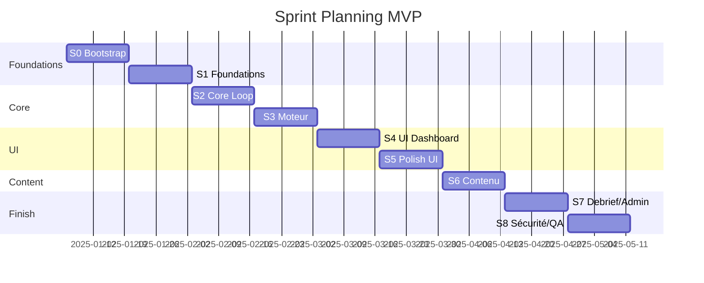

# Sprint Planning MVP — AssurManager

> **Découpage du MVP en sprints**
> Date : 2025-12-27
> Hypothèses : développeur solo, sprints 2 semaines, vélocité ~25 points

---

## 1) Hypothèses de planification

| Paramètre | Valeur | Justification |
|-----------|--------|---------------|
| Durée sprint | 2 semaines | Standard Scrum |
| Vélocité estimée | 20-25 pts/sprint | Solo + stack familière |
| Buffer | 10% | Imprévus techniques |
| Sizing | S=2, M=5, L=8 | Fibonacci simplifié |

---

## 2) Tableau récapitulatif

| Sprint | Thème | Points | US clés | Dépendances |
|:------:|-------|:------:|---------|-------------|
| **S0** | Bootstrap | ~20 | US-000 | - |
| **S1** | Foundations | ~26 | US-001-006 | S0 |
| **S2** | Core Loop | ~26 | US-010-014, US-020-022 | S1 |
| **S3** | Moteur | ~26 | US-023-025, US-030-033 | S2 |
| **S4** | UI & Contenu | ~26 | US-034-037, US-040-044 | S3 |
| **S5** | Polish & Export | ~26 | US-046-053, US-060-092, US-100 | S4 |

**Total estimé : ~150 points / 12 semaines**
*(avec buffer de contingence)*

---

## 3) Détail par sprint

### Sprint 0 — Bootstrap (2 sem)

> **Objectif** : Infrastructure technique opérationnelle
> **Statut** : ✅ TERMINÉ

| US | Titre | Taille | Points | Statut | Temps réel |
|----|-------|:------:|:------:|:------:|:----------:|
| US-000 | Initialiser Supabase & connecter l'app | M | 5 | ✅ Done | **1h00** |

**Livrables Sprint 0 :**
- [x] Projet Supabase créé et configuré
- [x] App Next.js connectée
- [x] Variables d'environnement configurées
- [x] CI/CD minimal (Vercel preview)
- [x] Structure projet initiale

**Critère de sortie :** `npm run dev` démarre, connexion Supabase OK ✅  
**CI/CD :** Vercel configuré, build production validé ✅

**Métriques Sprint 0 :**
| Métrique | Estimé | Réel |
|----------|:------:|:----:|
| Points | 5 | 5 |
| Temps | ~4h | 1h30 |
| Vélocité | - | Excellente |

---

### Sprint 1 — Foundations (2 sem)

> **Objectif** : Multi-tenant, auth, audit, stockage état
> **Statut** : ✅ TERMINÉ

| US | Titre | Taille | Points | Statut | Temps réel |
|----|-------|:------:|:------:|:------:|:----------:|
| US-001 | Créer et gérer des tenants | L | 8 | ✅ Done | **0h30** |
| US-002 | Inviter utilisateurs et attribuer rôles | L | 8 | ✅ Done | **2h30** |
| US-003 | Authentification sécurisée | M | 5 | ✅ Done | **0h45** |
| US-004 | Journal d'audit | M | 5 | ✅ Done | **0h50** |
| **Total** | | | **26** | | **4h35** |

**Livrables Sprint 1 :**
- [x] Table `tenants` + RLS
- [x] Table `users` + rôles RBAC
- [x] Auth Supabase configurée
- [x] Table `audit_logs`
- [x] Tests manuels multi-tenant

**Dépendances :** US-000 ✓

**Métriques Sprint 1 :**
| Métrique | Estimé | Réel |
|----------|:------:|:----:|
| Points | 26 | 26 |
| Temps | ~16h | 4h35 |
| Vélocité | - | Excellente |

---

### Sprint 2 — Core Loop (2 sem)

> **Objectif** : Boucle de tour jouable + base moteur
> **Statut** : ✅ TERMINÉ

| US | Titre | Taille | Points | Statut | Temps réel |
|----|-------|:------:|:------:|:------:|:----------:|
| US-005 | Stocker état par tour | L | 8 | ✅ Done | **0h25** |
| US-006 | Gestion version moteur | M | 5 | ✅ Done | **0h20** |
| US-010 | Créer une session | M | 5 | ✅ Done | **0h30** |
| US-011 | Générer code session | M | 5 | ✅ Done | **0h30** |
| US-012 | Rejoindre session | M | 5 | ✅ Done | **0h35** |
| US-013 | Confirmer scope produits | M | 5 | ✅ Done | **0h55** |
| **Total** | | | **33** | | **3h15** |

**Métriques Sprint 2 :**
| Métrique | Estimé | Réel |
|----------|:------:|:----:|
| Points | 33 | 33 |
| Temps | ~20h | 3h15 |
| Vélocité | - | Excellente |

**Livrables Sprint 2 :**
- [x] Schema `game_states` + service stockage état
- [x] Gestion version moteur (`ENGINE_VERSION`)
- [x] API création/rejointe session (`/api/sessions`)
- [x] UI liste sessions (`/dashboard/sessions`)
- [x] UI création session (formateur) - bouton + redirection setup
- [x] Page rejoindre session (`/sessions/join`)
- [x] API sélection produits (`POST /api/game/[sessionId]/products`)
- [x] Navigation session draft → setup page

**Dépendances :** Sprint 1 ✓

---

### Sprint 3 — Moteur (2 sem)

> **Objectif** : 7 indices, P&L, effets retard, UI dashboard
> **Statut** : ✅ TERMINÉ

| US | Titre | Taille | Points | Statut | Temps réel |
|----|-------|:------:|:------:|:------:|:----------:|
| US-020 | Calcul 7 indices + P&L | L | 8 | ✅ Done | **0h30** |
| US-021 | Effets retard / Empilement / Caps | L | 8 | ✅ Done | **0h20** |
| US-022 | Ressources communes | M | 5 | ✅ Done | **0h40** |
| US-023 | Calculs par produit + Agrégation | L | 8 | ✅ Done | **0h35** |
| US-014 | Boucle de tour complète | L | 8 | ✅ Done | **1h15** |
| **Total** | | | **37** | | **3h20** |

**Livrables Sprint 3 :**
- [x] Module `lib/engine/` avec calculs indices (US-020)
- [x] Tests unitaires moteur (coverage 99%+)
- [x] Système effets retard avec caps ±50% (US-021)
- [x] Agrégation multi-produits (US-022)
- [x] Calculs par produit + types décisions (US-023)
- [x] Boucle dashboard→décisions→résolution→feedback (US-014)

**Dépendances :** Sprint 2 ✓

---

### Sprint 4 — UI & Contenu (2 sem)

> **Objectif** : Cockpit complet, alertes, événements, compagnies
> **Statut** : 🔄 EN COURS

| US | Titre | Taille | Points | Statut | Temps réel |
|----|-------|:------:|:------:|:------:|:----------:|
| US-023 | Effets retard paramétrés | L | 8 | ✅ Done | **0h20** |
| US-024 | Persistance/compensation | L | 8 | 📋 TODO | - |
| US-025 | Fraude N1 | M | 5 | 📋 TODO | - |
| US-030 | Dashboard enrichi | L | 8 | 📋 TODO | - |
| **Total** | | | **29** | | **0h20** |

**Livrables Sprint 4 :**
- [x] Système effets retard paramétré (delay-config.ts, DelayedEffectIndicator, EffectTimeline)
- [ ] Compensation avec coût croissant
- [ ] Levier fraude N1
- [ ] Dashboard avec grille produits
- [ ] Indicateurs par difficulté

**Dépendances :** Sprint 3 ✓

---

### Sprint 5 — Polish & Export (2 sem)

> **Objectif** : UI finitions, alertes, vue marché, explainability

| US | Titre | Taille | Points |
|----|-------|:------:|:------:|
| US-032 | Alertes | M | 5 |
| US-033 | Écran événements | M | 5 |
| US-034 | Écran décisions gating | L | 8 |
| US-036 | Vue marché | M | 5 |
| US-037 | Explainability top 3 | M | 5 |
| **Total** | | | **28** |

**Livrables Sprint 5 :**
- [ ] Système d'alertes avec seuils
- [ ] News flash événements
- [ ] Gating leviers par difficulté
- [ ] Vue marché (parts + prix)
- [ ] Top 3 drivers

**Dépendances :** Sprint 4 ✓

---

### Sprint 6 — Contenu & Scoring (2 sem)

> **Objectif** : Compagnies, produits, événements, scoring

| US | Titre | Taille | Points |
|----|-------|:------:|:------:|
| US-040 | 18 fiches compagnies | M | 5 |
| US-041 | Produits Auto + MRH | L | 8 |
| US-043 | Événements marché | L | 8 |
| US-044 | Événements compagnie | M | 5 |
| US-046 | Posture souscription | M | 5 |
| **Total** | | | **31** |

**Livrables Sprint 6 :**
- [ ] 18 fiches avec ≥3 traits chacune
- [ ] Métriques Auto + MRH
- [ ] Catalogue événements marché
- [ ] Événements cyber + panne SI
- [ ] Levier posture souscription

**Dépendances :** Sprint 5 ✓

---

### Sprint 7 — Debrief & Admin (2 sem)

> **Objectif** : Fin de partie, export, admin, instrumentation

| US | Titre | Taille | Points |
|----|-------|:------:|:------:|
| US-048 | Politique indemnisation | M | 5 |
| US-050 | Score global | M | 5 |
| US-052 | Debrief fin partie | M | 5 |
| US-053 | Export PDF | M | 5 |
| US-060 | Gérer participants | M | 5 |
| US-064 | Vue admin KPI | M | 5 |
| **Total** | | | **30** |

**Livrables Sprint 7 :**
- [ ] Levier politique indemnisation
- [ ] Calcul score pondéré
- [ ] Écran debrief (top 5 décisions)
- [ ] Génération PDF
- [ ] Admin participants + KPIs

**Dépendances :** Sprint 6 ✓

---

### Sprint 8 — Sécurité & QA (2 sem)

> **Objectif** : Sécurité, instrumentation, polish final

| US | Titre | Taille | Points |
|----|-------|:------:|:------:|
| US-070 | Event tracking | M | 5 |
| US-071 | Tableau KPI produit | M | 5 |
| US-090 | RGPD minimal | M | 5 |
| US-091 | Sécurité baseline | M | 5 |
| US-092 | Logs techniques | M | 5 |
| US-100 | Guide in-app | M | 5 |
| **Total** | | | **30** |

**Livrables Sprint 8 :**
- [ ] Analytics événements
- [ ] Dashboard KPI admin
- [ ] Export/suppression données (RGPD)
- [ ] Rate limiting + logs
- [ ] Tooltips onboarding
- [ ] **QA finale**

**Dépendances :** Sprint 7 ✓

---

## 4) Vue Gantt simplifiée

---

## 5) Risques & mitigations sprint

| Sprint | Risque | Impact | Mitigation |
|:------:|--------|:------:|------------|
| S3 | Complexité calculs moteur | Délai | TDD + invariants stricts |
| S4 | Calibration effets retard | Qualité | Paramètres configurables |
| S6 | Volume contenu (18 compagnies) | Temps | Templates + génération |
| S7 | Génération PDF | Technique | Librairie éprouvée (pdf-lib) |
| S8 | Tests charge insuffisants | V1 | Différer scalabilité V1 |

---

## 6) Cérémonies (solo adapté)

| Cérémonie | Fréquence | Durée | Contenu |
|-----------|-----------|:-----:|---------|
| Sprint Planning | Début sprint | 30 min | Sélection US, objectifs |
| Daily | Quotidien | 5 min | Revue perso blockers |
| Review | Fin sprint | 1h | Démo livrables |
| Rétro | Fin sprint | 30 min | Amélioration continue |

---

## 7) Indicateurs de suivi

| KPI | Cible | Alerte |
|-----|:-----:|:------:|
| Vélocité réelle | ~25 pts | < 20 pts |
| Bugs bloquants | 0 | ≥ 1 |
| Coverage moteur | ≥ 80% | < 70% |
| US complètes/sprint | ≥ 4 | < 3 |

---

## 8) Décisions planning

| ID | Décision | Date |
|----|----------|:----:|
| SP-001 | 8 sprints MVP (16 sem avec buffer) | 2025-12 |
| SP-002 | Sprint 0 dédié bootstrap | 2025-12 |
| SP-003 | Moteur prioritaire (S3) | 2025-12 |
| SP-004 | QA intégrée à chaque sprint | 2025-12 |
| SP-005 | Buffer glissement S2→S3 si surchargé | 2025-12 |

---

## 9) Checklist de validation

- [ ] Toutes les US P0 assignées à un sprint
- [ ] Points totaux cohérents avec vélocité
- [ ] Dépendances respectées
- [ ] Buffer intégré
- [ ] Critères de sortie définis par sprint

---

> **Document de planification** — À ajuster après chaque sprint selon vélocité réelle.
