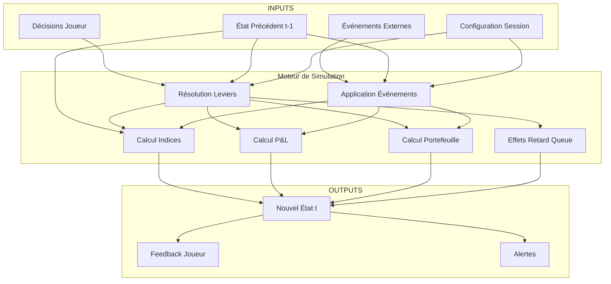

# overview.md — Moteur de Simulation AssurManager

**Version** : 1.0  
**Statut** : Draft  
**Dernière MAJ** : 2025-12-25  
**Auteur** : Simulation Engineer

---

## 1) Introduction

Le moteur de simulation d'AssurManager est le cœur algorithmique du serious game. Il simule le comportement d'une compagnie d'assurance IARD au sein d'un marché français concurrentiel à 18 acteurs.

### 1.1 Objectifs du moteur

| Objectif | Description |
|----------|-------------|
| **Cohérence** | Produire des impacts P&L et indices cohérents avec les décisions |
| **Pédagogie** | Rendre visibles les compromis et causalités |
| **Effets retard** | Intégrer l'inertie des décisions (RH, IT, prévention, réputation) |
| **Multi-produits** | Gérer 1+ produits (Auto, MRH) avec ressources partagées |
| **Explainability** | Expliquer les variations ("pourquoi ça bouge ?") |

### 1.2 Scope MVP

```
┌─────────────────────────────────────────────────────────────────┐
│                    MOTEUR DE SIMULATION MVP                      │
├─────────────────────────────────────────────────────────────────┤
│  Mode        : Solo (joueur vs IA)                              │
│  Produits    : Auto + MRH (1 ou 2 produits par session)         │
│  Difficultés : Novice / Intermédiaire                           │
│  Vitesse     : Moyenne (1 tour = 1 trimestre)                   │
│  Compagnies  : 18 acteurs (1 joueur + 17 IA)                    │
│  Indices     : 7 indices systémiques (0-100)                    │
│  Leviers     : ~12 (Novice) / ~22 (Intermédiaire)               │
│  Événements  : 20-30 (marché + 2 compagnie minimum)             │
└─────────────────────────────────────────────────────────────────┘
```

---

## 2) Architecture du Moteur

### 2.1 Composants principaux



### 2.2 Pipeline de résolution d'un tour

| Étape | Nom | Description |
|-------|-----|-------------|
| 1 | **Lecture** | Chargement état(t-1) + décisions joueur |
| 2 | **Événements** | Tirage et application des événements du tour |
| 3 | **Effets retard** | Application des effets différés arrivés à maturité |
| 4 | **Leviers** | Application des décisions avec leurs effets immédiats |
| 5 | **Concurrence** | Calcul des actions de l'IA (17 compagnies) |
| 6 | **Calcul indices** | Mise à jour des 7 indices |
| 7 | **Calcul P&L** | Mise à jour du compte de résultat |
| 8 | **Calcul portefeuille** | Mise à jour des métriques par produit |
| 9 | **Persistance** | Sauvegarde état(t) |
| 10 | **Feedback** | Génération alertes + explainability |

---

## 3) État de la Simulation

### 3.1 Structure de l'état

```typescript
interface SimulationState {
  // Méta
  session_id: string;
  turn: number;
  engine_version: string;
  timestamp: Date;
  
  // Configuration
  config: SessionConfig;
  
  // État compagnie
  company: {
    id: string;
    name: string;
    traits: CompanyTrait[];
  };
  
  // Indices (7)
  indices: {
    IAC: number;   // 0-100
    IPQO: number;  // 0-100
    IERH: number;  // 0-100
    IRF: number;   // 0-100
    IMD: number;   // 0-100
    IS: number;    // 0-100
    IPP: number;   // 0-100
  };
  
  // Portefeuille par produit
  portfolio: {
    [product: string]: ProductPortfolio;
  };
  
  // P&L
  pnl: PLStatement;
  
  // RH & Capacité
  workforce: Workforce;
  
  // File d'effets retard
  delayed_effects_queue: DelayedEffect[];
  
  // Leviers actifs
  active_levers: ActiveLever[];
  
  // Historique (pour explainability)
  history: TurnRecord[];
}
```

### 3.2 Produit (ProductPortfolio)

```typescript
interface ProductPortfolio {
  product_id: "AUTO" | "MRH" | "PJ" | "GAV";
  
  // Volume
  contracts: number;           // Nb contrats
  acquisition: number;         // Nouveaux contrats du tour
  churn: number;               // Résiliations du tour
  
  // Primes
  premium_collected: number;   // € primes collectées
  avg_premium: number;         // Prime moyenne
  
  // Sinistres
  claims_stock: number;        // Stock sinistres ouverts
  claims_new: number;          // Nouveaux sinistres
  claims_closed: number;       // Sinistres clôturés
  claims_cost: number;         // Coût sinistres réglés
  
  // Ratios
  loss_ratio: number;          // S/P %
  frequency: number;           // Fréquence sinistres
  severity: number;            // Sévérité moyenne €
}
```

---

## 4) Interactions Indices ↔ Leviers ↔ Événements

### 4.1 Matrice d'impact simplifiée

| Famille | Leviers principaux | Indices impactés | Délai |
|---------|-------------------|------------------|-------|
| **Produit/Tarif** | LEV-TAR-01, LEV-GAR-01 | IAC, IPP | 1T |
| **Distribution** | LEV-DIS-01, LEV-DIS-02 | IAC, IPP | 2T |
| **Marketing** | LEV-MKT-01 | IAC | 0T (décroît) |
| **RH** | LEV-RH-01 à 06 | IERH → IPQO | 2-3T |
| **IT/Data** | LEV-IT-01 à 05 | IMD → IPQO, IPP | 3-6T |
| **Sinistres** | LEV-SIN-01, 02 | IPQO, IPP | 1-4T |
| **Réassurance** | LEV-REA-01 | IRF, IPP | 0T |
| **Prévention** | LEV-PREV-01 à 03 | Fréquence → IPP | 4-8T |
| **Provisions** | LEV-PROV-01 | IS, IRF, IPP | 0T→2-4T |

### 4.2 Cascade d'effets (exemple)

```
Décision: Sous-investissement RH (t=0)
    │
    ├─→ [t+2] IERH ↓ (-10)
    │       │
    │       └─→ [t+4] IPQO ↓ (-8)
    │               │
    │               ├─→ [t+5] Satisfaction ↓ → IAC ↓ (-5)
    │               │
    │               └─→ [t+5] Coûts sinistres ↑ → IPP ↓ (-7)
    │
    └─→ [t+3] Risque événement "Crise RH" ↑ si IERH < 30
```

---

## 5) Gestion Multi-Produits

### 5.1 Ressources partagées vs spécifiques

| Ressource | Scope | Description |
|-----------|-------|-------------|
| Budget tour | Global | Alloué entre tous les leviers |
| Effectifs | Global | Partagés (sinistres traite Auto+MRH) |
| Capacité IT/Data | Global | Partagée |
| Capital / Fonds propres | Global | Absorbe pertes tous produits |
| Réassurance | Global | Protection globale |
| Tarification | **Produit** | Différenciée par produit |
| Garanties/Franchises | **Produit** | Spécifiques |
| Sinistralité | **Produit** | Fréquence/Sévérité propres |
| Prévention | **Produit** | Effets ciblés (MRH, Auto) |

### 5.2 Exemple d'arbitrage multi-produits

```
Budget tour = 10 unités
Contrainte: Effectifs sinistres insuffisants (surcharge)

Option A: Investir 100% sur Auto
  → Stock sinistres Auto ↓, IPQO Auto ↑
  → Stock sinistres MRH ↑ (négligé), IPQO MRH ↓
  → IPQO global = moyenne pondérée

Option B: Équilibrer 50/50
  → Amélioration partielle sur les deux
  → IPQO global stable

Option C: Investir sur capacité globale (RH)
  → Effet retard 2T mais bénéfice durable
  → IPQO ↑ sur Auto ET MRH
```

---

## 6) Randomness et Reproductibilité

### 6.1 Principes

- Chaque session utilise un **seed initial** (généré ou fourni)
- Le seed détermine : événements, intensité, comportement IA
- Même seed + même engine_version = résultats identiques
- Voir [aleatoire_seeds.md](./aleatoire_seeds.md) pour détails

### 6.2 Sources d'aléatoire

| Élément | Méthode | Contrôle |
|---------|---------|----------|
| Tirage événements | PRNG (seed) | Reproductible |
| Intensité événements | Gaussienne bornée | min/max config |
| Décisions IA | PRNG + profil | Reproductible |
| Sinistralité | Fluctuation autour baseline | ± variance config |

---

## 7) Versionning du Moteur

### 7.1 engine_version

Format : `MAJOR.MINOR.PATCH`

- **MAJOR** : Changement de modèle fondamental (indices, formules)
- **MINOR** : Ajout de leviers, événements, paramètres
- **PATCH** : Fix bugs, ajustements équilibrage

### 7.2 Compatibilité

```
engine_version stocké avec chaque partie
  → Comparaison de scores uniquement si engine_version identique
  → Recalcul rétroactif interdit (INV-ENGINE-01)
```

---

## 8) Invariants du Moteur

Ces invariants DOIVENT être respectés en permanence :

```
INV-ENGINE-01  Recalcul rétroactif interdit
               (une partie terminée ne peut être recalculée)

INV-ENGINE-02  ∀ Indice ∈ [0, 100] (jamais en dehors des bornes)

INV-ENGINE-03  Score = Σ(Indice_i × Poids_i) où Σ(Poids_i) = 1.0

INV-ENGINE-04  Budget_Consommé ≤ Budget_Disponible

INV-ENGINE-05  Même (seed, décisions, engine_version) → Même résultat

INV-ENGINE-06  État(t) = f(État(t-1), Décisions(t), Événements(t))
               (déterminisme du moteur)

INV-ENGINE-07  Σ Mix_Canaux = 100%

INV-ENGINE-08  Niveau_Levier_Progressif(t) ≥ Niveau(t-1)
               (pas de régression)
```

---

## 9) Fichiers de Configuration

Le moteur utilise des fichiers de configuration pour le paramétrage :

| Fichier | Contenu |
|---------|---------|
| [schema_config.yaml](./config/schema_config.yaml) | Schéma de validation |
| [defaults_by_difficulty.yaml](./config/defaults_by_difficulty.yaml) | Paramètres par difficulté |
| [events.yaml](./config/events.yaml) | Catalogue d'événements |

---

## 10) Tests & Validation

### 10.1 Test Vectors

Voir [test_vectors.json](./test_vectors.json) pour les cas de test formalisés (Given/When/Then).

### 10.2 Checklist de validation moteur

- [ ] Tous les invariants sont vérifiés à chaque tour
- [ ] Les indices restent dans [0, 100]
- [ ] Les effets retard s'appliquent au bon tour
- [ ] La somme des mix canaux = 100%
- [ ] Le budget n'est jamais dépassé
- [ ] Le seed produit des résultats reproductibles
- [ ] Les leviers progressifs ne régressent pas
- [ ] Le scoring est cohérent avec les pondérations

---

## 11) Références

- [indices.md](./indices.md) — Spécification détaillée des 7 indices
- [formules.md](./formules.md) — Formules de calcul
- [effets_retard.md](./effets_retard.md) — Documentation effets retard
- [leviers_catalogue.md](./leviers_catalogue.md) — Catalogue des leviers
- [events_catalogue.md](./events_catalogue.md) — Catalogue événements
- [aleatoire_seeds.md](./aleatoire_seeds.md) — Gestion aléatoire
- [../00_product/prd.md](../00_product/prd.md) — PRD (source of truth produit)
- [../00_product/glossary.md](../00_product/glossary.md) — Glossaire
