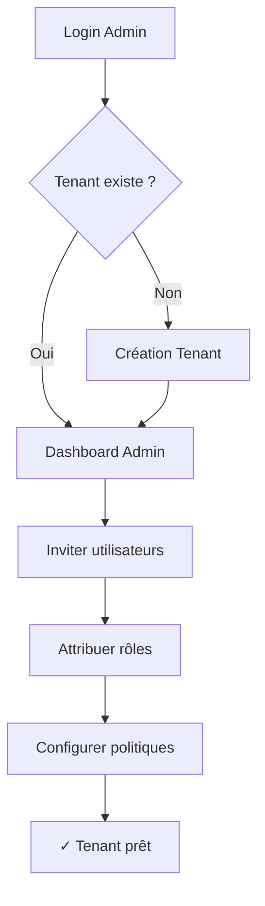
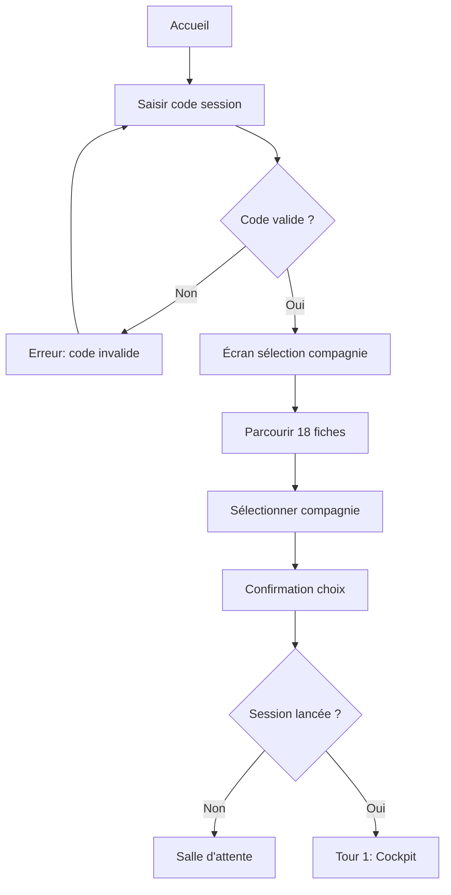
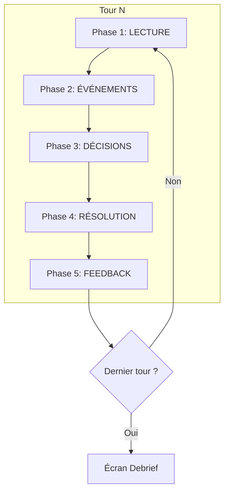
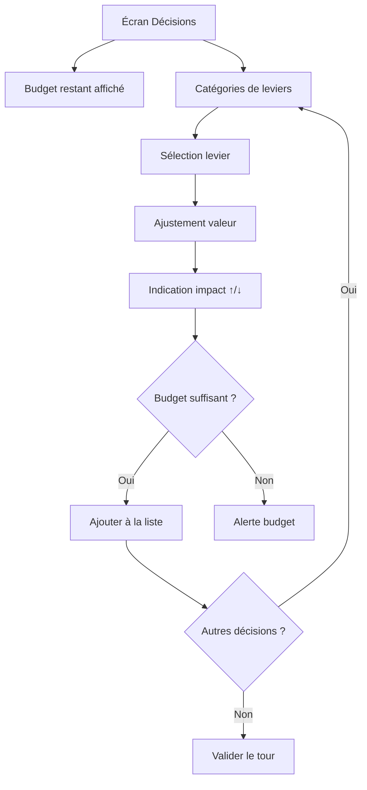
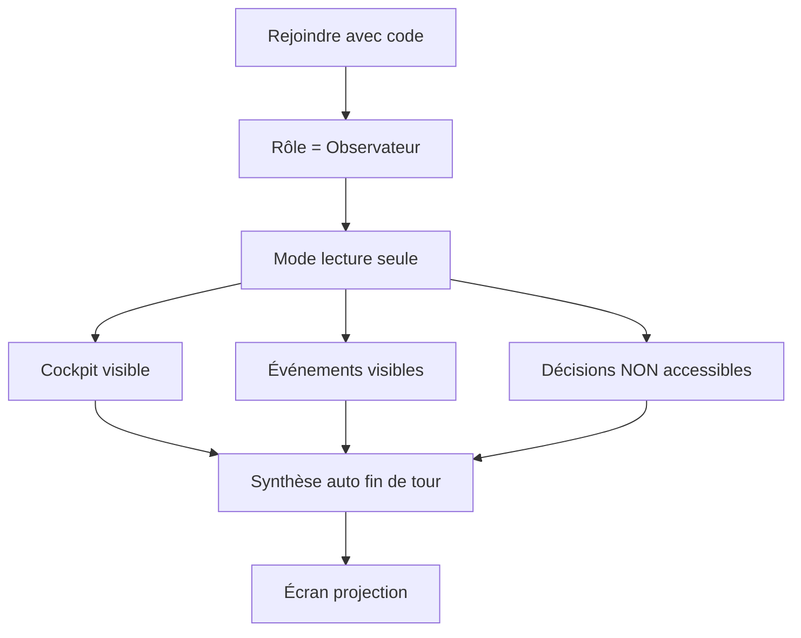

# user_flows.md — Parcours utilisateur AssurManager

**Version** : 1.0  
**Statut** : Draft  
**Dernière MAJ** : 2025-12-25  
**Auteur** : UX/UI Designer

---

## 1) Vue d'ensemble des flux MVP

| Flux | Persona principal | Objectif |
|------|-------------------|----------|
| F1 — Onboarding Admin | P5 (Nadia) | Configurer le tenant et inviter les utilisateurs |
| F2 — Création Session | P2 (Romain) | Paramétrer et lancer une session de jeu |
| F3 — Onboarding Joueur | P6 (Malik) | Rejoindre une session et choisir sa compagnie |
| F4 — Boucle de Jeu | P6/P7 | Jouer un tour complet (5 phases) |
| F5 — Fin de Partie | P6/P7 | Consulter le debrief et exporter les résultats |
| F6 — Observation | P8 (Julie) | Suivre une session sans décider |

---

## 2) F1 — Flux Onboarding Admin

### Diagramme



### Étapes détaillées

| Étape | Action utilisateur | Feedback système | État suivant |
|-------|-------------------|------------------|--------------|
| 1 | Se connecte avec identifiants | Validation + redirection | Dashboard Admin |
| 2 | Clique "Inviter" | Modal invitation s'ouvre | Saisie email |
| 3 | Saisit email + rôle | Envoi invitation | Confirmation toast |
| 4 | Configure politiques (optionnel) | Sauvegarde auto | Feedback "Enregistré" |

### Points d'attention UX
- **First-time experience** : Guide de configuration en 3 étapes
- **Erreur email invalide** : Message inline immédiat
- **Succès invitation** : Toast + email apparaît dans liste

---

## 3) F2 — Flux Création Session (Formateur)

### Diagramme

```mermaid
flowchart TD
    A[Dashboard Formateur] --> B[Clic "Nouvelle Session"]
    B --> C[Wizard étape 1: Paramètres]
    C --> D[Wizard étape 2: Produits]
    D --> E[Wizard étape 3: Difficulté]
    E --> F[Wizard étape 4: Événements]
    F --> G[Récapitulatif]
    G --> H{Valider ?}
    H -->|Oui| I[Session créée]
    H -->|Non| C
    I --> J[Code session généré]
    J --> K[Partager aux joueurs]
```

### Wizard de création

| Étape | Contenu | Validation |
|-------|---------|------------|
| **1. Paramètres** | Nom, durée (nb tours), vitesse (trimestre) | Nom obligatoire |
| **2. Produits** | Sélection Auto/MRH (min 1) | Au moins 1 produit |
| **3. Difficulté** | Novice / Intermédiaire | Choix obligatoire |
| **4. Événements** | Catalogue baseline (on/off par catégorie) | Optionnel |

### Micro-interactions
- **Navigation wizard** : Stepper visuel avec état (✓ done / ● current / ○ todo)
- **Sélection produit** : Card clickable avec animation de sélection
- **Génération code** : Animation de copie + feedback "Copié !"

---

## 4) F3 — Flux Onboarding Joueur

### Diagramme



### Sélection compagnie

| Élément | Contenu | Interaction |
|---------|---------|-------------|
| **Grille 18 compagnies** | Logo + Nom + 3 traits | Hover = preview rapide |
| **Fiche détaillée** | Traits complets + points forts/faibles | Clic = modal |
| **Bouton "Choisir"** | CTA principal | Clic = confirmation |

### États de la salle d'attente
- **Loading** : "En attente du lancement par le formateur..."
- **Joueurs connectés** : Liste des participants (avatars)
- **Compte à rebours** : Si timer de lancement configuré

---

## 5) F4 — Flux Boucle de Jeu (1 tour)

### Diagramme principal



### Phase 1 : LECTURE (Cockpit)

```mermaid
flowchart LR
    A[Affichage Cockpit] --> B[Radar 7 indices]
    A --> C[P&L synthétique]
    A --> D[Indicateurs par produit]
    A --> E[Alertes actives]
    B & C & D & E --> F[Bouton "Continuer"]
```

**Temps estimé** : 1-2 min de lecture  
**Action** : Bouton "Voir les événements" pour passer à la phase suivante

### Phase 2 : ÉVÉNEMENTS

```mermaid
flowchart TD
    A[News Flash apparaît] --> B{Événement ?}
    B -->|Oui| C[Card événement]
    C --> D[Type: Marché/Compagnie]
    C --> E[Impact estimé]
    C --> F[Durée]
    D & E & F --> G[Bouton "Compris"]
    B -->|Non| H[Message "Trimestre calme"]
    G --> I[Phase Décisions]
    H --> I
```

**Animation** : Apparition slide-in des cards événements  
**Interaction** : Clic sur card = détails étendus

### Phase 3 : DÉCISIONS



**Contraintes affichées** :
- Budget restant (jauge)
- Prérequis non remplis (levier grisé + tooltip)
- Exclusions mutuelles (warning)

### Phase 4 : RÉSOLUTION

**Durée** : < 2 secondes (pas d'interaction)  
**Affichage** : Spinner + "Calcul en cours..."

### Phase 5 : FEEDBACK

```mermaid
flowchart TD
    A[Écran Feedback] --> B[Variations indices Δ]
    A --> C[Top 3 drivers]
    A --> D[Nouvelles alertes]
    A --> E[Preview effets retard]
    A --> F[Message pédagogique]
    B & C & D & E & F --> G[Bouton "Tour suivant"]
```

**Micro-interactions** :
- Variations : Animation jauge (slide de l'ancienne à la nouvelle valeur)
- Drivers : Cards avec icône (décision/événement/effet retard)
- Alertes : Apparition avec pulse si critique

---

## 6) F5 — Flux Fin de Partie

### Diagramme

```mermaid
flowchart TD
    A[Dernier tour terminé] --> B[Écran Score Final]
    B --> C[Score global + composants]
    B --> D[Classement si multijoueur]
    C & D --> E[Bouton "Voir le Debrief"]
    E --> F[Écran Debrief]
    F --> G[Top 5 décisions]
    F --> H[Courbes indices]
    F --> I[Biais détectés]
    F --> J[Recommandations]
    G & H & I & J --> K[Bouton "Exporter PDF"]
    K --> L[Téléchargement PDF]
```

### Contenu du debrief

| Section | Contenu | Format |
|---------|---------|--------|
| **Score** | Score global + détail par indice | Jauge + breakdown |
| **Timeline** | Courbe des indices tour par tour | Graphique ligne |
| **Décisions clés** | Top 5 décisions ayant eu le plus d'impact | Liste + pourquoi |
| **Biais** | Court-termisme, négligence d'un indice... | Texte + conseil |
| **Recommandations** | Axes d'amélioration pour la prochaine partie | Liste actionnable |

---

## 7) F6 — Flux Observation (Séminaire)

### Diagramme



### Différences avec le mode Joueur

| Élément | Joueur | Observateur |
|---------|--------|-------------|
| Cockpit | Interactif | Lecture seule |
| Décisions | Peut décider | Grisé / masqué |
| Feedback | Personnel | Synthèse équipe |
| Actions | Toutes | Aucune |

### Mode projection (grand écran)
- **Layout simplifié** : Moins de détails, plus lisible
- **Taille police** : +50% minimum
- **Couleurs** : Contrastes renforcés
- **Contenu priorisé** : Indices + événements majeurs + score

---

## 8) Transitions entre écrans

| De | Vers | Transition | Durée |
|----|------|------------|-------|
| Login | Dashboard | Fade-in | 300ms |
| Dashboard | Session | Slide-right | 400ms |
| Phase → Phase | Suivante | Slide-up | 300ms |
| Modal | Fermeture | Fade-out + scale | 200ms |
| Tour → Tour | Suivant | Crossfade | 500ms |

---

## 9) Gestion des erreurs dans les flux

| Flux | Erreur type | Affichage | Récupération |
|------|-------------|-----------|--------------|
| Login | Identifiants invalides | Message inline rouge | Retry |
| Code session | Code inexistant | Toast erreur | Ressaisir |
| Décision | Budget insuffisant | Alert + suggestion | Ajuster |
| Résolution | Timeout moteur | Modal erreur | Retry auto |
| Export PDF | Échec génération | Toast + retry | Bouton retry |

---

## 10) Décisions / Risques / Checklist

### Décisions UX

| ID | Décision | Justification |
|----|----------|---------------|
| UF-01 | Wizard 4 étapes pour création session | Réduction charge cognitive |
| UF-02 | Salle d'attente avant lancement | Synchronisation joueurs |
| UF-03 | 5 phases séquentielles par tour | Cohérence avec gameplay_core.md |
| UF-04 | Mode projection pour séminaire | Besoin personas P8/P4 |

### Risques

| ID | Risque | Mitigation |
|----|--------|------------|
| R-01 | Flux trop long avant de jouer | Onboarding progressif, skip optionnel |
| R-02 | Confusion entre phases | Indicateur de phase toujours visible |
| R-03 | Observateur frustré | Synthèse enrichie, accès au replay |

### Checklist

- [x] Flux onboarding admin documenté
- [x] Flux création session documenté
- [x] Flux onboarding joueur documenté
- [x] Boucle de jeu 5 phases documentée
- [x] Flux fin de partie documenté
- [x] Flux observation documenté
- [x] Transitions définies
- [x] Erreurs types listées
