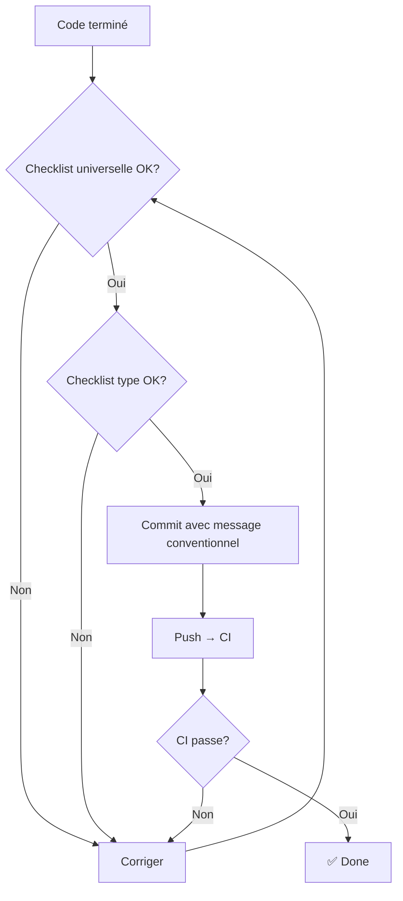

# Definition of Done — AssurManager

> **Source of Truth** pour les critères de complétion d'une tâche.
> Dernière mise à jour : 2025-12-25

---

## 1) Philosophie

> **Done = Déployable sans peur.**

Une tâche est terminée quand elle peut partir en production sans casser l'existant ni créer de dette technique non documentée.

---

## 2) Garde-fous explicites

> [!CAUTION]
> **Refactors non demandés INTERDITS**

| Interdit | Autorisé |
|----------|----------|
| Refactorer un module "parce que c'est mieux" | Refactorer si c'est dans la US |
| Changer la structure du projet sans discussion | Proposer via PR et attendre review |
| Ajouter des features "tant qu'on y est" | S'en tenir à la US |
| Optimiser prématurément | Optimiser si perf bloquante mesurée |

**Règle** : Si ce n'est pas dans l'US, ça n'est pas dans le PR.

---

## 3) Checklist universelle

Chaque PR/commit doit valider :

### Build & Types

- [ ] `npm run build` passe sans erreur
- [ ] `npm run type-check` passe sans erreur
- [ ] Pas de `any` sauf exception documentée en commentaire

### Lint

- [ ] `npm run lint` passe sans erreur
- [ ] Pas de `eslint-disable` sauf exception justifiée

### Tests

- [ ] Tests existants passent (`npm run test:run`)
- [ ] Si logique moteur modifiée → tests ajoutés/mis à jour
- [ ] Couverture moteur maintenue ≥ 80%

### Code

- [ ] Pas de `console.log` en production (sauf debug temporaire tagué `// TODO: remove`)
- [ ] Pas de code commenté sans `// TODO` ou `// FIXME`
- [ ] Pas de secrets hardcodés
- [ ] Nommage conforme à [`project_structure.md`](./project_structure.md)

### Documentation

- [ ] README mis à jour si nouveau setup requis
- [ ] JSDoc pour les fonctions publiques complexes
- [ ] Types exportés documentés si API publique

---

## 4) Checklist par type de tâche

### Feature (nouvelle fonctionnalité)

En plus de la checklist universelle :

- [ ] US référencée dans le commit (`US-XXX: description`)
- [ ] Critères d'acceptation (AC) de la US validés
- [ ] Screenshots/vidéo si UI modifiée
- [ ] Edge cases gérés (erreurs, états vides, loading)

### Bugfix

En plus de la checklist universelle :

- [ ] Issue référencée (`Fixes #XXX`)
- [ ] Test de non-régression ajouté (si applicable)
- [ ] Root cause identifiée et documentée dans le commit

### Refactor

En plus de la checklist universelle :

- [ ] **Explicitement demandé** (pas spontané)
- [ ] Comportement identique (tests passent)
- [ ] Pas de changement d'API sans migration
- [ ] Performance non dégradée

### Hotfix

En plus de la checklist universelle :

- [ ] Branche depuis `main`
- [ ] Scope minimal (un seul fix)
- [ ] Test manuel avant push
- [ ] Merge direct dans `main` + backport si branche dev existe

---

## 5) Critères par composant

### Moteur de simulation (`lib/engine/`)

| Critère | Obligatoire |
|---------|-------------|
| Tests unitaires | ✅ |
| Couverture ≥ 80% | ✅ |
| Pas d'effets de bord | ✅ |
| Pas d'imports React | ✅ |
| Types stricts | ✅ |
| Invariants vérifiés | ✅ |

> **Invariants moteur** (voir [`indices.md`](../00_product/indices.md)) :
> - Tous les indices restent dans [0, 100]
> - P&L = primes - sinistres - frais + produits financiers
> - Aucune division par zéro possible

### Composants UI (`components/`)

| Critère | Obligatoire |
|---------|-------------|
| Fonctionne sur écrans 1024px+ | ✅ |
| États empty/loading/error gérés | ✅ |
| Accessible (aria-labels si interactif) | Recommandé |
| CSS Modules (pas de style inline) | ✅ |

### API Routes (`app/api/`)

| Critère | Obligatoire |
|---------|-------------|
| Validation des inputs (zod ou manuel) | ✅ |
| Codes HTTP corrects (200, 400, 401, 500) | ✅ |
| Errors loggées côté serveur | ✅ |
| Pas de données sensibles en response | ✅ |

### Migrations SQL (`supabase/migrations/`)

| Critère | Obligatoire |
|---------|-------------|
| Fichier numéroté (`XXX_description.sql`) | ✅ |
| Réversible (ou justification si non) | Recommandé |
| Testé sur environnement de dev | ✅ |
| RLS policies si nouvelles tables | ✅ |

---

## 6) Commit message convention

Format :

```
<type>(scope): <description>

[optional body]

[optional footer: US-XXX, Fixes #XXX]
```

### Types

| Type | Usage |
|------|-------|
| `feat` | Nouvelle fonctionnalité |
| `fix` | Correction de bug |
| `refactor` | Refactoring (même comportement) |
| `docs` | Documentation uniquement |
| `test` | Ajout/modification de tests |
| `chore` | Maintenance (deps, config) |

### Exemples

```
feat(engine): implement IAC calculation

- Add calculateIAC function with pricing and satisfaction factors
- Add unit tests for edge cases

US-020
```

```
fix(cockpit): correct index display rounding

Indices were showing 3 decimals, now correctly rounded to integers.

Fixes #42
```

---

## 7) Workflow de validation



---

## 8) Exceptions documentées

Parfois, une règle ne peut pas être respectée. **Documenter l'exception** :

```typescript
// TODO: Refactor when time permits - this is a quick fix for US-015
// eslint-disable-next-line @typescript-eslint/no-explicit-any
const legacyData: any = response.data;
```

| Tag | Usage |
|-----|-------|
| `// TODO:` | À faire plus tard |
| `// FIXME:` | Bug connu, workaround en place |
| `// HACK:` | Solution temporaire pas idéale |
| `// NOTE:` | Explication importante |

---

## 9) Risques & Mitigations

| Risque | Impact | Probabilité | Mitigation |
|--------|--------|-------------|------------|
| **DoD trop stricte** | Ralentissement | Moyenne | Ajuster si friction excessive |
| **DoD ignorée** | Dette technique | Haute si pas de CI | CI bloquante |
| **Refactor "scope creep"** | Délais | Haute | Règle "pas dans l'US = pas dans PR" |
| **Tests oubliés moteur** | Bugs calculs | Moyenne | Coverage gate en CI |
| **Commit mal formé** | Historique illisible | Faible | Pas bloquant, mais à corriger |

---

## 10) Décisions actées

| ID | Décision | Date | Contexte |
|----|----------|------|----------|
| DOD-001 | Pas de refactor non demandé | 2025-12 | Protège contre scope creep |
| DOD-002 | Coverage 80% moteur | 2025-12 | Cœur métier critique |
| DOD-003 | Build + lint + type-check obligatoires | 2025-12 | CI gate |
| DOD-004 | Convention commit simple | 2025-12 | Historique lisible |
| DOD-005 | Exceptions documentées OK | 2025-12 | Pragmatisme > dogmatisme |

---

## 11) Quick Reference Card

À afficher / imprimer :

```
╔══════════════════════════════════════════════════╗
║              DEFINITION OF DONE                  ║
╠══════════════════════════════════════════════════╣
║ ☐ npm run build     → OK                         ║
║ ☐ npm run type-check → OK                        ║
║ ☐ npm run lint       → OK                        ║
║ ☐ npm run test:run   → OK                        ║
║ ☐ Pas de console.log                             ║
║ ☐ Pas de code commenté sans TODO                 ║
║ ☐ US référencée si feature                       ║
║ ☐ Tests ajoutés si moteur modifié                ║
║ ☐ PAS DE REFACTOR NON DEMANDÉ                    ║
╚══════════════════════════════════════════════════╝
```
