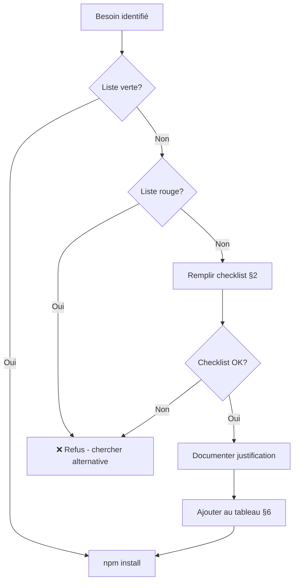

# Politique des Dépendances — AssurManager

> **Source of Truth** pour l'ajout, l'évaluation et la gestion des dépendances.
> Dernière mise à jour : 2025-12-25

---

## 1) Philosophie

> **Chaque dépendance est une dette.**

En solo dev, chaque package ajouté implique :
- Maintenance des mises à jour (breaking changes)
- Risque de vulnérabilités (supply chain attacks)
- Augmentation du bundle size
- Temps d'apprentissage de l'API

**Règle d'or** : Si tu peux le faire en 50 lignes de code maintenables, ne l'importe pas.

---

## 2) Checklist AVANT d'ajouter une dépendance

Avant d'exécuter `npm install <package>`, répondre à TOUTES ces questions :

### A. Nécessité

- [ ] **Ai-je vraiment besoin de cette fonctionnalité ?**
  - Est-ce un besoin MVP ou un nice-to-have ?
  - Référence : [`backlog.md`](../00_product/backlog.md)

- [ ] **Existe-t-il une solution native ?**
  - API du navigateur (Fetch, IntersectionObserver, etc.)
  - API Next.js (Image, Link, etc.)
  - API React 19 (use, useFormStatus, etc.)

- [ ] **Puis-je l'implémenter en < 100 lignes ?**
  - Si oui → ne pas importer

### B. Qualité du package

| Critère | Seuil minimum |
|---------|---------------|
| Downloads/semaine | > 10 000 |
| Dernière release | < 6 mois |
| Issues ouvertes (critiques) | < 20 |
| Étoiles GitHub | > 500 |
| TypeScript natif ou `@types/` | Obligatoire |
| Licence | MIT, Apache 2.0, ISC |

### C. Impact technique

- [ ] **Bundle size** : vérifier sur [bundlephobia.com](https://bundlephobia.com)
  - Seuil : < 50 KB gzipped (sauf justification)

- [ ] **Tree-shakable ?**
  - ESM + exports spécifiques

- [ ] **Dépendances transitives ?**
  - `npm ls <package>` pour vérifier

---

## 3) Liste verte (préapprouvées)

Ces dépendances peuvent être ajoutées **sans discussion** :

| Package | Usage | Justification |
|---------|-------|---------------|
| `vitest` | Tests unitaires | Standard moderne, rapide, ESM natif |
| `@testing-library/react` | Tests composants | Standard React, avec Vitest |
| `date-fns` | Manipulation dates | Léger, tree-shakable, alternative à Moment |
| `zod` | Validation schémas | Léger, TypeScript-first |
| `clsx` | Classes CSS conditionnelles | 228 bytes, utilitaire minimal |
| `recharts` | Graphiques cockpit | React natif, léger, déclaratif |

---

## 4) Liste rouge (interdites/déconseillées)

| Package | Raison | Alternative |
|---------|--------|-------------|
| `moment` / `dayjs` | Trop lourd, `date-fns` suffit | `date-fns` ou `Intl` natif |
| `lodash` (complet) | Trop lourd | Fonctions natives ES6+ |
| `axios` | `fetch` natif suffit | `fetch` + wrapper maison |
| `styled-components` | CSS-in-JS lourd | CSS Modules |
| `redux` / `mobx` | Overengineering | React Context + hooks |
| `prisma` / `drizzle` | Supabase client suffit | `@supabase/supabase-js` |
| `jquery` | Inutile avec React | React natif |
| `bootstrap` / `tailwind` | CSS Modules suffisent MVP | CSS custom |

> **Exception** : Si une fonctionnalité V1+ justifie absolument un package listé, documenter la justification dans le PR.

---

## 5) Processus d'ajout



---

## 6) Tableau des dépendances (à maintenir)

### Production (`dependencies`)

| Package | Version | Ajout | Taille | Justification |
|---------|---------|-------|--------|---------------|
| `next` | ^15.1.0 | Initial | 5.2 MB | Framework coeur |
| `react` | ^19.0.0 | Initial | 6.4 KB | UI coeur |
| `react-dom` | ^19.0.0 | Initial | 130 KB | React DOM |
| `@supabase/supabase-js` | ^2.47.0 | Initial | 89 KB | Client Supabase |
| `@supabase/ssr` | ^0.5.2 | Initial | 4 KB | Auth SSR Next.js |

### Développement (`devDependencies`)

| Package | Version | Ajout | Justification |
|---------|---------|-------|---------------|
| `typescript` | ^5.7.2 | Initial | Typage statique |
| `eslint` | ^9.17.0 | Initial | Linting |
| `eslint-config-next` | ^15.1.0 | Initial | Config ESLint Next.js |
| `@types/node` | ^22.10.2 | Initial | Types Node.js |
| `@types/react` | ^19.0.1 | Initial | Types React |
| `@types/react-dom` | ^19.0.2 | Initial | Types React DOM |

---

## 7) Audit périodique

### Fréquence
- **Mensuel** : `npm audit` (vulnérabilités)
- **Trimestriel** : révision du tableau §6 (pertinence)

### Commandes

```bash
# Vulnérabilités
npm audit

# Packages outdated
npm outdated

# Packages non utilisés
npx depcheck

# Taille bundle (si build Next.js)
npx @next/bundle-analyzer
```

---

## 8) Risques & Mitigations

| Risque | Impact | Probabilité | Mitigation |
|--------|--------|-------------|------------|
| **Supply chain attack** | Sécurité compromise | Faible | `npm audit`, lock versions, peu de deps |
| **Breaking change majeur** | Temps perdu en migration | Moyenne | Pin versions, tester avant upgrade |
| **Package abandonné** | Code legacy | Moyenne | Vérifier activité avant ajout |
| **Bundle bloat** | Performance dégradée | Moyenne | Bundlephobia check, tree-shaking |
| **Licence incompatible** | Problème légal | Faible | Vérifier licence avant ajout |

---

## 9) Décisions actées

| ID | Décision | Date | Contexte |
|----|----------|------|----------|
| DEP-001 | Pas de lodash, ES6 natif | 2025-12 | Fonctions natives suffisantes |
| DEP-002 | Pas de CSS framework | 2025-12 | CSS Modules + custom |
| DEP-003 | Vitest préapprouvé | 2025-12 | Tests moteur prioritaires |
| DEP-004 | date-fns si besoin dates | 2025-12 | Léger, tree-shakable |
| DEP-005 | recharts si besoin graphiques | 2025-12 | React natif, MVP cockpit |

---

## 10) Template de justification

Quand tu ajoutes une nouvelle dépendance, copie ce template dans le commit/PR :

```markdown
## Ajout dépendance : `<package-name>`

**Besoin** : [Description du besoin métier]
**Alternative native explorée** : [Ce qui a été essayé]
**Raison du choix** : [Pourquoi ce package]
**Taille bundle** : [X KB gzipped]
**Dernière release** : [Date]
**Licence** : [MIT/Apache/etc.]
```
