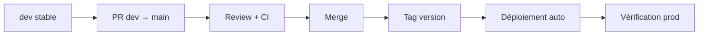
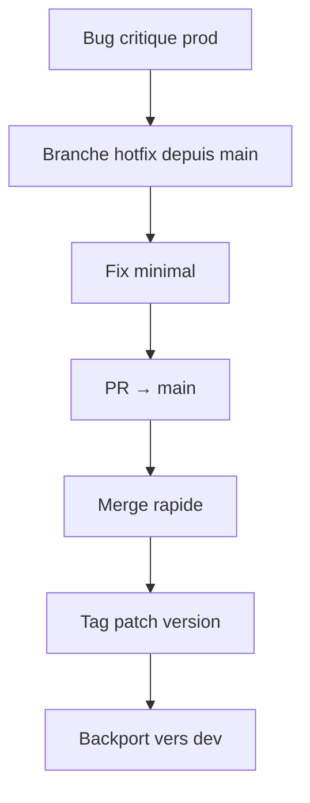

# Release Process — AssurManager

> **Source of Truth** pour le processus de release.
> Dernière mise à jour : 2025-12-26

---

## 1) Vue d'ensemble



---

## 2) Versioning

### Schéma SemVer

```
v<MAJOR>.<MINOR>.<PATCH>
```

| Composant | Quand incrémenter | Exemple |
|-----------|-------------------|---------|
| **MAJOR** | Breaking changes, incompatibilité API | `v1.0.0` → `v2.0.0` |
| **MINOR** | Nouvelles fonctionnalités (backward compatible) | `v1.0.0` → `v1.1.0` |
| **PATCH** | Bugfixes, corrections mineures | `v1.0.0` → `v1.0.1` |

### Exemples

```
v0.1.0  → MVP initial
v0.2.0  → Ajout mode multijoueur
v0.2.1  → Fix affichage indices
v1.0.0  → Release publique stable
```

### Convention MVP

Pendant le développement MVP, rester en `v0.x.x` :
- Chaque sprint = increment `MINOR`
- Bugfixes = increment `PATCH`

---

## 3) Checklist pré-release

### Validation technique

- [ ] CI verte sur `dev` (build + lint + tests)
- [ ] Couverture moteur ≥ 80%
- [ ] Pas de `console.log` restants
- [ ] Pas de `TODO` critiques non résolus
- [ ] Pas de vulnérabilités connues (`npm audit`)

### Validation fonctionnelle

- [ ] Toutes les US du sprint sont mergées
- [ ] Test manuel des features critiques
- [ ] Test sur navigateurs cibles (Chrome, Firefox)
- [ ] Données de test nettoyées

### Documentation

- [ ] CHANGELOG mis à jour
- [ ] Version dans `package.json` mise à jour
- [ ] Notes de release rédigées

---

## 4) Processus step-by-step

### Étape 1 : Préparer la release

```bash
# 1. S'assurer que dev est à jour
git checkout dev
git pull origin dev

# 2. Vérifier CI et tests
npm run build
npm run test:run
npm run lint

# 3. Mettre à jour la version
npm version minor  # ou major/patch selon le cas
# Cela modifie package.json et crée un commit

# 4. Mettre à jour le CHANGELOG
# Éditer CHANGELOG.md avec les changements
```

### Étape 2 : Créer la PR de release

```bash
# Push des changements de version
git push origin dev
```

Créer une PR `dev` → `main` avec :

```markdown
## 🚀 Release v0.2.0

### 📋 Contenu

- feat: Calcul IAC (US-020)
- feat: Dashboard cockpit (US-015)
- fix: Arrondi des indices (#42)
- chore: Upgrade dependencies

### ✅ Checklist release

- [x] CI verte
- [x] Tests passent
- [x] CHANGELOG mis à jour
- [x] Version package.json mise à jour
- [x] Test manuel effectué

### 📝 Notes
<!-- Points d'attention pour la prod -->
```

### Étape 3 : Review et merge

1. **Review** la PR (même en solo, re-vérifier les changements)
2. **Merge** (pas squash, garder l'historique)
3. CI déploie automatiquement sur production

### Étape 4 : Taguer la release

```bash
# Après merge dans main
git checkout main
git pull origin main

# Créer le tag
git tag v0.2.0
git push origin v0.2.0
```

### Étape 5 : Créer la release GitHub

Via l'interface GitHub ou CLI :

```bash
gh release create v0.2.0 \
  --title "v0.2.0 - Dashboard et calculs" \
  --notes "$(cat CHANGELOG.md | head -50)"
```

### Étape 6 : Vérification post-déploiement

- [ ] Site accessible
- [ ] Fonctionnalités principales opérationnelles
- [ ] Logs sans erreurs critiques
- [ ] Métriques normales

---

## 5) Hotfix process

Pour les correctifs urgents en production :



### Commandes

```bash
# 1. Créer branche hotfix
git checkout main
git pull origin main
git checkout -b hotfix/v0.2.1-critical-bug

# 2. Fix et commit
git commit -m "hotfix: fix critical auth issue"

# 3. Push et PR vers main
git push origin hotfix/v0.2.1-critical-bug
# Créer PR → main (review accélérée)

# 4. Après merge, tag
git checkout main
git pull
git tag v0.2.1
git push origin v0.2.1

# 5. Backport vers dev
git checkout dev
git cherry-pick <commit-hash>
git push origin dev
```

---

## 6) CHANGELOG format

```markdown
# Changelog

Toutes les modifications notables de ce projet sont documentées ici.

Format basé sur [Keep a Changelog](https://keepachangelog.com/).

## [Unreleased]

### Added
- 

### Changed
- 

### Fixed
- 

## [0.2.0] - 2025-12-30

### Added
- feat(engine): Calcul de l'IAC (US-020)
- feat(cockpit): Dashboard avec indices (US-015)

### Changed
- refactor(ui): Nouveau design des cartes

### Fixed
- fix(cockpit): Arrondi des indices (#42)

## [0.1.0] - 2025-12-15

### Added
- Initial MVP release
- Moteur de simulation base
- Interface cockpit
```

---

## 7) CI/CD intégration

### Workflow simplifié

```yaml
# .github/workflows/release.yml
name: Release

on:
  push:
    tags:
      - 'v*'

jobs:
  release:
    runs-on: ubuntu-latest
    steps:
      - uses: actions/checkout@v4
      
      - name: Build
        run: npm ci && npm run build
        
      - name: Deploy
        # Vercel auto-deploy sur push main
```

### Vercel settings

| Setting | Valeur |
|---------|--------|
| Production branch | `main` |
| Preview branches | `dev`, `feat/*` |
| Auto-deploy | Enabled |

---

## 8) Rollback

Si problème post-déploiement :

### Option 1 : Revert via Vercel

1. Dashboard Vercel → Deployments
2. Sélectionner le déploiement précédent
3. "Promote to Production"

### Option 2 : Revert Git

```bash
git checkout main
git revert HEAD
git push origin main
# Déploiement auto du revert
```

---

## 9) Planning releases MVP

| Version | Contenu prévu | Date estimée |
|---------|--------------|--------------|
| `v0.1.0` | Setup + structure | Sprint 1 |
| `v0.2.0` | Moteur simulation base | Sprint 2 |
| `v0.3.0` | UI cockpit | Sprint 3 |
| `v0.4.0` | Leviers jouables | Sprint 4 |
| `v0.5.0` | Événements | Sprint 5 |
| `v0.6.0` | Scoring + debrief | Sprint 6 |
| `v1.0.0` | MVP complet | Date cible |

---

## 10) Quick Reference

```
╔══════════════════════════════════════════════════════════════════╗
║                     RELEASE PROCESS                              ║
╠══════════════════════════════════════════════════════════════════╣
║  1. dev stable + CI verte                                        ║
║  2. npm version minor/patch                                      ║
║  3. Update CHANGELOG.md                                          ║
║  4. PR dev → main                                                ║
║  5. Merge (no squash)                                            ║
║  6. git tag vX.Y.Z && git push --tags                            ║
║  7. gh release create vX.Y.Z                                     ║
║  8. Verify production                                            ║
╠══════════════════════════════════════════════════════════════════╣
║  Hotfix: main → hotfix/* → main → cherry-pick dev                ║
╚══════════════════════════════════════════════════════════════════╝
```

---

## 11) Décisions actées

| ID | Décision | Date |
|----|----------|------|
| REL-001 | SemVer pour versioning | 2025-12 |
| REL-002 | Tags manuels (pas auto) | 2025-12 |
| REL-003 | CHANGELOG obligatoire | 2025-12 |
| REL-004 | Vercel pour déploiement | 2025-12 |
| REL-005 | Rester en v0.x pendant MVP | 2025-12 |
