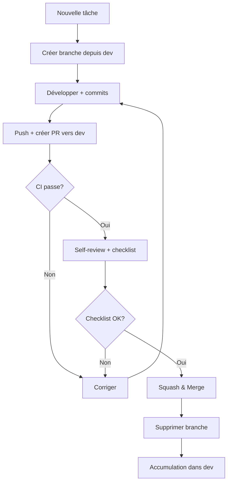
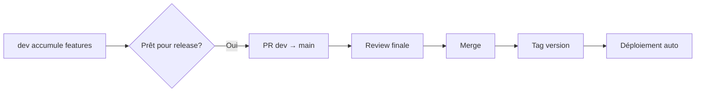

# Git Workflow — AssurManager

> **Source of Truth** pour la stratégie de branches.
> Dernière mise à jour : 2025-12-26

---

## 1) Philosophie

> **Simple, robuste, adapté au développeur solo.**

Ce workflow suit le principe : **`main` = production**, **`dev` = intégration**, **`feat/*` = travail en cours**.

---

## 2) Branches principales

```
main ─────●─────────────●─────────────●───────── (production)
          │             │             │
          │     merge   │     merge   │
          │             │             │
dev ──────●─────●───────●─────●───────●───────── (intégration)
               /              /
       feat/xxx         feat/yyy
```

| Branche | Rôle | Protection |
|---------|------|------------|
| `main` | **Production** — Code stable, déployé | ✅ Protégée, PR obligatoire |
| `dev` | **Intégration** — Accumule les features avant release | ✅ Protégée, PR obligatoire |
| `feat/*` | **Travail** — Une branche par fonctionnalité/bug | ❌ Non protégée |

---

## 3) Nomenclature des branches

### Format

```
<type>/<identifiant>-<description-courte>
```

### Types autorisés

| Type | Usage | Exemple |
|------|-------|---------|
| `feat/` | Nouvelle fonctionnalité | `feat/US-020-calcul-iac` |
| `fix/` | Correction de bug | `fix/42-arrondi-indices` |
| `refactor/` | Refactoring (demandé) | `refactor/moteur-optimisation` |
| `docs/` | Documentation seule | `docs/readme-update` |
| `chore/` | Maintenance | `chore/upgrade-deps` |
| `hotfix/` | Correctif urgent prod | `hotfix/auth-crash` |

### Règles

- **Minuscules uniquement**
- **Tirets** pour séparer les mots (pas d'underscore)
- **Identifiant** = numéro US (`US-XXX`) ou issue (`#XX`)
- **Description courte** : 2-4 mots max

### Exemples concrets

```bash
# Features
git checkout -b feat/US-020-calcul-iac
git checkout -b feat/US-015-dashboard-cockpit
git checkout -b feat/US-040-tutoriel-interactif

# Bugfixes
git checkout -b fix/42-rounding-indices
git checkout -b fix/auth-session-expire

# Documentation
git checkout -b docs/api-specification

# Hotfix production
git checkout -b hotfix/crash-login
```

---

## 4) Cycle de vie d'une feature



### Commandes type

```bash
# 1. Créer la branche
git checkout dev
git pull origin dev
git checkout -b feat/US-020-calcul-iac

# 2. Développer avec commits fréquents
git add .
git commit -m "feat(engine): add IAC base calculation"
git commit -m "test(engine): add IAC unit tests"

# 3. Push et créer PR
git push -u origin feat/US-020-calcul-iac
# → Créer PR vers dev via GitHub

# 4. Après merge, nettoyer
git checkout dev
git pull origin dev
git branch -d feat/US-020-calcul-iac
```

---

## 5) Cycle de release



### Processus

1. **Vérifier** que `dev` est stable (CI vert, QA OK)
2. **Créer PR** `dev` → `main`
3. **Review finale** : vérifier le changelog
4. **Merge** (pas squash pour garder l'historique)
5. **Tag** la version : `git tag v1.0.0 && git push --tags`

---

## 6) Hotfix (urgence production)

```bash
# 1. Branche depuis main
git checkout main
git pull origin main
git checkout -b hotfix/critical-bug

# 2. Fix minimal
git commit -m "hotfix: fix critical login crash"

# 3. PR directe vers main
# → Merge après CI

# 4. Backport vers dev
git checkout dev
git cherry-pick <commit-hash>
git push origin dev
```

---

## 7) Règles d'or

| Règle | Détail |
|-------|--------|
| ✅ **PR obligatoire** | Jamais de push direct sur `main` ou `dev` |
| ✅ **CI doit passer** | Build + lint + tests avant merge |
| ✅ **Une branche = une tâche** | Pas de "fourre-tout" |
| ✅ **Branches courtes** | Merge dans les 2-3 jours si possible |
| ✅ **Supprimer après merge** | Garder le repo propre |
| ❌ **Force push interdit** | Sauf sur sa propre branche feature |

---

## 8) Configuration GitHub recommandée

### Branch protection rules

#### Pour `main`

- [x] Require a pull request before merging
- [x] Require status checks to pass (CI)
- [x] Require branches to be up to date
- [x] Do not allow bypassing the above settings
- [x] Require linear history (recommandé)

#### Pour `dev`

- [x] Require a pull request before merging
- [x] Require status checks to pass (CI)
- [ ] Require approvals (optionnel en solo)

---

## 9) Risques & Mitigations

| Risque | Impact | Mitigation |
|--------|--------|------------|
| **Oubli de PR** | Code non reviewé | Protection branches |
| **Branches longues** | Conflits | Merge `dev` dans feature régulièrement |
| **Hotfix oublié dans dev** | Régression | Checklist release |
| **Historique pollué** | Difficulté debug | Squash merge pour features |

---

## 10) Quick Reference

```
╔══════════════════════════════════════════════════════════════════╗
║                       GIT WORKFLOW                               ║
╠══════════════════════════════════════════════════════════════════╣
║  main    ← production (protégée)                                 ║
║  dev     ← intégration (protégée)                                ║
║  feat/*  ← travail en cours                                      ║
╠══════════════════════════════════════════════════════════════════╣
║  git checkout dev && git pull                                    ║
║  git checkout -b feat/US-XXX-description                         ║
║  ... commits ...                                                 ║
║  git push -u origin feat/US-XXX-description                      ║
║  → PR vers dev → CI → Merge → Supprimer branche                  ║
╚══════════════════════════════════════════════════════════════════╝
```
