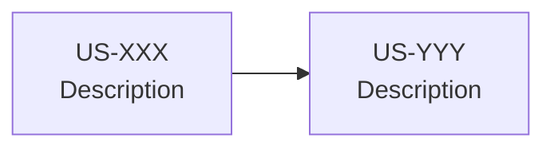

# Prompt Templates — Antigravity × AssurManager

> **Bibliothèque de prompts** réutilisables pour les tâches courantes.
> Dernière mise à jour : 2026-01-01

---

## 1) Template générique

```markdown
Lis d'abord docs/README.md, puis les sources de vérité pertinentes :
- [LISTE DES DOCS À LIRE]

Endosse le rôle : <NOM DU RÔLE> (voir docs/70_ai/roles_pack.md)

Objectif : créer/compléter <LISTE DE FICHIERS>

Contraintes :
- Ne rien inventer hors PRD. Si manque : [OPEN QUESTION] + 2 options + recommandation.
- Pas de modifications de code ; uniquement docs/.
- Ajouter : Décisions, Risques & mitigations, Checklist.

Sortie attendue :
- [DESCRIPTION DU LIVRABLE]
```

---

## 2) Templates par type de tâche

### 📝 Documentation produit

```markdown
Lis d'abord docs/README.md et docs/00_product/prd.md.
Endosse le rôle : PM Senior.

Objectif : créer/compléter docs/00_product/<fichier>.md

Contraintes :
- Alignement strict avec le PRD.
- User stories avec critères d'acceptation.
- Périmètre MVP explicite.

Sortie attendue :
- Document actionnable, pas de marketing.
- Section Décisions + Risques + Checklist.
```

---

### 🔧 Documentation technique

```markdown
Lis d'abord docs/README.md, docs/40_engineering/stack.md et docs/40_engineering/definition_of_done.md.
Endosse le rôle : Lead Dev & Architecte.

Objectif : créer/compléter docs/40_engineering/<fichier>.md

Contraintes :
- Simplicité avant sophistication.
- Justifier chaque choix technique.
- Pas de refactor non demandé.

Sortie attendue :
- Stack, conventions, ou process documentés.
- Section Risques & mitigations.
- Exemples concrets (commandes, config).
```

---

### 🎮 Game Design

```markdown
Lis d'abord docs/README.md, docs/00_product/prd.md et docs/10_game_design/gameplay_core.md.
Endosse le rôle : Game Designer.

Objectif : créer/compléter docs/10_game_design/<fichier>.md

Contraintes :
- Fun utile : plaisir + apprentissage.
- Cohérence avec la simulation (effets, retards).
- MVP uniquement, taguer [OUT OF SCOPE] sinon.

Sortie attendue :
- Mécaniques formalisées (inputs, outputs, limites).
- Exemples de scénarios joueur.
```

---

### 🧮 Simulation / Moteur

```markdown
Lis d'abord docs/README.md et docs/20_simulation/indices.md.
Endosse le rôle : Simulation Engineer.

Objectif : créer/compléter docs/20_simulation/<fichier>.md

Contraintes :
- Formules explicites avec unités et bornes.
- Pseudocode si calcul complexe.
- Invariants testables.

Sortie attendue :
- Spécification implémentable.
- Exemples chiffrés (Given/When/Then).
- Test vectors si applicable.
```

---

### 🔒 Sécurité

```markdown
Lis d'abord docs/README.md et docs/50_security_compliance/auth_rbac.md.
Endosse le rôle : Sécurité / Multi-tenant.

Objectif : créer/compléter docs/50_security_compliance/<fichier>.md

Contraintes :
- Deny-by-default.
- Aucune zone grise ("ça dépend" interdit).
- RGPD : finalités, rétention, droits.

Sortie attendue :
- Matrice rôles × actions complète.
- Scénarios de test d'isolation.
- Section Impacts Dev.
```

---

### 💻 Implémentation code

```markdown
Lis d'abord :
- docs/README.md
- docs/40_engineering/stack.md
- docs/40_engineering/definition_of_done.md
- docs/60_github/workflow.md

Objectif : implémenter US-XXX (voir docs/00_product/backlog.md)

Contraintes :
- 1 ticket = 1 PR, scope strict.
- Branch : feat/US-XXX-description
- Tests si moteur modifié.
- Pas de refactor non demandé.

Checklist avant PR :
- [ ] npm run build → OK
- [ ] npm run type-check → OK
- [ ] npm run lint → OK
- [ ] npm run test:run → OK
- [ ] Commit formaté : feat(scope): description [US-XXX]
```

---

### 🔄 Migrations SQL

```markdown
Lis d'abord :
- docs/40_engineering/definition_of_done.md
- docs/70_ai/working_agreement.md (section garde-fous)

Objectif : créer migration pour <description>

⚠️ PROCESSUS OBLIGATOIRE :
1. D'ABORD : Écrire le plan de migration (pas de code)
2. ATTENDRE : Validation humaine
3. ENSUITE : Exécuter

Plan requis :
- Objectif de la migration
- SQL UP (création)
- SQL DOWN (rollback)
- Tables/colonnes affectées
- Données existantes à migrer ?
- Risque de downtime ?
```

---

## 3) Templates pour situations spéciales

### ❓ Question ouverte

```markdown
> [!IMPORTANT]
> **[OPEN QUESTION]** <Titre de la question>
>
> **Contexte** : <Pourquoi cette question se pose>
>
> | Option | Avantages | Inconvénients |
> |--------|-----------|---------------|
> | A : <option A> | <+> | <-> |
> | B : <option B> | <+> | <-> |
>
> **Recommandation** : Option <X> parce que <justification>
```

---

### 🚫 Hors scope

```markdown
> [!NOTE]
> **[OUT OF SCOPE MVP]** <Fonctionnalité>
>
> Non implémenté car :
> - <raison 1>
> - <raison 2>
>
> Candidat pour : V1 / V2
> Action : Créer issue #XXX si à planifier
```

---

### ⚠️ Blocage

```markdown
## ⚠️ Blocage

**Cause** : <description du problème>

**Impact** : <ce qui est bloqué>

**Options de contournement** :
1. <Option A> — <conséquence>
2. <Option B> — <conséquence>

**Recommandation** : <option recommandée + justification>

**En attente de** : <décision/ressource/information>
```

---

## 4) Matrice Document → Rôle → Reviewers

| Document | Rédacteur principal | Reviewers |
|----------|---------------------|-----------|
| `00_product/*` | PM Senior | Référent IARD, Ingénieur formation |
| `10_game_design/*` | Game Designer | Ingénieur formation, Simulation Engineer |
| `20_simulation/*` | Simulation Engineer | Référent IARD, Lead Dev |
| `30_ux_ui/*` | UX/UI Designer | PM Senior, Ingénieur formation |
| `40_engineering/*` | Lead Dev & Architecte | Database Engineer, Sécurité |
| `50_security_compliance/*` | Sécurité/Multi-tenant | Lead Dev, Database Engineer |
| `60_github/*` | Lead Dev | PM Senior |
| `70_ai/*` | Tech Writer / DocOps | PM Senior, Lead Dev |
| `80_api_data/*` | Database Engineer | Lead Dev, Simulation Engineer |
| `docs/README.md` | Tech Writer / DocOps | PM Senior |

---

## 5) Templates de Review

### 🔍 Review Documentation générique

```markdown
Lis d'abord docs/README.md et le fichier à reviewer.
Endosse le rôle : <RÔLE REVIEWER> (voir matrice §4)

Objectif : reviewer <FICHIER>

Checklist de review :
- [ ] Alignement avec le PRD et les sources de vérité
- [ ] Pas de duplication d'information
- [ ] Formulations claires et non ambiguës
- [ ] Exemples concrets fournis
- [ ] Sections Décisions/Risques/Checklist présentes
- [ ] Termes conformes au glossary.md

Sortie attendue :
- Liste des points OK ✅
- Liste des problèmes avec corrections proposées ❌
- Questions ouvertes si ambiguïté
```

---

### 🔍 Review PRD / Backlog

```markdown
Lis d'abord docs/README.md, docs/00_product/prd.md, docs/00_product/scope.md.
Endosse le rôle : PM Senior ou Référent Métier IARD.

Objectif : reviewer docs/00_product/<fichier>.md

Points de contrôle :
- [ ] Cohérence PRD ↔ Backlog ↔ Scope
- [ ] Toutes les US ont des critères d'acceptation
- [ ] Priorités P0/P1/P2 justifiées
- [ ] Pas de features hors scope non taguées
- [ ] Termes métier conformes au glossary.md
- [ ] Réalisme métier (leviers, effets, ordres de grandeur)

Sortie attendue :
- Corrections métier avec justification
- Incohérences identifiées
- Suggestions d'amélioration si applicable
```

---

### 🔍 Review Simulation / Moteur

```markdown
Lis d'abord docs/20_simulation/indices.md et docs/20_simulation/leviers_catalogue.md.
Endosse le rôle : Référent Métier IARD ou Simulation Engineer.

Objectif : reviewer docs/20_simulation/<fichier>.md

Points de contrôle :
- [ ] Formules explicites avec unités et bornes
- [ ] Invariants vérifiables (indices 0-100, P&L cohérent)
- [ ] Effets retard quantifiés
- [ ] Causalités métier plausibles
- [ ] Pas de "augmente légèrement" sans chiffre
- [ ] Test vectors ou exemples Given/When/Then

Sortie attendue :
- Erreurs de calcul / logique
- Incohérences métier
- Invariants manquants proposés
```

---

### 🔍 Review Code (PR)

```markdown
Lis d'abord le diff de la PR et les fichiers modifiés.

Objectif : reviewer PR #XXX pour US-YYY

Checklist technique :
- [ ] Scope = US référencée uniquement (pas de refactor caché)
- [ ] Types stricts (pas de `any` non justifié)
- [ ] Tests ajoutés si moteur modifié
- [ ] Pas de console.log / code commenté
- [ ] Nommage conforme à project_structure.md
- [ ] Gestion erreurs (try/catch, codes HTTP)

Checklist sécurité :
- [ ] tenant_id vérifié si données scopées
- [ ] Pas de secrets hardcodés
- [ ] Input validation présente
- [ ] Pas de données sensibles en log/response

Checklist DoD :
- [ ] Build + lint + type-check + tests passent
- [ ] Commit formaté correctement
- [ ] Documentation mise à jour si nécessaire

Sortie attendue :
- APPROVE / REQUEST CHANGES / COMMENT
- Problèmes bloquants (must fix)
- Suggestions (nice to have)
```

---

### 🔍 Review Migration SQL

```markdown
Lis d'abord docs/80_api_data/data_model.md et la migration proposée.
Endosse le rôle : Database Engineer.

Objectif : reviewer migration <NOM>

Points de contrôle critiques :
- [ ] Script UP complet et syntaxiquement correct
- [ ] Script DOWN (rollback) fourni et testé
- [ ] tenant_id présent si table scopée
- [ ] Indexes appropriés
- [ ] Contraintes (FK, UNIQUE, CHECK) définies
- [ ] RLS policy si nouvelle table

Points de contrôle risque :
- [ ] Impact sur données existantes évalué
- [ ] Risque de downtime documenté
- [ ] Ordre des opérations correct
- [ ] Pas de perte de données

Sortie attendue :
- APPROVE / BLOCK
- Corrections SQL si erreurs
- Questions sur les cas limites
```

---

### 🔍 Review API Contract

```markdown
Lis d'abord docs/80_api_data/api_contract.md et les endpoints proposés.
Endosse le rôle : Lead Dev ou Database Engineer.

Objectif : reviewer endpoints API

Points de contrôle :
- [ ] Endpoints RESTful cohérents
- [ ] Codes HTTP corrects (200, 201, 400, 401, 403, 404, 500)
- [ ] Payloads request/response documentés
- [ ] Erreurs détaillées avec codes
- [ ] Pagination si liste
- [ ] Auth/permissions documentées
- [ ] Cohérence avec data_model.md

Sortie attendue :
- Incohérences avec le modèle de données
- Endpoints manquants
- Améliorations d'ergonomie API
```

---

### 🔍 Review Sécurité

```markdown
Lis d'abord docs/50_security_compliance/auth_rbac.md et le document à reviewer.
Endosse le rôle : Sécurité / Multi-tenant.

Objectif : reviewer <FICHIER> pour aspects sécurité

Points de contrôle :
- [ ] Deny-by-default appliqué
- [ ] Matrice rôles × actions complète
- [ ] Isolation tenant garantie
- [ ] Pas de zone grise ("ça dépend")
- [ ] Scénarios de test définis
- [ ] RGPD : finalités, rétention, droits

Sortie attendue :
- Failles potentielles identifiées
- Permissions manquantes ou excessives
- Tests de sécurité à ajouter
```

---

### 🔍 Review UX/UI

```markdown
Lis d'abord docs/30_ux_ui/user_flows.md et docs/30_ux_ui/design_system.md.
Endosse le rôle : UX/UI Designer ou PM Senior.

Objectif : reviewer <FICHIER> ou écran/composant

Points de contrôle :
- [ ] Parcours utilisateur cohérent
- [ ] États gérés (loading, empty, error, success)
- [ ] Cas limites documentés
- [ ] Accessibilité (clavier, focus, labels)
- [ ] Cohérence avec le design system
- [ ] Mobile-friendly si applicable

Sortie attendue :
- Problèmes UX identifiés
- Incohérences avec le parcours global
- Suggestions d'amélioration
```

---

## 7) Génération de fichier prompts pour une Epic

### 🚀 Méta-prompt : Génération prompts_epic_eX.md

```markdown
📖 CONTEXTE
Lis d'abord :
- docs/README.md
- docs/000_projet/sprint_planning_mvp.md (Sprint concerné)
- docs/000_projet/specs_fonctionnelles_mvp.md (US concernées)
- docs/70_ai/prompt_templates.md (conventions)
- docs/40_engineering/definition_of_done.md

🎭 RÔLE
Endosse le rôle : Tech Writer / DocOps + PM Senior

🎯 OBJECTIF
Générer le fichier docs/000_projet/prompts_epic_e<X>.md pour le Sprint <N>

Contenu requis :
1. En-tête avec titre Epic, liste des US, date
2. Section "Conventions d'utilisation"
3. Section "DoD Global Sprint <N>"
4. Section "QA Global Sprint <N>"
5. UN PROMPT PAR US (dans l'ordre d'exécution)
6. Diagramme mermaid de l'ordre d'exécution
7. Tableau récapitulatif avec statut
8. Quick Reference ASCII

📋 STRUCTURE DE CHAQUE PROMPT US
Chaque prompt doit inclure TOUTES les sections suivantes :

```
📖 CONTEXTE    → Docs à lire en premier
🎭 RÔLE        → Persona à endosser
🎯 OBJECTIF    → US + livrables attendus
📋 AC          → Critères d'acceptation
⚠️ CONTRAINTES → Garde-fous
📋 DoD         → Definition of Done spécifique (checklist)
🧪 QA          → Tests et validation (3+ unitaires, 2+ intégration, 3 propriétés moteur, 1 scénario E2E)
📤 SORTIE      → Fichiers créés + commit message
```

⚠️ CONTRAINTES
- Pas de placeholders : tous les champs doivent être remplis
- Cohérence DoD : aligné avec docs/40_engineering/definition_of_done.md
- Types explicites : interfaces TypeScript complètes si applicable
- Exemples de code : snippets fonctionnels (pas de "...")
- Tests minimaux :
  - Tests unitaires : ≥3 par module
  - Tests intégration : ≥2 par US
  - Propriétés vérifiées : 3 par module moteur
  - Scénario E2E : 1 par US (étapes numérotées)
- Format commit : feat(<scope>): <description> [US-XXX]
- Encodage : UTF-8 sans BOM

📤 SORTIE ATTENDUE

1. **En-tête fichier**
```markdown
# Prompts Antigravity — <Epic Name> (<Sprint Name>)

> **Prompts d'implémentation** pour les User Stories US-XXX à US-YYY
> Ordre d'exécution : US-XXX → US-YYY → ...
> À utiliser avec Claude Opus 4.5 / Antigravity
> Date : YYYY-MM-DD
```

2. **DoD Global** (checklist commune à toutes les US du sprint)

3. **QA Global** (exigences tests minimales)

4. **Prompts individuels** (1 par US, format complet)

5. **Ordre d'exécution** (diagramme mermaid + tableau)


| Ordre | US | Dépend de | Durée estimée | Statut |
|:-----:|:---|-----------|:-------------:|:------:|
| 1 | US-XXX | Sprint précédent | X jours | 🔲 À faire |

6. **Quick Reference** (récapitulatif ASCII)
```
╔═══════════════════════════════════════════════════════════════════╗
║               EPIC EX — <EPIC NAME>                               ║
╠═══════════════════════════════════════════════════════════════════╣
║  US-XXX → Description      │ feat(<scope>): ... [US-XXX]          ║
╚═══════════════════════════════════════════════════════════════════╝
```

CHECKLIST AVANT LIVRAISON
- [ ] Toutes les US du sprint couvertes
- [ ] Aucun placeholder (rechercher TODO, TBD, ...)
- [ ] Types TypeScript complets (pas de `any`)
- [ ] Tests QA détaillés pour chaque US
- [ ] DoD spécifique à chaque US
- [ ] Diagramme mermaid syntaxiquement correct
- [ ] Commit messages formatés
- [ ] Encodage UTF-8 vérifié
- [ ] Date mise à jour
```

---

### 📋 Checklist de validation prompts_epic_eX.md

| Critère | Vérifié |
|---------|:-------:|
| En-tête complet (titre, date, liste US) | ☐ |
| DoD Global présent | ☐ |
| QA Global présent | ☐ |
| Chaque US a toutes les sections (📖🎭🎯📋⚠️📋🧪📤) | ☐ |
| Types TypeScript inclus si applicable | ☐ |
| Exemples de code fonctionnels | ☐ |
| Tests unitaires ≥3 par module | ☐ |
| Tests intégration ≥2 par US | ☐ |
| Scénario E2E documenté par US | ☐ |
| Diagramme mermaid valide | ☐ |
| Tableau récapitulatif avec statuts | ☐ |
| Quick Reference ASCII | ☐ |
| Pas de placeholders | ☐ |
| Encodage UTF-8 | ☐ |

---

## 8) Quick Reference

```
╔═══════════════════════════════════════════════════════════════════╗
║                      PROMPT TEMPLATES                             ║
╠═══════════════════════════════════════════════════════════════════╣
║  STRUCTURE :                                                      ║
║    1. Lis d'abord [docs]                                          ║
║    2. Endosse le rôle : [rôle]                                    ║
║    3. Objectif : [fichiers à créer/compléter]                     ║
║    4. Contraintes : [règles spécifiques]                          ║
║    5. Sortie attendue : [format du livrable]                      ║
╠═══════════════════════════════════════════════════════════════════╣
║  TAGS :                                                           ║
║    [OPEN QUESTION]   → Décision requise, 2 options + reco         ║
║    [OUT OF SCOPE]    → Hors MVP, issue à créer                    ║
║    US-XXX            → Référence User Story                       ║
║    Fixes #XXX        → Ferme automatiquement l'issue              ║
╚═══════════════════════════════════════════════════════════════════╝
```
